    install.packages(c("nnet", "ElemStatLearn", "gam", "mda", "e1071"), repos='http://cran.rstudio.com/')

    also installing the dependencies 'iterators', 'foreach'
    
    

    package 'iterators' successfully unpacked and MD5 sums checked
    package 'foreach' successfully unpacked and MD5 sums checked
    package 'nnet' successfully unpacked and MD5 sums checked
    package 'ElemStatLearn' successfully unpacked and MD5 sums checked
    package 'gam' successfully unpacked and MD5 sums checked
    package 'mda' successfully unpacked and MD5 sums checked
    package 'e1071' successfully unpacked and MD5 sums checked
    
    The downloaded binary packages are in
    	C:\Users\syleeie\AppData\Local\Temp\RtmpEPidcf\downloaded_packages
    

    library(nnet)

    data(iris)

    head(iris)

<table>
<thead><tr><th></th><th scope=col>Sepal.Length</th><th scope=col>Sepal.Width</th><th scope=col>Petal.Length</th><th scope=col>Petal.Width</th><th scope=col>Species</th></tr></thead>
<tbody>
	<tr><th scope=row>1</th><td>5.1</td><td>3.5</td><td>1.4</td><td>0.2</td><td>setosa</td></tr>
	<tr><th scope=row>2</th><td>4.9</td><td>3</td><td>1.4</td><td>0.2</td><td>setosa</td></tr>
	<tr><th scope=row>3</th><td>4.7</td><td>3.2</td><td>1.3</td><td>0.2</td><td>setosa</td></tr>
	<tr><th scope=row>4</th><td>4.6</td><td>3.1</td><td>1.5</td><td>0.2</td><td>setosa</td></tr>
	<tr><th scope=row>5</th><td>5</td><td>3.6</td><td>1.4</td><td>0.2</td><td>setosa</td></tr>
	<tr><th scope=row>6</th><td>5.4</td><td>3.9</td><td>1.7</td><td>0.4</td><td>setosa</td></tr>
</tbody>
</table>

    samp = c(sample(1:50,25), sample(51:100,25), sample(101:150,25))
    iris.tr = iris[samp,]
    iris.te = iris[-samp,]

    ir1 <- nnet(Species~., data=iris.tr, size=2, decap=5e-4)
    names(ir1)
    summary(ir1)

    # weights:  19
    initial  value 104.843776 
    iter  10 value 65.519705
    iter  20 value 34.692737
    iter  30 value 34.657481
    final  value 34.657359 
    converged
    

<ol class=list-inline>
	<li>"n"</li>
	<li>"nunits"</li>
	<li>"nconn"</li>
	<li>"conn"</li>
	<li>"nsunits"</li>
	<li>"decay"</li>
	<li>"entropy"</li>
	<li>"softmax"</li>
	<li>"censored"</li>
	<li>"value"</li>
	<li>"wts"</li>
	<li>"convergence"</li>
	<li>"fitted.values"</li>
	<li>"residuals"</li>
	<li>"lev"</li>
	<li>"call"</li>
	<li>"terms"</li>
	<li>"coefnames"</li>
	<li>"xlevels"</li>
</ol>

    a 4-2-3 network with 19 weights
    options were - softmax modelling 
     b->h1 i1->h1 i2->h1 i3->h1 i4->h1 
      1.00  -1.12   5.48  -6.23  -9.09 
     b->h2 i1->h2 i2->h2 i3->h2 i4->h2 
     -0.20  -1.14  -0.99  -1.71  -0.31 
     b->o1 h1->o1 h2->o1 
    -12.20  49.69   0.05 
     b->o2 h1->o2 h2->o2 
      6.52 -44.05  -0.32 
     b->o3 h1->o3 h2->o3 
      6.52  -6.02  -0.10 

    y = iris.te$Species
    p = predict(ir1, iris.te, type="class")
    table(y,p)

                p
    y            setosa versicolor virginica
      setosa         22          0         3
      versicolor      0         13        12
      virginica       0         15        10

    test.err <- function(h.size)
    {
      ir <- nnet(Species~., data=iris.tr, size=h.size, decay=5e-4, trace=F)
      y <- iris.te$Species
      p <- predict(ir, iris.te, type="class")
      err = mean(y != p)
      c(h.size, err)
    }

    out <- t(sapply(2:10, FUN = test.err))

    plot(out, type="b", xlab="The number of Hidden units", ylab="Test Error")

    Error in cairo_pdf(tf, width, height, pointsize, FALSE, family, bg, antialias): unable to load winCairo.dll: was it built?
    

    Error in svg(tf, width, height, pointsize, FALSE, family, bg, antialias): unable to load winCairo.dll: was it built?
    

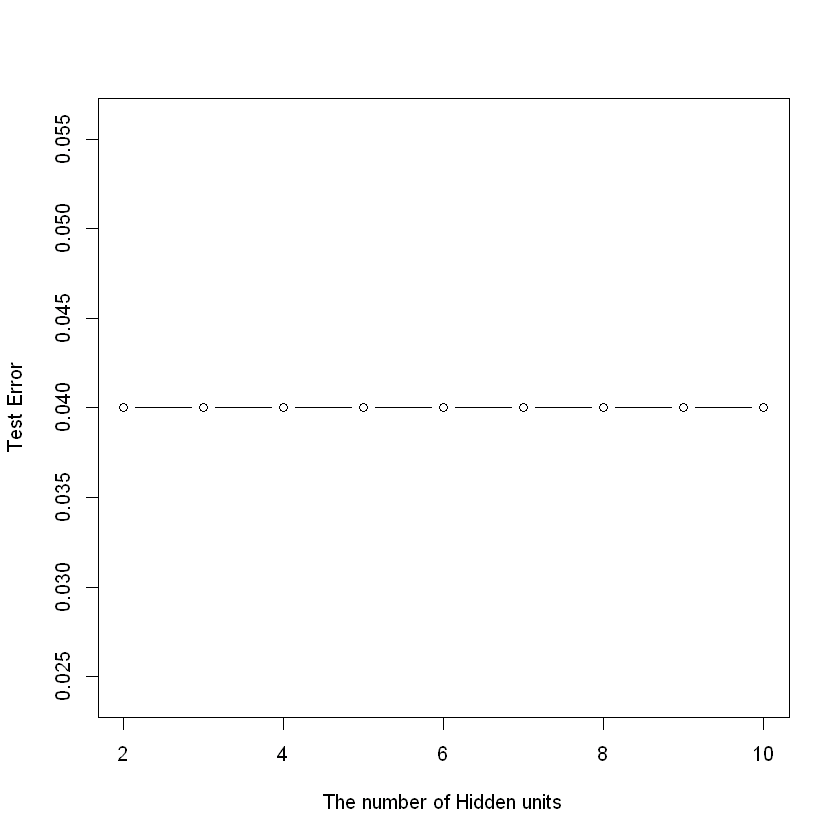

    library(ElemStatLearn)

    library(gam)

    data(SAheart)

    head(SAheart)

<table>
<thead><tr><th></th><th scope=col>sbp</th><th scope=col>tobacco</th><th scope=col>ldl</th><th scope=col>adiposity</th><th scope=col>famhist</th><th scope=col>typea</th><th scope=col>obesity</th><th scope=col>alcohol</th><th scope=col>age</th><th scope=col>chd</th></tr></thead>
<tbody>
	<tr><th scope=row>1</th><td>160</td><td>12</td><td>5.73</td><td>23.11</td><td>Present</td><td>49</td><td>25.3</td><td>97.2</td><td>52</td><td>1</td></tr>
	<tr><th scope=row>2</th><td>144</td><td>0.01</td><td>4.41</td><td>28.61</td><td>Absent</td><td>55</td><td>28.87</td><td>2.06</td><td>63</td><td>1</td></tr>
	<tr><th scope=row>3</th><td>118</td><td>0.08</td><td>3.48</td><td>32.28</td><td>Present</td><td>52</td><td>29.14</td><td>3.81</td><td>46</td><td>0</td></tr>
	<tr><th scope=row>4</th><td>170</td><td>7.5</td><td>6.41</td><td>38.03</td><td>Present</td><td>51</td><td>31.99</td><td>24.26</td><td>58</td><td>1</td></tr>
	<tr><th scope=row>5</th><td>134</td><td>13.6</td><td>3.5</td><td>27.78</td><td>Present</td><td>60</td><td>25.99</td><td>57.34</td><td>49</td><td>1</td></tr>
	<tr><th scope=row>6</th><td>132</td><td>6.2</td><td>6.47</td><td>36.21</td><td>Present</td><td>62</td><td>30.77</td><td>14.14</td><td>45</td><td>0</td></tr>
</tbody>
</table>

    str(SAheart)

    'data.frame':	462 obs. of  10 variables:
     $ sbp      : int  160 144 118 170 134 132 142 114 114 132 ...
     $ tobacco  : num  12 0.01 0.08 7.5 13.6 6.2 4.05 4.08 0 0 ...
     $ ldl      : num  5.73 4.41 3.48 6.41 3.5 6.47 3.38 4.59 3.83 5.8 ...
     $ adiposity: num  23.1 28.6 32.3 38 27.8 ...
     $ famhist  : Factor w/ 2 levels "Absent","Present": 2 1 2 2 2 2 1 2 2 2 ...
     $ typea    : int  49 55 52 51 60 62 59 62 49 69 ...
     $ obesity  : num  25.3 28.9 29.1 32 26 ...
     $ alcohol  : num  97.2 2.06 3.81 24.26 57.34 ...
     $ age      : int  52 63 46 58 49 45 38 58 29 53 ...
     $ chd      : int  1 1 0 1 1 0 0 1 0 1 ...
    

    heart.fit <- gam(chd~ 1 + s(sbp) + s(tobacco) + s(ldl) + s(adiposity) + famhist + s(typea) + s(obesity) + s(alcohol) + s(age), family = binomial, data=SAheart, trace=T)

    GAM s.wam loop 1: deviance = 446.2746 
    GAM s.wam loop 2: deviance = 436.7085 
    GAM s.wam loop 3: deviance = 434.3667 
    GAM s.wam loop 4: deviance = 433.8427 
    GAM s.wam loop 5: deviance = 433.7665 
    GAM s.wam loop 6: deviance = 433.7608 
    GAM s.wam loop 7: deviance = 433.7604 
    GAM s.wam loop 8: deviance = 433.7604 
    

    summary(heart.fit)

    
    Call: gam(formula = chd ~ 1 + s(sbp) + s(tobacco) + s(ldl) + s(adiposity) + 
        famhist + s(typea) + s(obesity) + s(alcohol) + s(age), family = binomial, 
        data = SAheart, trace = T)
    Deviance Residuals:
        Min      1Q  Median      3Q     Max 
    -1.8282 -0.7786 -0.3942  0.8104  2.7631 
    
    (Dispersion Parameter for binomial family taken to be 1)
    
        Null Deviance: 596.1084 on 461 degrees of freedom
    Residual Deviance: 433.7604 on 427.9998 degrees of freedom
    AIC: 501.7608 
    
    Number of Local Scoring Iterations: 8 
    
    Anova for Parametric Effects
                  Df Sum Sq Mean Sq F value    Pr(>F)    
    s(sbp)         1   5.88  5.8800  6.0570 0.0142450 *  
    s(tobacco)     1  17.01 17.0060 17.5180 3.456e-05 ***
    s(ldl)         1  14.26 14.2562 14.6855 0.0001461 ***
    s(adiposity)   1   1.48  1.4817  1.5263 0.2173469    
    famhist        1  19.73 19.7336 20.3278 8.435e-06 ***
    s(typea)       1   4.18  4.1846  4.3106 0.0384712 *  
    s(obesity)     1  12.22 12.2171 12.5850 0.0004319 ***
    s(alcohol)     1   0.05  0.0543  0.0559 0.8131348    
    s(age)         1  10.96 10.9642 11.2944 0.0008472 ***
    Residuals    428 415.49  0.9708                      
    ---
    Signif. codes:  0 '***' 0.001 '**' 0.01 '*' 0.05 '.' 0.1 ' ' 1
    
    Anova for Nonparametric Effects
                 Npar Df Npar Chisq  P(Chi)  
    (Intercept)                              
    s(sbp)             3     5.0812 0.16595  
    s(tobacco)         3     5.6677 0.12897  
    s(ldl)             3     2.3796 0.49745  
    s(adiposity)       3     4.8310 0.18460  
    famhist                                  
    s(typea)           3     6.5481 0.08777 .
    s(obesity)         3     5.4080 0.14425  
    s(alcohol)         3     0.7722 0.85611  
    s(age)             3     6.0883 0.10738  
    ---
    Signif. codes:  0 '***' 0.001 '**' 0.01 '*' 0.05 '.' 0.1 ' ' 1

    step.fit <- step.gam(heart.fit, scope=list("sbp"=~1+s(abp),"tobacco"=~1+s(tobacco), "ldl" = ~1+s(ldl), "adiposity"=~1+s(adiposity),"famhist"=~1+famhist,"typea"=~1+s(typea),"obesity"=~1+s(obesity),"alcohol"=~1+s(alcohol),"age"=~1+s(age)),direction="backward")

    Start:  chd ~ 1 + s(sbp) + s(tobacco) + s(ldl) + s(adiposity) + famhist +      s(typea) + s(obesity) + s(alcohol) + s(age); AIC= 501.7608 
    Step:1 chd ~ s(sbp) + s(tobacco) + s(ldl) + s(adiposity) + famhist +      s(typea) + s(obesity) + s(age) ; AIC= 494.4895 
    Step:2 chd ~ s(sbp) + s(tobacco) + s(ldl) + famhist + s(typea) + s(obesity) +      s(age) ; AIC= 492.5474 
    

    summary(step.fit)

    
    Call: gam(formula = chd ~ s(sbp) + s(tobacco) + s(ldl) + famhist + 
        s(typea) + s(obesity) + s(age), family = binomial, data = SAheart, 
        trace = FALSE)
    Deviance Residuals:
        Min      1Q  Median      3Q     Max 
    -1.8366 -0.7875 -0.3925  0.8590  2.7795 
    
    (Dispersion Parameter for binomial family taken to be 1)
    
        Null Deviance: 596.1084 on 461 degrees of freedom
    Residual Deviance: 440.5473 on 436 degrees of freedom
    AIC: 492.5474 
    
    Number of Local Scoring Iterations: 8 
    
    Anova for Parametric Effects
                Df Sum Sq Mean Sq F value    Pr(>F)    
    s(sbp)       1   6.43  6.4319  6.5483 0.0108353 *  
    s(tobacco)   1  16.85 16.8546 17.1596 4.129e-05 ***
    s(ldl)       1  13.87 13.8721 14.1231 0.0001945 ***
    famhist      1  19.96 19.9594 20.3206 8.426e-06 ***
    s(typea)     1   3.66  3.6626  3.7289 0.0541268 .  
    s(obesity)   1   1.92  1.9250  1.9598 0.1622433    
    s(age)       1  19.98 19.9771 20.3386 8.351e-06 ***
    Residuals  436 428.25  0.9822                      
    ---
    Signif. codes:  0 '***' 0.001 '**' 0.01 '*' 0.05 '.' 0.1 ' ' 1
    
    Anova for Nonparametric Effects
                Npar Df Npar Chisq  P(Chi)  
    (Intercept)                             
    s(sbp)            3     4.8243 0.18513  
    s(tobacco)        3     6.0412 0.10964  
    s(ldl)            3     2.6004 0.45743  
    famhist                                 
    s(typea)          3     6.6656 0.08334 .
    s(obesity)        3     6.4404 0.09205 .
    s(age)            3     6.1323 0.10534  
    ---
    Signif. codes:  0 '***' 0.001 '**' 0.01 '*' 0.05 '.' 0.1 ' ' 1

    plot(step.fit, se=TRUE, ask=T)

    Error in menu(tmenu, title = "Make a plot selection (or 0 to exit):\n"): menu() cannot be used non-interactively
    

    library(MASS)

    attach(rock)

    data(rock)

    head(rock)

<table>
<thead><tr><th></th><th scope=col>area</th><th scope=col>peri</th><th scope=col>shape</th><th scope=col>perm</th></tr></thead>
<tbody>
	<tr><th scope=row>1</th><td>4990</td><td>2791.9</td><td>0.0903296</td><td>6.3</td></tr>
	<tr><th scope=row>2</th><td>7002</td><td>3892.6</td><td>0.148622</td><td>6.3</td></tr>
	<tr><th scope=row>3</th><td>7558</td><td>3930.66</td><td>0.183312</td><td>6.3</td></tr>
	<tr><th scope=row>4</th><td>7352</td><td>3869.32</td><td>0.117063</td><td>6.3</td></tr>
	<tr><th scope=row>5</th><td>7943</td><td>3948.54</td><td>0.122417</td><td>17.1</td></tr>
	<tr><th scope=row>6</th><td>7979</td><td>4010.15</td><td>0.167045</td><td>17.1</td></tr>
</tbody>
</table>

    area1 = area/10000

    peri1 = peri/10000

    rock.ppr = ppr(log(perm)~area1+peri1+shape, data=rock, nterms=2, max.terms=5)

    summary(rock.ppr)

    Call:
    ppr(formula = log(perm) ~ area1 + peri1 + shape, data = rock, 
        nterms = 2, max.terms = 5)
    
    Goodness of fit:
     2 terms  3 terms  4 terms  5 terms 
    8.737806 5.289517 4.745799 4.490378 
    
    Projection direction vectors:
          term 1      term 2     
    area1  0.34357179  0.37071027
    peri1 -0.93781471 -0.61923542
    shape  0.04961846  0.69218595
    
    Coefficients of ridge terms:
       term 1    term 2 
    1.6079271 0.5460971 

    par(mfrow=c(3,2))

    plot(rock.ppr, main="ppr(log(perm)~).,, nterms=2, max.terms=5)")

    Error in cairo_pdf(tf, width, height, pointsize, FALSE, family, bg, antialias): unable to load winCairo.dll: was it built?
    

    Error in svg(tf, width, height, pointsize, FALSE, family, bg, antialias): unable to load winCairo.dll: was it built?
    

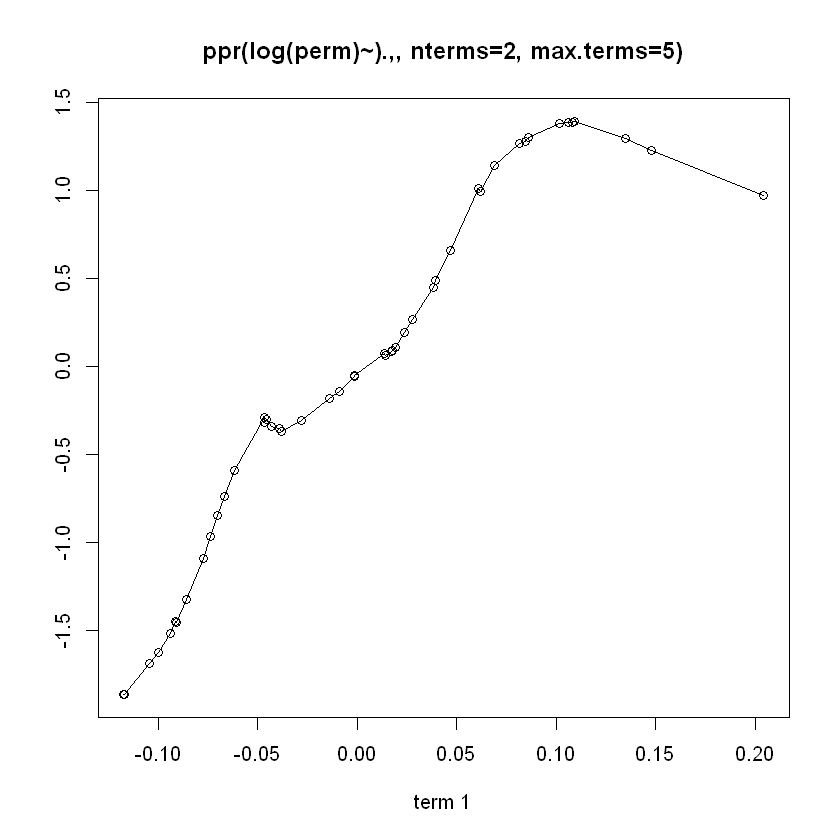

    Error in cairo_pdf(tf, width, height, pointsize, FALSE, family, bg, antialias): unable to load winCairo.dll: was it built?
    

    Error in svg(tf, width, height, pointsize, FALSE, family, bg, antialias): unable to load winCairo.dll: was it built?
    

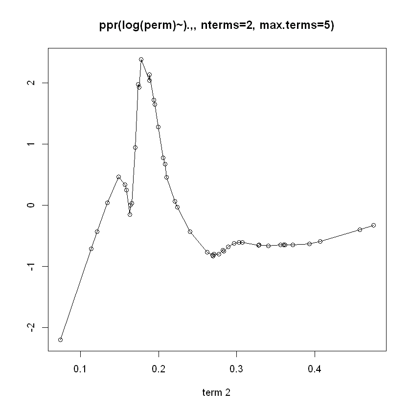

    plot(update(rock.ppr, base=5), main="update(..., bass=5)")

    Error in cairo_pdf(tf, width, height, pointsize, FALSE, family, bg, antialias): unable to load winCairo.dll: was it built?
    

    Error in svg(tf, width, height, pointsize, FALSE, family, bg, antialias): unable to load winCairo.dll: was it built?
    

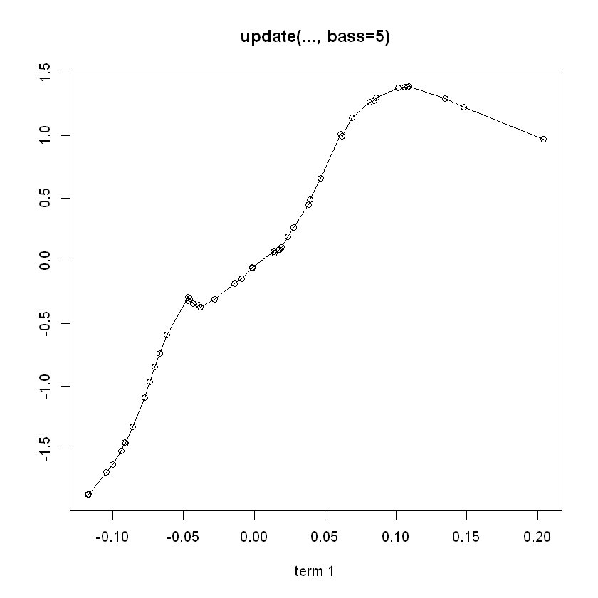

    Error in cairo_pdf(tf, width, height, pointsize, FALSE, family, bg, antialias): unable to load winCairo.dll: was it built?
    

    Error in svg(tf, width, height, pointsize, FALSE, family, bg, antialias): unable to load winCairo.dll: was it built?
    

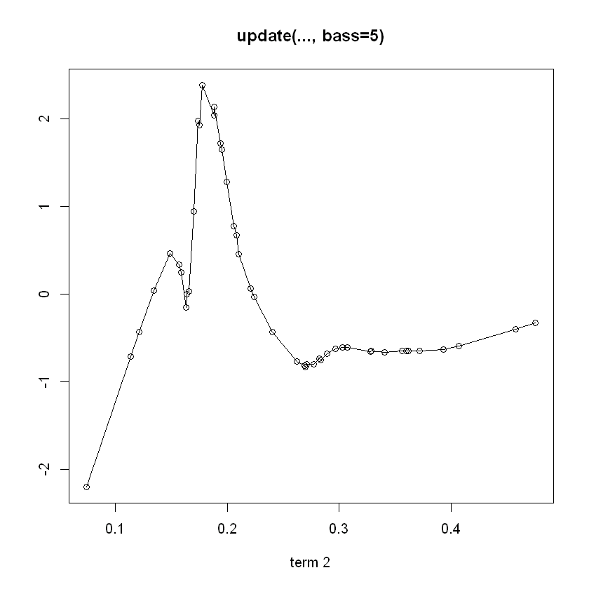

    plot(update(rock.ppr, sm.method="gcv", gcvpen=2), main="update(..., sm.method=\"gcv\", gcvpen=2)")

    Error in cairo_pdf(tf, width, height, pointsize, FALSE, family, bg, antialias): unable to load winCairo.dll: was it built?
    

    Error in svg(tf, width, height, pointsize, FALSE, family, bg, antialias): unable to load winCairo.dll: was it built?
    

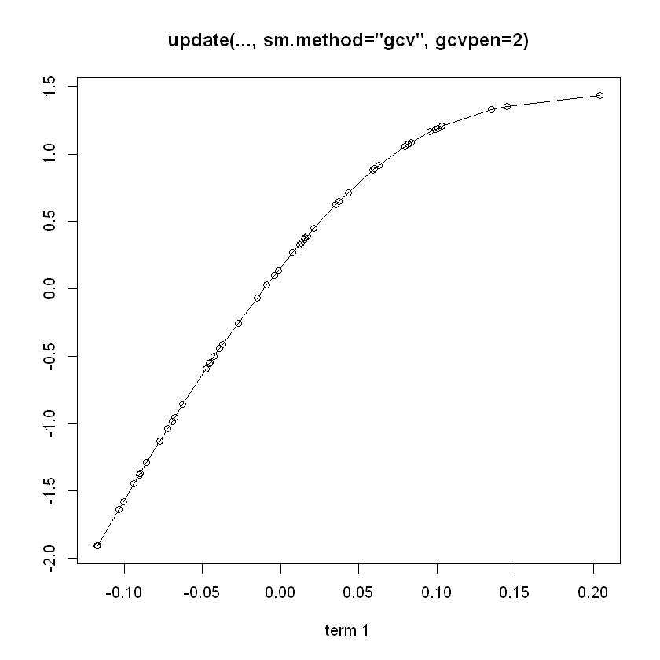

    Error in cairo_pdf(tf, width, height, pointsize, FALSE, family, bg, antialias): unable to load winCairo.dll: was it built?
    

    Error in svg(tf, width, height, pointsize, FALSE, family, bg, antialias): unable to load winCairo.dll: was it built?
    

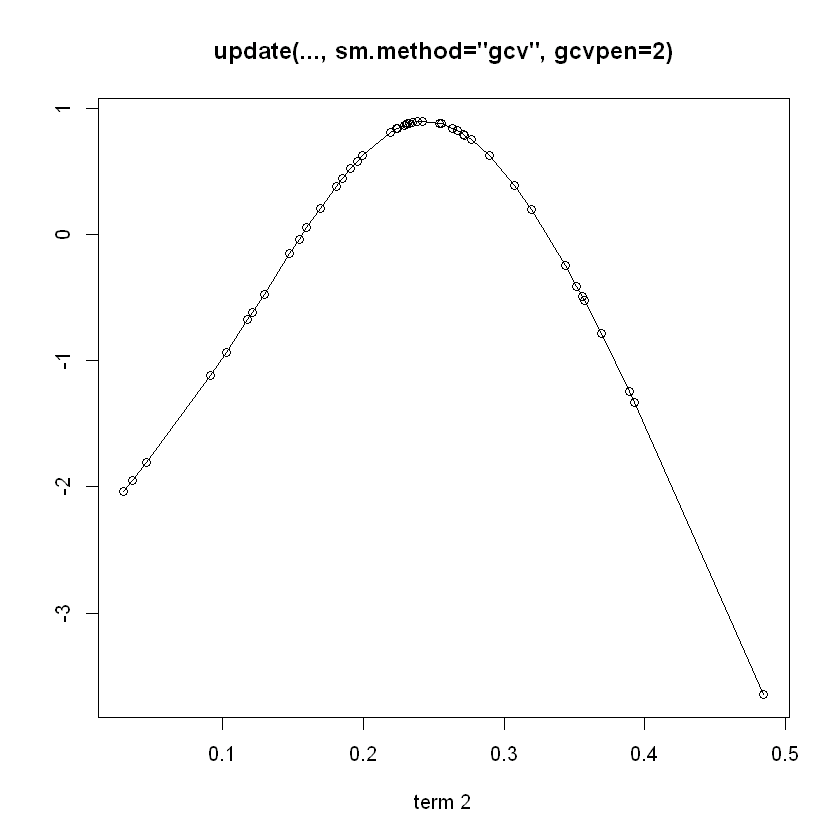

    library(mda)

    Loading required package: class
    Loaded mda 0.4-7
    
    

    data(trees)

    pairs(trees, panel=panel.smooth, main="trees data")

    Error in cairo_pdf(tf, width, height, pointsize, FALSE, family, bg, antialias): unable to load winCairo.dll: was it built?
    

    Error in svg(tf, width, height, pointsize, FALSE, family, bg, antialias): unable to load winCairo.dll: was it built?
    

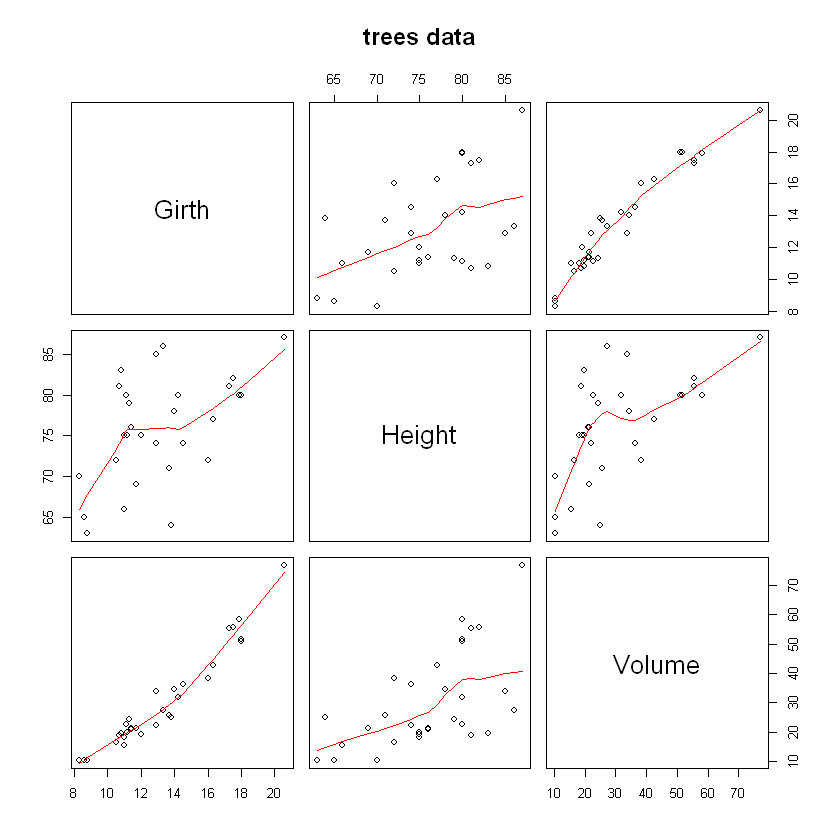

    fit1 <- mars(trees[,-3], trees[3])

    showcuts <- function(obj){
        tmp <- obj$cuts[obj$sel,]
        dimnames(tmp) <- list(NULL, names(trees)[-3])
        tmp
    }

    showcuts(fit1)

<table>
<thead><tr><th scope=col>Girth</th><th scope=col>Height</th></tr></thead>
<tbody>
	<tr><td>0</td><td>0</td></tr>
	<tr><td>13.8</td><td> 0.0</td></tr>
	<tr><td>13.8</td><td> 0.0</td></tr>
	<tr><td> 0</td><td>72</td></tr>
</tbody>
</table>

    Xp <- matrix(sapply(trees[1:2], mean), nrow(trees), 2, byrow=T)

    for(i in 1:2){
        xr <- sapply(trees, range)
        Xp1 <- Xp; Xp1[,i] <- seq(xr[1,i], xr[2,i], len=nrow(trees))
        Xf <- predict(fit1, Xp1)
        plot(Xp1[,i], Xf, xlab=names(trees)[i], ylab="", type="l")
    }

    Error in cairo_pdf(tf, width, height, pointsize, FALSE, family, bg, antialias): unable to load winCairo.dll: was it built?
    

    Error in svg(tf, width, height, pointsize, FALSE, family, bg, antialias): unable to load winCairo.dll: was it built?
    

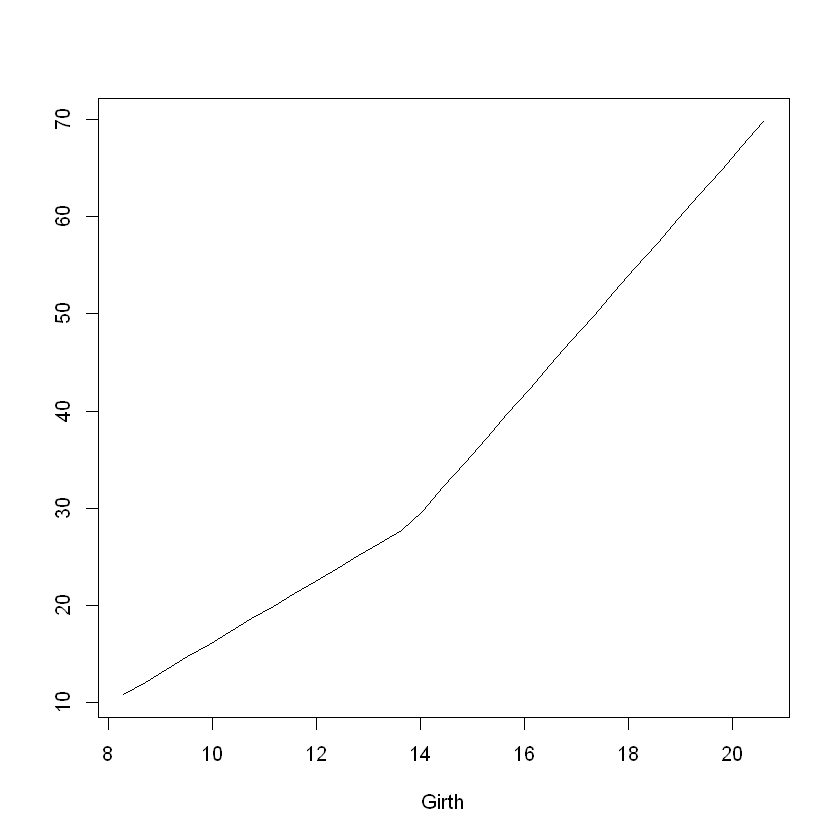

    Error in cairo_pdf(tf, width, height, pointsize, FALSE, family, bg, antialias): unable to load winCairo.dll: was it built?
    

    Error in svg(tf, width, height, pointsize, FALSE, family, bg, antialias): unable to load winCairo.dll: was it built?
    

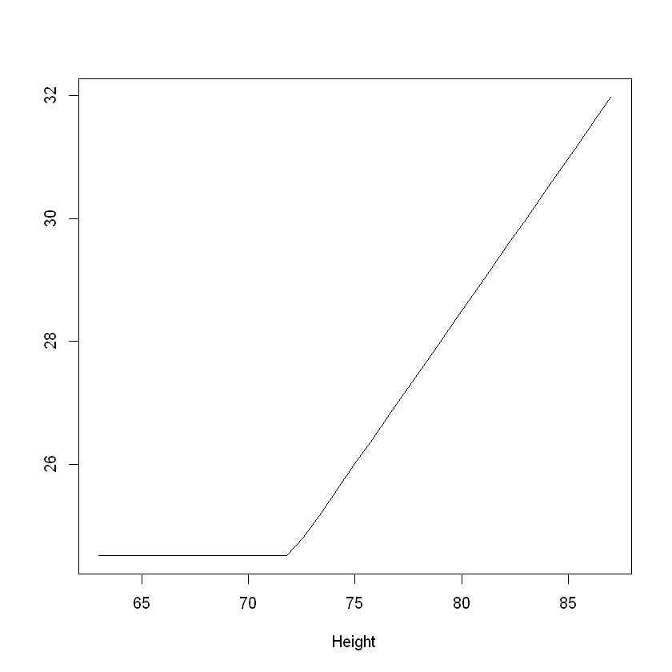

    library(e1071)

    install.packages("mlbench", repos='http://cran.rstudio.com/')

    package 'mlbench' successfully unpacked and MD5 sums checked
    
    The downloaded binary packages are in
    	C:\Users\syleeie\AppData\Local\Temp\RtmpEPidcf\downloaded_packages
    

    library(mlbench)

    data(HouseVotes84, package="mlbench")

    HouseVotes84

<table>
<thead><tr><th></th><th scope=col>Class</th><th scope=col>V1</th><th scope=col>V2</th><th scope=col>V3</th><th scope=col>V4</th><th scope=col>V5</th><th scope=col>V6</th><th scope=col>V7</th><th scope=col>V8</th><th scope=col>V9</th><th scope=col>V10</th><th scope=col>V11</th><th scope=col>V12</th><th scope=col>V13</th><th scope=col>V14</th><th scope=col>V15</th><th scope=col>V16</th></tr></thead>
<tbody>
	<tr><th scope=row>1</th><td>republican</td><td>n</td><td>y</td><td>n</td><td>y</td><td>y</td><td>y</td><td>n</td><td>n</td><td>n</td><td>y</td><td>NA</td><td>y</td><td>y</td><td>y</td><td>n</td><td>y</td></tr>
	<tr><th scope=row>2</th><td>republican</td><td>n</td><td>y</td><td>n</td><td>y</td><td>y</td><td>y</td><td>n</td><td>n</td><td>n</td><td>n</td><td>n</td><td>y</td><td>y</td><td>y</td><td>n</td><td>NA</td></tr>
	<tr><th scope=row>3</th><td>democrat</td><td>NA</td><td>y</td><td>y</td><td>NA</td><td>y</td><td>y</td><td>n</td><td>n</td><td>n</td><td>n</td><td>y</td><td>n</td><td>y</td><td>y</td><td>n</td><td>n</td></tr>
	<tr><th scope=row>4</th><td>democrat</td><td>n</td><td>y</td><td>y</td><td>n</td><td>NA</td><td>y</td><td>n</td><td>n</td><td>n</td><td>n</td><td>y</td><td>n</td><td>y</td><td>n</td><td>n</td><td>y</td></tr>
	<tr><th scope=row>5</th><td>democrat</td><td>y</td><td>y</td><td>y</td><td>n</td><td>y</td><td>y</td><td>n</td><td>n</td><td>n</td><td>n</td><td>y</td><td>NA</td><td>y</td><td>y</td><td>y</td><td>y</td></tr>
	<tr><th scope=row>6</th><td>democrat</td><td>n</td><td>y</td><td>y</td><td>n</td><td>y</td><td>y</td><td>n</td><td>n</td><td>n</td><td>n</td><td>n</td><td>n</td><td>y</td><td>y</td><td>y</td><td>y</td></tr>
	<tr><th scope=row>7</th><td>democrat</td><td>n</td><td>y</td><td>n</td><td>y</td><td>y</td><td>y</td><td>n</td><td>n</td><td>n</td><td>n</td><td>n</td><td>n</td><td>NA</td><td>y</td><td>y</td><td>y</td></tr>
	<tr><th scope=row>8</th><td>republican</td><td>n</td><td>y</td><td>n</td><td>y</td><td>y</td><td>y</td><td>n</td><td>n</td><td>n</td><td>n</td><td>n</td><td>n</td><td>y</td><td>y</td><td>NA</td><td>y</td></tr>
	<tr><th scope=row>9</th><td>republican</td><td>n</td><td>y</td><td>n</td><td>y</td><td>y</td><td>y</td><td>n</td><td>n</td><td>n</td><td>n</td><td>n</td><td>y</td><td>y</td><td>y</td><td>n</td><td>y</td></tr>
	<tr><th scope=row>10</th><td>democrat</td><td>y</td><td>y</td><td>y</td><td>n</td><td>n</td><td>n</td><td>y</td><td>y</td><td>y</td><td>n</td><td>n</td><td>n</td><td>n</td><td>n</td><td>NA</td><td>NA</td></tr>
	<tr><th scope=row>11</th><td>republican</td><td>n</td><td>y</td><td>n</td><td>y</td><td>y</td><td>n</td><td>n</td><td>n</td><td>n</td><td>n</td><td>NA</td><td>NA</td><td>y</td><td>y</td><td>n</td><td>n</td></tr>
	<tr><th scope=row>12</th><td>republican</td><td>n</td><td>y</td><td>n</td><td>y</td><td>y</td><td>y</td><td>n</td><td>n</td><td>n</td><td>n</td><td>y</td><td>NA</td><td>y</td><td>y</td><td>NA</td><td>NA</td></tr>
	<tr><th scope=row>13</th><td>democrat</td><td>n</td><td>y</td><td>y</td><td>n</td><td>n</td><td>n</td><td>y</td><td>y</td><td>y</td><td>n</td><td>n</td><td>n</td><td>y</td><td>n</td><td>NA</td><td>NA</td></tr>
	<tr><th scope=row>14</th><td>democrat</td><td>y</td><td>y</td><td>y</td><td>n</td><td>n</td><td>y</td><td>y</td><td>y</td><td>NA</td><td>y</td><td>y</td><td>NA</td><td>n</td><td>n</td><td>y</td><td>NA</td></tr>
	<tr><th scope=row>15</th><td>republican</td><td>n</td><td>y</td><td>n</td><td>y</td><td>y</td><td>y</td><td>n</td><td>n</td><td>n</td><td>n</td><td>n</td><td>y</td><td>NA</td><td>NA</td><td>n</td><td>NA</td></tr>
	<tr><th scope=row>16</th><td>republican</td><td>n</td><td>y</td><td>n</td><td>y</td><td>y</td><td>y</td><td>n</td><td>n</td><td>n</td><td>y</td><td>n</td><td>y</td><td>y</td><td>NA</td><td>n</td><td>NA</td></tr>
	<tr><th scope=row>17</th><td>democrat</td><td>y</td><td>n</td><td>y</td><td>n</td><td>n</td><td>y</td><td>n</td><td>y</td><td>NA</td><td>y</td><td>y</td><td>y</td><td>NA</td><td>n</td><td>n</td><td>y</td></tr>
	<tr><th scope=row>18</th><td>democrat</td><td>y</td><td>NA</td><td>y</td><td>n</td><td>n</td><td>n</td><td>y</td><td>y</td><td>y</td><td>n</td><td>n</td><td>n</td><td>y</td><td>n</td><td>y</td><td>y</td></tr>
	<tr><th scope=row>19</th><td>republican</td><td>n</td><td>y</td><td>n</td><td>y</td><td>y</td><td>y</td><td>n</td><td>n</td><td>n</td><td>n</td><td>n</td><td>NA</td><td>y</td><td>y</td><td>n</td><td>n</td></tr>
	<tr><th scope=row>20</th><td>democrat</td><td>y</td><td>y</td><td>y</td><td>n</td><td>n</td><td>n</td><td>y</td><td>y</td><td>y</td><td>n</td><td>y</td><td>n</td><td>n</td><td>n</td><td>y</td><td>y</td></tr>
	<tr><th scope=row>21</th><td>democrat</td><td>y</td><td>y</td><td>y</td><td>n</td><td>n</td><td>NA</td><td>y</td><td>y</td><td>n</td><td>n</td><td>y</td><td>n</td><td>n</td><td>n</td><td>y</td><td>y</td></tr>
	<tr><th scope=row>22</th><td>democrat</td><td>y</td><td>y</td><td>y</td><td>n</td><td>n</td><td>n</td><td>y</td><td>y</td><td>y</td><td>n</td><td>n</td><td>n</td><td>NA</td><td>NA</td><td>y</td><td>y</td></tr>
	<tr><th scope=row>23</th><td>democrat</td><td>y</td><td>NA</td><td>y</td><td>n</td><td>n</td><td>n</td><td>y</td><td>y</td><td>y</td><td>n</td><td>n</td><td>NA</td><td>n</td><td>n</td><td>y</td><td>y</td></tr>
	<tr><th scope=row>24</th><td>democrat</td><td>y</td><td>y</td><td>y</td><td>n</td><td>n</td><td>n</td><td>y</td><td>y</td><td>y</td><td>n</td><td>n</td><td>n</td><td>n</td><td>n</td><td>y</td><td>y</td></tr>
	<tr><th scope=row>25</th><td>democrat</td><td>y</td><td>n</td><td>y</td><td>n</td><td>n</td><td>n</td><td>y</td><td>y</td><td>y</td><td>n</td><td>n</td><td>n</td><td>n</td><td>n</td><td>y</td><td>NA</td></tr>
	<tr><th scope=row>26</th><td>democrat</td><td>y</td><td>n</td><td>y</td><td>n</td><td>n</td><td>n</td><td>y</td><td>y</td><td>y</td><td>y</td><td>n</td><td>n</td><td>n</td><td>n</td><td>y</td><td>y</td></tr>
	<tr><th scope=row>27</th><td>democrat</td><td>y</td><td>n</td><td>y</td><td>n</td><td>n</td><td>n</td><td>y</td><td>y</td><td>y</td><td>n</td><td>y</td><td>n</td><td>n</td><td>n</td><td>y</td><td>y</td></tr>
	<tr><th scope=row>28</th><td>democrat</td><td>y</td><td>y</td><td>y</td><td>n</td><td>n</td><td>n</td><td>y</td><td>y</td><td>y</td><td>n</td><td>y</td><td>n</td><td>n</td><td>n</td><td>y</td><td>y</td></tr>
	<tr><th scope=row>29</th><td>republican</td><td>y</td><td>n</td><td>n</td><td>y</td><td>y</td><td>n</td><td>y</td><td>y</td><td>y</td><td>n</td><td>n</td><td>y</td><td>y</td><td>y</td><td>n</td><td>y</td></tr>
	<tr><th scope=row>30</th><td>democrat</td><td>y</td><td>y</td><td>y</td><td>n</td><td>n</td><td>n</td><td>y</td><td>y</td><td>y</td><td>n</td><td>y</td><td>n</td><td>n</td><td>n</td><td>y</td><td>y</td></tr>
	<tr><th scope=row>31</th><td>republican</td><td>n</td><td>y</td><td>n</td><td>y</td><td>y</td><td>y</td><td>n</td><td>n</td><td>n</td><td>n</td><td>n</td><td>y</td><td>y</td><td>y</td><td>n</td><td>n</td></tr>
	<tr><th scope=row>32</th><td>democrat</td><td>y</td><td>y</td><td>y</td><td>n</td><td>n</td><td>n</td><td>y</td><td>y</td><td>y</td><td>n</td><td>y</td><td>n</td><td>n</td><td>n</td><td>y</td><td>NA</td></tr>
	<tr><th scope=row>33</th><td>democrat</td><td>y</td><td>y</td><td>y</td><td>n</td><td>n</td><td>n</td><td>y</td><td>y</td><td>y</td><td>y</td><td>n</td><td>n</td><td>y</td><td>n</td><td>y</td><td>y</td></tr>
	<tr><th scope=row>34</th><td>republican</td><td>n</td><td>y</td><td>n</td><td>y</td><td>y</td><td>y</td><td>n</td><td>n</td><td>n</td><td>n</td><td>n</td><td>y</td><td>y</td><td>y</td><td>n</td><td>y</td></tr>
	<tr><th scope=row>35</th><td>democrat</td><td>y</td><td>y</td><td>y</td><td>n</td><td>n</td><td>n</td><td>y</td><td>y</td><td>y</td><td>n</td><td>n</td><td>n</td><td>n</td><td>n</td><td>y</td><td>y</td></tr>
	<tr><th scope=row>36</th><td>republican</td><td>n</td><td>y</td><td>n</td><td>y</td><td>y</td><td>y</td><td>n</td><td>n</td><td>n</td><td>n</td><td>n</td><td>y</td><td>y</td><td>y</td><td>n</td><td>n</td></tr>
	<tr><th scope=row>37</th><td>republican</td><td>y</td><td>NA</td><td>n</td><td>y</td><td>y</td><td>y</td><td>n</td><td>n</td><td>n</td><td>y</td><td>n</td><td>y</td><td>NA</td><td>y</td><td>n</td><td>y</td></tr>
	<tr><th scope=row>38</th><td>republican</td><td>y</td><td>y</td><td>n</td><td>y</td><td>y</td><td>y</td><td>n</td><td>n</td><td>n</td><td>n</td><td>n</td><td>n</td><td>y</td><td>y</td><td>n</td><td>y</td></tr>
	<tr><th scope=row>39</th><td>republican</td><td>n</td><td>y</td><td>n</td><td>y</td><td>y</td><td>y</td><td>n</td><td>n</td><td>n</td><td>y</td><td>n</td><td>y</td><td>y</td><td>y</td><td>n</td><td>n</td></tr>
	<tr><th scope=row>40</th><td>democrat</td><td>y</td><td>n</td><td>y</td><td>n</td><td>n</td><td>n</td><td>y</td><td>y</td><td>y</td><td>y</td><td>y</td><td>n</td><td>y</td><td>n</td><td>y</td><td>y</td></tr>
	<tr><th scope=row>41</th><td>democrat</td><td>y</td><td>y</td><td>y</td><td>n</td><td>n</td><td>n</td><td>y</td><td>y</td><td>y</td><td>n</td><td>NA</td><td>n</td><td>n</td><td>n</td><td>n</td><td>NA</td></tr>
	<tr><th scope=row>42</th><td>democrat</td><td>y</td><td>y</td><td>y</td><td>n</td><td>n</td><td>n</td><td>y</td><td>y</td><td>y</td><td>n</td><td>n</td><td>n</td><td>n</td><td>n</td><td>y</td><td>NA</td></tr>
	<tr><th scope=row>43</th><td>democrat</td><td>y</td><td>n</td><td>y</td><td>n</td><td>n</td><td>n</td><td>y</td><td>y</td><td>y</td><td>n</td><td>n</td><td>n</td><td>n</td><td>n</td><td>n</td><td>y</td></tr>
	<tr><th scope=row>44</th><td>democrat</td><td>y</td><td>n</td><td>y</td><td>n</td><td>n</td><td>n</td><td>y</td><td>y</td><td>y</td><td>n</td><td>n</td><td>n</td><td>n</td><td>n</td><td>y</td><td>y</td></tr>
	<tr><th scope=row>45</th><td>democrat</td><td>y</td><td>y</td><td>y</td><td>n</td><td>n</td><td>n</td><td>y</td><td>y</td><td>y</td><td>n</td><td>y</td><td>n</td><td>n</td><td>n</td><td>n</td><td>NA</td></tr>
	<tr><th scope=row>46</th><td>democrat</td><td>y</td><td>y</td><td>y</td><td>n</td><td>n</td><td>n</td><td>y</td><td>y</td><td>NA</td><td>n</td><td>y</td><td>n</td><td>n</td><td>n</td><td>y</td><td>NA</td></tr>
	<tr><th scope=row>47</th><td>democrat</td><td>y</td><td>y</td><td>y</td><td>n</td><td>n</td><td>n</td><td>y</td><td>y</td><td>y</td><td>n</td><td>n</td><td>n</td><td>n</td><td>n</td><td>n</td><td>y</td></tr>
	<tr><th scope=row>48</th><td>democrat</td><td>y</td><td>n</td><td>y</td><td>n</td><td>n</td><td>n</td><td>y</td><td>y</td><td>NA</td><td>n</td><td>n</td><td>n</td><td>n</td><td>n</td><td>n</td><td>NA</td></tr>
	<tr><th scope=row>49</th><td>democrat</td><td>y</td><td>y</td><td>y</td><td>n</td><td>n</td><td>n</td><td>y</td><td>y</td><td>n</td><td>n</td><td>n</td><td>n</td><td>n</td><td>y</td><td>n</td><td>y</td></tr>
	<tr><th scope=row>50</th><td>republican</td><td>n</td><td>NA</td><td>n</td><td>y</td><td>y</td><td>y</td><td>n</td><td>n</td><td>n</td><td>n</td><td>n</td><td>y</td><td>y</td><td>y</td><td>n</td><td>n</td></tr>
	<tr><th scope=row>51</th><td>democrat</td><td>y</td><td>y</td><td>y</td><td>n</td><td>n</td><td>n</td><td>y</td><td>y</td><td>y</td><td>n</td><td>y</td><td>n</td><td>n</td><td>n</td><td>y</td><td>y</td></tr>
	<tr><th scope=row>52</th><td>republican</td><td>n</td><td>y</td><td>n</td><td>y</td><td>y</td><td>y</td><td>n</td><td>NA</td><td>n</td><td>n</td><td>n</td><td>y</td><td>y</td><td>y</td><td>n</td><td>y</td></tr>
	<tr><th scope=row>53</th><td>democrat</td><td>y</td><td>y</td><td>y</td><td>n</td><td>n</td><td>n</td><td>y</td><td>y</td><td>y</td><td>n</td><td>n</td><td>n</td><td>n</td><td>n</td><td>NA</td><td>NA</td></tr>
	<tr><th scope=row>54</th><td>republican</td><td>y</td><td>y</td><td>n</td><td>y</td><td>y</td><td>y</td><td>n</td><td>n</td><td>n</td><td>y</td><td>n</td><td>y</td><td>y</td><td>y</td><td>n</td><td>n</td></tr>
	<tr><th scope=row>55</th><td>democrat</td><td>y</td><td>y</td><td>y</td><td>n</td><td>n</td><td>y</td><td>NA</td><td>y</td><td>n</td><td>n</td><td>y</td><td>y</td><td>n</td><td>y</td><td>n</td><td>NA</td></tr>
	<tr><th scope=row>56</th><td>republican</td><td>n</td><td>y</td><td>n</td><td>y</td><td>y</td><td>y</td><td>n</td><td>n</td><td>n</td><td>y</td><td>y</td><td>y</td><td>y</td><td>y</td><td>n</td><td>n</td></tr>
	<tr><th scope=row>57</th><td>republican</td><td>n</td><td>y</td><td>n</td><td>y</td><td>y</td><td>y</td><td>n</td><td>n</td><td>n</td><td>y</td><td>y</td><td>y</td><td>y</td><td>y</td><td>n</td><td>y</td></tr>
	<tr><th scope=row>58</th><td>republican</td><td>n</td><td>y</td><td>n</td><td>y</td><td>y</td><td>y</td><td>n</td><td>n</td><td>n</td><td>y</td><td>n</td><td>y</td><td>y</td><td>y</td><td>n</td><td>y</td></tr>
	<tr><th scope=row>59</th><td>republican</td><td>n</td><td>y</td><td>n</td><td>y</td><td>y</td><td>y</td><td>n</td><td>n</td><td>n</td><td>y</td><td>n</td><td>y</td><td>y</td><td>y</td><td>n</td><td>y</td></tr>
	<tr><th scope=row>60</th><td>republican</td><td>n</td><td>y</td><td>n</td><td>y</td><td>y</td><td>y</td><td>n</td><td>n</td><td>n</td><td>y</td><td>n</td><td>y</td><td>y</td><td>y</td><td>n</td><td>NA</td></tr>
	<tr><th scope=row>61</th><td>democrat</td><td>y</td><td>y</td><td>y</td><td>n</td><td>n</td><td>NA</td><td>y</td><td>y</td><td>y</td><td>y</td><td>n</td><td>n</td><td>n</td><td>n</td><td>y</td><td>NA</td></tr>
	<tr><th scope=row>62</th><td>republican</td><td>n</td><td>y</td><td>n</td><td>y</td><td>y</td><td>y</td><td>n</td><td>n</td><td>n</td><td>n</td><td>n</td><td>y</td><td>y</td><td>y</td><td>n</td><td>n</td></tr>
	<tr><th scope=row>63</th><td>democrat</td><td>y</td><td>y</td><td>y</td><td>n</td><td>n</td><td>n</td><td>y</td><td>y</td><td>y</td><td>n</td><td>n</td><td>n</td><td>n</td><td>n</td><td>n</td><td>NA</td></tr>
	<tr><th scope=row>64</th><td>democrat</td><td>y</td><td>y</td><td>y</td><td>n</td><td>n</td><td>n</td><td>y</td><td>y</td><td>y</td><td>n</td><td>y</td><td>n</td><td>n</td><td>n</td><td>n</td><td>y</td></tr>
	<tr><th scope=row>65</th><td>democrat</td><td>y</td><td>y</td><td>y</td><td>n</td><td>n</td><td>n</td><td>y</td><td>y</td><td>y</td><td>n</td><td>y</td><td>NA</td><td>n</td><td>n</td><td>n</td><td>y</td></tr>
	<tr><th scope=row>66</th><td>republican</td><td>y</td><td>y</td><td>n</td><td>y</td><td>y</td><td>y</td><td>y</td><td>n</td><td>n</td><td>n</td><td>n</td><td>y</td><td>y</td><td>y</td><td>n</td><td>y</td></tr>
	<tr><th scope=row>67</th><td>republican</td><td>n</td><td>y</td><td>n</td><td>y</td><td>y</td><td>y</td><td>y</td><td>n</td><td>n</td><td>n</td><td>y</td><td>y</td><td>y</td><td>y</td><td>n</td><td>y</td></tr>
	<tr><th scope=row>68</th><td>republican</td><td>n</td><td>y</td><td>n</td><td>y</td><td>y</td><td>y</td><td>n</td><td>n</td><td>n</td><td>y</td><td>n</td><td>y</td><td>y</td><td>y</td><td>n</td><td>n</td></tr>
	<tr><th scope=row>69</th><td>democrat</td><td>y</td><td>NA</td><td>y</td><td>n</td><td>n</td><td>n</td><td>y</td><td>y</td><td>y</td><td>n</td><td>n</td><td>n</td><td>y</td><td>n</td><td>y</td><td>y</td></tr>
	<tr><th scope=row>70</th><td>democrat</td><td>y</td><td>y</td><td>y</td><td>n</td><td>n</td><td>n</td><td>y</td><td>y</td><td>y</td><td>n</td><td>n</td><td>n</td><td>n</td><td>n</td><td>y</td><td>y</td></tr>
	<tr><th scope=row>71</th><td>democrat</td><td>y</td><td>n</td><td>y</td><td>n</td><td>n</td><td>n</td><td>y</td><td>y</td><td>y</td><td>n</td><td>n</td><td>n</td><td>y</td><td>n</td><td>y</td><td>NA</td></tr>
	<tr><th scope=row>72</th><td>republican</td><td>y</td><td>y</td><td>y</td><td>y</td><td>n</td><td>n</td><td>y</td><td>y</td><td>y</td><td>y</td><td>y</td><td>n</td><td>n</td><td>y</td><td>n</td><td>y</td></tr>
	<tr><th scope=row>73</th><td>democrat</td><td>y</td><td>y</td><td>y</td><td>n</td><td>n</td><td>n</td><td>y</td><td>y</td><td>y</td><td>n</td><td>y</td><td>n</td><td>n</td><td>n</td><td>y</td><td>NA</td></tr>
	<tr><th scope=row>74</th><td>republican</td><td>y</td><td>n</td><td>y</td><td>y</td><td>y</td><td>n</td><td>y</td><td>n</td><td>y</td><td>y</td><td>n</td><td>n</td><td>y</td><td>y</td><td>n</td><td>y</td></tr>
	<tr><th scope=row>75</th><td>democrat</td><td>y</td><td>n</td><td>y</td><td>n</td><td>n</td><td>y</td><td>y</td><td>y</td><td>y</td><td>y</td><td>y</td><td>n</td><td>n</td><td>y</td><td>y</td><td>y</td></tr>
	<tr><th scope=row>76</th><td>democrat</td><td>n</td><td>y</td><td>y</td><td>y</td><td>y</td><td>y</td><td>n</td><td>n</td><td>n</td><td>y</td><td>y</td><td>n</td><td>y</td><td>y</td><td>n</td><td>n</td></tr>
	<tr><th scope=row>77</th><td>democrat</td><td>n</td><td>y</td><td>y</td><td>n</td><td>y</td><td>y</td><td>n</td><td>n</td><td>n</td><td>y</td><td>y</td><td>y</td><td>y</td><td>y</td><td>n</td><td>NA</td></tr>
	<tr><th scope=row>78</th><td>democrat</td><td>n</td><td>y</td><td>y</td><td>y</td><td>y</td><td>y</td><td>n</td><td>y</td><td>y</td><td>y</td><td>y</td><td>y</td><td>y</td><td>y</td><td>n</td><td>y</td></tr>
	<tr><th scope=row>79</th><td>democrat</td><td>y</td><td>y</td><td>y</td><td>n</td><td>y</td><td>y</td><td>n</td><td>n</td><td>n</td><td>y</td><td>y</td><td>n</td><td>y</td><td>y</td><td>n</td><td>y</td></tr>
	<tr><th scope=row>80</th><td>republican</td><td>n</td><td>n</td><td>n</td><td>y</td><td>y</td><td>n</td><td>n</td><td>n</td><td>n</td><td>y</td><td>n</td><td>y</td><td>y</td><td>y</td><td>n</td><td>n</td></tr>
	<tr><th scope=row>81</th><td>democrat</td><td>y</td><td>n</td><td>y</td><td>n</td><td>n</td><td>y</td><td>y</td><td>y</td><td>y</td><td>y</td><td>n</td><td>y</td><td>n</td><td>y</td><td>n</td><td>NA</td></tr>
	<tr><th scope=row>82</th><td>democrat</td><td>y</td><td>n</td><td>y</td><td>n</td><td>n</td><td>n</td><td>y</td><td>y</td><td>NA</td><td>y</td><td>y</td><td>y</td><td>n</td><td>y</td><td>n</td><td>y</td></tr>
	<tr><th scope=row>83</th><td>republican</td><td>n</td><td>n</td><td>n</td><td>y</td><td>y</td><td>y</td><td>n</td><td>n</td><td>n</td><td>y</td><td>n</td><td>y</td><td>y</td><td>y</td><td>n</td><td>y</td></tr>
	<tr><th scope=row>84</th><td>republican</td><td>n</td><td>n</td><td>n</td><td>y</td><td>y</td><td>y</td><td>n</td><td>n</td><td>n</td><td>n</td><td>n</td><td>y</td><td>y</td><td>y</td><td>n</td><td>n</td></tr>
	<tr><th scope=row>85</th><td>republican</td><td>n</td><td>NA</td><td>n</td><td>y</td><td>y</td><td>y</td><td>n</td><td>n</td><td>n</td><td>y</td><td>n</td><td>y</td><td>y</td><td>y</td><td>n</td><td>n</td></tr>
	<tr><th scope=row>86</th><td>democrat</td><td>n</td><td>n</td><td>y</td><td>n</td><td>y</td><td>y</td><td>n</td><td>n</td><td>n</td><td>y</td><td>y</td><td>y</td><td>y</td><td>y</td><td>n</td><td>y</td></tr>
	<tr><th scope=row>87</th><td>republican</td><td>n</td><td>n</td><td>n</td><td>y</td><td>y</td><td>y</td><td>n</td><td>n</td><td>n</td><td>y</td><td>n</td><td>y</td><td>y</td><td>y</td><td>n</td><td>n</td></tr>
	<tr><th scope=row>88</th><td>republican</td><td>n</td><td>n</td><td>n</td><td>y</td><td>y</td><td>y</td><td>n</td><td>n</td><td>n</td><td>n</td><td>n</td><td>y</td><td>y</td><td>y</td><td>n</td><td>n</td></tr>
	<tr><th scope=row>89</th><td>democrat</td><td>n</td><td>y</td><td>y</td><td>n</td><td>y</td><td>y</td><td>y</td><td>n</td><td>y</td><td>y</td><td>y</td><td>n</td><td>y</td><td>y</td><td>n</td><td>y</td></tr>
	<tr><th scope=row>90</th><td>republican</td><td>n</td><td>n</td><td>n</td><td>y</td><td>y</td><td>y</td><td>n</td><td>n</td><td>n</td><td>y</td><td>n</td><td>NA</td><td>y</td><td>y</td><td>n</td><td>NA</td></tr>
	<tr><th scope=row>91</th><td>democrat</td><td>y</td><td>n</td><td>y</td><td>n</td><td>n</td><td>n</td><td>y</td><td>y</td><td>y</td><td>y</td><td>n</td><td>n</td><td>n</td><td>n</td><td>y</td><td>y</td></tr>
	<tr><th scope=row>92</th><td>democrat</td><td>y</td><td>n</td><td>y</td><td>n</td><td>n</td><td>n</td><td>y</td><td>y</td><td>y</td><td>y</td><td>y</td><td>n</td><td>n</td><td>n</td><td>y</td><td>y</td></tr>
	<tr><th scope=row>93</th><td>democrat</td><td>y</td><td>y</td><td>y</td><td>n</td><td>n</td><td>n</td><td>y</td><td>y</td><td>n</td><td>y</td><td>y</td><td>n</td><td>n</td><td>NA</td><td>y</td><td>y</td></tr>
	<tr><th scope=row>94</th><td>democrat</td><td>y</td><td>n</td><td>y</td><td>n</td><td>n</td><td>n</td><td>y</td><td>n</td><td>y</td><td>y</td><td>y</td><td>n</td><td>n</td><td>n</td><td>y</td><td>y</td></tr>
	<tr><th scope=row>95</th><td>democrat</td><td>y</td><td>n</td><td>y</td><td>n</td><td>y</td><td>y</td><td>n</td><td>n</td><td>n</td><td>n</td><td>n</td><td>n</td><td>n</td><td>n</td><td>n</td><td>y</td></tr>
	<tr><th scope=row>96</th><td>democrat</td><td>y</td><td>n</td><td>y</td><td>n</td><td>y</td><td>y</td><td>n</td><td>NA</td><td>NA</td><td>n</td><td>y</td><td>NA</td><td>NA</td><td>NA</td><td>y</td><td>y</td></tr>
	<tr><th scope=row>97</th><td>democrat</td><td>n</td><td>n</td><td>NA</td><td>n</td><td>y</td><td>y</td><td>n</td><td>n</td><td>n</td><td>n</td><td>y</td><td>y</td><td>y</td><td>y</td><td>n</td><td>y</td></tr>
	<tr><th scope=row>98</th><td>democrat</td><td>y</td><td>n</td><td>n</td><td>n</td><td>y</td><td>y</td><td>y</td><td>n</td><td>n</td><td>y</td><td>y</td><td>n</td><td>n</td><td>y</td><td>n</td><td>y</td></tr>
	<tr><th scope=row>99</th><td>democrat</td><td>y</td><td>y</td><td>y</td><td>n</td><td>n</td><td>y</td><td>y</td><td>y</td><td>y</td><td>y</td><td>n</td><td>n</td><td>n</td><td>n</td><td>n</td><td>y</td></tr>
	<tr><th scope=row>100</th><td>republican</td><td>n</td><td>n</td><td>n</td><td>y</td><td>y</td><td>y</td><td>n</td><td>n</td><td>n</td><td>y</td><td>NA</td><td>y</td><td>y</td><td>y</td><td>n</td><td>n</td></tr>
	<tr><th scope=row>101</th><td>democrat</td><td>y</td><td>n</td><td>n</td><td>n</td><td>y</td><td>y</td><td>n</td><td>n</td><td>n</td><td>n</td><td>y</td><td>y</td><td>n</td><td>y</td><td>n</td><td>y</td></tr>
	<tr><th scope=row>102</th><td>democrat</td><td>y</td><td>n</td><td>y</td><td>n</td><td>y</td><td>y</td><td>y</td><td>n</td><td>n</td><td>n</td><td>y</td><td>n</td><td>n</td><td>y</td><td>n</td><td>y</td></tr>
	<tr><th scope=row>103</th><td>democrat</td><td>y</td><td>n</td><td>y</td><td>n</td><td>y</td><td>y</td><td>y</td><td>n</td><td>NA</td><td>n</td><td>y</td><td>n</td><td>y</td><td>y</td><td>y</td><td>NA</td></tr>
	<tr><th scope=row>104</th><td>democrat</td><td>y</td><td>n</td><td>n</td><td>n</td><td>y</td><td>y</td><td>NA</td><td>n</td><td>NA</td><td>n</td><td>n</td><td>n</td><td>n</td><td>y</td><td>NA</td><td>n</td></tr>
	<tr><th scope=row>105</th><td>democrat</td><td>NA</td><td>NA</td><td>NA</td><td>NA</td><td>n</td><td>y</td><td>y</td><td>y</td><td>y</td><td>y</td><td>NA</td><td>n</td><td>y</td><td>y</td><td>n</td><td>NA</td></tr>
	<tr><th scope=row>106</th><td>democrat</td><td>y</td><td>y</td><td>y</td><td>n</td><td>n</td><td>n</td><td>n</td><td>y</td><td>y</td><td>n</td><td>y</td><td>n</td><td>n</td><td>n</td><td>y</td><td>y</td></tr>
	<tr><th scope=row>107</th><td>republican</td><td>n</td><td>y</td><td>n</td><td>y</td><td>y</td><td>y</td><td>n</td><td>n</td><td>n</td><td>n</td><td>n</td><td>y</td><td>y</td><td>y</td><td>n</td><td>y</td></tr>
	<tr><th scope=row>108</th><td>republican</td><td>n</td><td>NA</td><td>NA</td><td>NA</td><td>NA</td><td>NA</td><td>NA</td><td>NA</td><td>NA</td><td>NA</td><td>NA</td><td>NA</td><td>NA</td><td>y</td><td>NA</td><td>NA</td></tr>
	<tr><th scope=row>109</th><td>democrat</td><td>y</td><td>NA</td><td>y</td><td>n</td><td>n</td><td>n</td><td>y</td><td>y</td><td>y</td><td>n</td><td>n</td><td>n</td><td>n</td><td>n</td><td>y</td><td>NA</td></tr>
	<tr><th scope=row>110</th><td>democrat</td><td>y</td><td>NA</td><td>y</td><td>n</td><td>n</td><td>n</td><td>y</td><td>y</td><td>y</td><td>n</td><td>n</td><td>n</td><td>n</td><td>n</td><td>y</td><td>NA</td></tr>
	<tr><th scope=row>111</th><td>democrat</td><td>n</td><td>n</td><td>y</td><td>n</td><td>n</td><td>n</td><td>y</td><td>y</td><td>y</td><td>y</td><td>n</td><td>n</td><td>n</td><td>n</td><td>y</td><td>y</td></tr>
	<tr><th scope=row>112</th><td>republican</td><td>n</td><td>NA</td><td>n</td><td>y</td><td>y</td><td>y</td><td>n</td><td>n</td><td>n</td><td>y</td><td>n</td><td>y</td><td>y</td><td>y</td><td>n</td><td>y</td></tr>
	<tr><th scope=row>113</th><td>democrat</td><td>n</td><td>NA</td><td>y</td><td>n</td><td>n</td><td>y</td><td>y</td><td>y</td><td>n</td><td>y</td><td>n</td><td>n</td><td>n</td><td>n</td><td>y</td><td>NA</td></tr>
	<tr><th scope=row>114</th><td>republican</td><td>n</td><td>NA</td><td>n</td><td>y</td><td>y</td><td>y</td><td>n</td><td>n</td><td>n</td><td>y</td><td>n</td><td>y</td><td>y</td><td>y</td><td>n</td><td>n</td></tr>
	<tr><th scope=row>115</th><td>democrat</td><td>y</td><td>NA</td><td>y</td><td>n</td><td>n</td><td>n</td><td>y</td><td>y</td><td>y</td><td>n</td><td>n</td><td>n</td><td>n</td><td>n</td><td>y</td><td>NA</td></tr>
	<tr><th scope=row>116</th><td>democrat</td><td>n</td><td>NA</td><td>y</td><td>n</td><td>NA</td><td>NA</td><td>y</td><td>y</td><td>y</td><td>y</td><td>NA</td><td>NA</td><td>n</td><td>n</td><td>y</td><td>y</td></tr>
	<tr><th scope=row>117</th><td>democrat</td><td>y</td><td>n</td><td>y</td><td>n</td><td>n</td><td>n</td><td>y</td><td>y</td><td>y</td><td>n</td><td>y</td><td>n</td><td>n</td><td>n</td><td>y</td><td>y</td></tr>
	<tr><th scope=row>118</th><td>republican</td><td>y</td><td>y</td><td>y</td><td>y</td><td>y</td><td>n</td><td>y</td><td>n</td><td>n</td><td>n</td><td>n</td><td>y</td><td>y</td><td>y</td><td>n</td><td>y</td></tr>
	<tr><th scope=row>119</th><td>democrat</td><td>n</td><td>y</td><td>y</td><td>n</td><td>n</td><td>n</td><td>n</td><td>y</td><td>y</td><td>y</td><td>y</td><td>n</td><td>n</td><td>n</td><td>y</td><td>y</td></tr>
	<tr><th scope=row>120</th><td>republican</td><td>n</td><td>n</td><td>n</td><td>y</td><td>y</td><td>y</td><td>n</td><td>n</td><td>n</td><td>n</td><td>n</td><td>y</td><td>y</td><td>y</td><td>n</td><td>n</td></tr>
	<tr><th scope=row>121</th><td>republican</td><td>n</td><td>NA</td><td>NA</td><td>y</td><td>y</td><td>y</td><td>n</td><td>n</td><td>n</td><td>y</td><td>n</td><td>y</td><td>y</td><td>y</td><td>NA</td><td>y</td></tr>
	<tr><th scope=row>122</th><td>republican</td><td>n</td><td>NA</td><td>n</td><td>y</td><td>y</td><td>y</td><td>n</td><td>n</td><td>n</td><td>y</td><td>n</td><td>y</td><td>y</td><td>y</td><td>n</td><td>y</td></tr>
	<tr><th scope=row>123</th><td>republican</td><td>n</td><td>n</td><td>n</td><td>y</td><td>y</td><td>y</td><td>n</td><td>n</td><td>n</td><td>y</td><td>n</td><td>y</td><td>n</td><td>y</td><td>n</td><td>y</td></tr>
	<tr><th scope=row>124</th><td>republican</td><td>y</td><td>NA</td><td>n</td><td>y</td><td>y</td><td>y</td><td>n</td><td>y</td><td>n</td><td>n</td><td>n</td><td>y</td><td>y</td><td>y</td><td>n</td><td>y</td></tr>
	<tr><th scope=row>125</th><td>democrat</td><td>n</td><td>NA</td><td>y</td><td>n</td><td>n</td><td>n</td><td>y</td><td>y</td><td>y</td><td>n</td><td>n</td><td>n</td><td>n</td><td>n</td><td>y</td><td>y</td></tr>
	<tr><th scope=row>126</th><td>republican</td><td>n</td><td>NA</td><td>n</td><td>y</td><td>y</td><td>y</td><td>n</td><td>n</td><td>n</td><td>y</td><td>n</td><td>y</td><td>y</td><td>y</td><td>n</td><td>y</td></tr>
	<tr><th scope=row>127</th><td>republican</td><td>n</td><td>NA</td><td>n</td><td>y</td><td>y</td><td>y</td><td>n</td><td>n</td><td>n</td><td>n</td><td>n</td><td>y</td><td>y</td><td>y</td><td>n</td><td>n</td></tr>
	<tr><th scope=row>128</th><td>democrat</td><td>n</td><td>NA</td><td>y</td><td>n</td><td>n</td><td>n</td><td>y</td><td>y</td><td>y</td><td>y</td><td>y</td><td>n</td><td>n</td><td>y</td><td>y</td><td>y</td></tr>
	<tr><th scope=row>129</th><td>democrat</td><td>n</td><td>NA</td><td>y</td><td>n</td><td>n</td><td>y</td><td>n</td><td>y</td><td>n</td><td>y</td><td>y</td><td>n</td><td>n</td><td>n</td><td>y</td><td>y</td></tr>
	<tr><th scope=row>130</th><td>democrat</td><td>NA</td><td>NA</td><td>y</td><td>n</td><td>n</td><td>n</td><td>y</td><td>y</td><td>NA</td><td>n</td><td>NA</td><td>NA</td><td>NA</td><td>NA</td><td>NA</td><td>NA</td></tr>
	<tr><th scope=row>131</th><td>democrat</td><td>y</td><td>NA</td><td>y</td><td>n</td><td>NA</td><td>NA</td><td>y</td><td>y</td><td>y</td><td>n</td><td>n</td><td>n</td><td>n</td><td>n</td><td>y</td><td>NA</td></tr>
	<tr><th scope=row>132</th><td>democrat</td><td>n</td><td>n</td><td>y</td><td>n</td><td>n</td><td>y</td><td>n</td><td>y</td><td>y</td><td>y</td><td>n</td><td>n</td><td>n</td><td>y</td><td>n</td><td>y</td></tr>
	<tr><th scope=row>133</th><td>republican</td><td>n</td><td>n</td><td>n</td><td>y</td><td>y</td><td>y</td><td>n</td><td>n</td><td>n</td><td>y</td><td>n</td><td>y</td><td>y</td><td>y</td><td>n</td><td>NA</td></tr>
	<tr><th scope=row>134</th><td>republican</td><td>n</td><td>n</td><td>n</td><td>y</td><td>y</td><td>y</td><td>n</td><td>n</td><td>n</td><td>y</td><td>n</td><td>y</td><td>y</td><td>y</td><td>n</td><td>y</td></tr>
	<tr><th scope=row>135</th><td>republican</td><td>n</td><td>n</td><td>n</td><td>y</td><td>y</td><td>y</td><td>n</td><td>n</td><td>n</td><td>n</td><td>n</td><td>y</td><td>y</td><td>y</td><td>n</td><td>NA</td></tr>
	<tr><th scope=row>136</th><td>republican</td><td>n</td><td>n</td><td>n</td><td>y</td><td>y</td><td>y</td><td>n</td><td>n</td><td>n</td><td>y</td><td>n</td><td>y</td><td>y</td><td>y</td><td>n</td><td>n</td></tr>
	<tr><th scope=row>137</th><td>republican</td><td>n</td><td>y</td><td>n</td><td>y</td><td>y</td><td>y</td><td>n</td><td>n</td><td>n</td><td>y</td><td>y</td><td>y</td><td>y</td><td>n</td><td>n</td><td>y</td></tr>
	<tr><th scope=row>138</th><td>democrat</td><td>n</td><td>NA</td><td>y</td><td>n</td><td>n</td><td>y</td><td>y</td><td>y</td><td>y</td><td>y</td><td>n</td><td>n</td><td>n</td><td>y</td><td>y</td><td>y</td></tr>
	<tr><th scope=row>139</th><td>democrat</td><td>n</td><td>n</td><td>y</td><td>n</td><td>n</td><td>y</td><td>y</td><td>y</td><td>y</td><td>y</td><td>n</td><td>n</td><td>n</td><td>y</td><td>n</td><td>y</td></tr>
	<tr><th scope=row>140</th><td>democrat</td><td>y</td><td>n</td><td>y</td><td>n</td><td>n</td><td>y</td><td>y</td><td>y</td><td>y</td><td>n</td><td>n</td><td>n</td><td>n</td><td>n</td><td>y</td><td>y</td></tr>
	<tr><th scope=row>141</th><td>republican</td><td>n</td><td>n</td><td>n</td><td>y</td><td>n</td><td>n</td><td>y</td><td>y</td><td>y</td><td>y</td><td>n</td><td>n</td><td>y</td><td>y</td><td>n</td><td>y</td></tr>
	<tr><th scope=row>142</th><td>republican</td><td>n</td><td>n</td><td>n</td><td>y</td><td>y</td><td>y</td><td>y</td><td>y</td><td>y</td><td>y</td><td>n</td><td>y</td><td>y</td><td>y</td><td>NA</td><td>y</td></tr>
	<tr><th scope=row>143</th><td>republican</td><td>n</td><td>n</td><td>n</td><td>y</td><td>y</td><td>y</td><td>y</td><td>y</td><td>y</td><td>y</td><td>n</td><td>y</td><td>y</td><td>y</td><td>n</td><td>y</td></tr>
	<tr><th scope=row>144</th><td>democrat</td><td>NA</td><td>y</td><td>n</td><td>n</td><td>n</td><td>n</td><td>y</td><td>y</td><td>y</td><td>y</td><td>y</td><td>n</td><td>n</td><td>y</td><td>y</td><td>y</td></tr>
	<tr><th scope=row>145</th><td>democrat</td><td>n</td><td>NA</td><td>n</td><td>n</td><td>n</td><td>y</td><td>y</td><td>y</td><td>y</td><td>y</td><td>n</td><td>n</td><td>n</td><td>y</td><td>n</td><td>NA</td></tr>
	<tr><th scope=row>146</th><td>democrat</td><td>n</td><td>n</td><td>y</td><td>n</td><td>n</td><td>y</td><td>y</td><td>y</td><td>y</td><td>y</td><td>n</td><td>n</td><td>n</td><td>y</td><td>NA</td><td>y</td></tr>
	<tr><th scope=row>147</th><td>republican</td><td>n</td><td>y</td><td>n</td><td>y</td><td>y</td><td>y</td><td>n</td><td>n</td><td>n</td><td>n</td><td>n</td><td>y</td><td>y</td><td>y</td><td>n</td><td>y</td></tr>
	<tr><th scope=row>148</th><td>democrat</td><td>n</td><td>n</td><td>n</td><td>n</td><td>n</td><td>n</td><td>y</td><td>y</td><td>y</td><td>y</td><td>n</td><td>y</td><td>y</td><td>y</td><td>y</td><td>y</td></tr>
	<tr><th scope=row>149</th><td>republican</td><td>n</td><td>y</td><td>n</td><td>y</td><td>y</td><td>y</td><td>n</td><td>n</td><td>n</td><td>y</td><td>y</td><td>y</td><td>y</td><td>y</td><td>n</td><td>y</td></tr>
	<tr><th scope=row>150</th><td>democrat</td><td>n</td><td>n</td><td>y</td><td>n</td><td>n</td><td>n</td><td>y</td><td>y</td><td>y</td><td>y</td><td>n</td><td>n</td><td>y</td><td>n</td><td>y</td><td>y</td></tr>
	<tr><th scope=row>151</th><td>republican</td><td>y</td><td>y</td><td>n</td><td>y</td><td>y</td><td>y</td><td>n</td><td>n</td><td>n</td><td>y</td><td>n</td><td>y</td><td>y</td><td>y</td><td>n</td><td>y</td></tr>
	<tr><th scope=row>152</th><td>democrat</td><td>y</td><td>y</td><td>NA</td><td>y</td><td>y</td><td>y</td><td>n</td><td>n</td><td>y</td><td>n</td><td>y</td><td>NA</td><td>y</td><td>y</td><td>n</td><td>n</td></tr>
	<tr><th scope=row>153</th><td>democrat</td><td>n</td><td>y</td><td>y</td><td>n</td><td>n</td><td>y</td><td>n</td><td>y</td><td>y</td><td>y</td><td>y</td><td>n</td><td>y</td><td>n</td><td>y</td><td>y</td></tr>
	<tr><th scope=row>154</th><td>democrat</td><td>n</td><td>n</td><td>y</td><td>n</td><td>n</td><td>y</td><td>y</td><td>y</td><td>y</td><td>y</td><td>y</td><td>n</td><td>y</td><td>y</td><td>n</td><td>y</td></tr>
	<tr><th scope=row>155</th><td>republican</td><td>n</td><td>y</td><td>n</td><td>y</td><td>y</td><td>y</td><td>n</td><td>n</td><td>n</td><td>n</td><td>n</td><td>y</td><td>y</td><td>y</td><td>n</td><td>n</td></tr>
	<tr><th scope=row>156</th><td>republican</td><td>y</td><td>y</td><td>n</td><td>y</td><td>y</td><td>y</td><td>n</td><td>NA</td><td>n</td><td>n</td><td>y</td><td>y</td><td>y</td><td>y</td><td>n</td><td>n</td></tr>
	<tr><th scope=row>157</th><td>republican</td><td>y</td><td>y</td><td>n</td><td>y</td><td>y</td><td>y</td><td>y</td><td>n</td><td>n</td><td>n</td><td>n</td><td>y</td><td>y</td><td>y</td><td>n</td><td>n</td></tr>
	<tr><th scope=row>158</th><td>democrat</td><td>n</td><td>y</td><td>y</td><td>n</td><td>n</td><td>y</td><td>n</td><td>y</td><td>y</td><td>n</td><td>y</td><td>n</td><td>NA</td><td>NA</td><td>NA</td><td>NA</td></tr>
	<tr><th scope=row>159</th><td>republican</td><td>n</td><td>y</td><td>n</td><td>y</td><td>y</td><td>y</td><td>n</td><td>n</td><td>n</td><td>y</td><td>n</td><td>y</td><td>y</td><td>y</td><td>n</td><td>n</td></tr>
	<tr><th scope=row>160</th><td>democrat</td><td>n</td><td>y</td><td>y</td><td>n</td><td>NA</td><td>y</td><td>y</td><td>y</td><td>y</td><td>y</td><td>y</td><td>n</td><td>n</td><td>NA</td><td>n</td><td>NA</td></tr>
	<tr><th scope=row>161</th><td>democrat</td><td>n</td><td>y</td><td>n</td><td>n</td><td>y</td><td>y</td><td>n</td><td>n</td><td>n</td><td>n</td><td>n</td><td>y</td><td>y</td><td>y</td><td>y</td><td>y</td></tr>
	<tr><th scope=row>162</th><td>democrat</td><td>n</td><td>n</td><td>n</td><td>n</td><td>y</td><td>y</td><td>y</td><td>n</td><td>n</td><td>n</td><td>n</td><td>y</td><td>y</td><td>y</td><td>n</td><td>y</td></tr>
	<tr><th scope=row>163</th><td>democrat</td><td>n</td><td>y</td><td>y</td><td>n</td><td>y</td><td>y</td><td>y</td><td>n</td><td>n</td><td>n</td><td>y</td><td>y</td><td>y</td><td>y</td><td>n</td><td>y</td></tr>
	<tr><th scope=row>164</th><td>republican</td><td>n</td><td>y</td><td>n</td><td>y</td><td>y</td><td>y</td><td>y</td><td>n</td><td>n</td><td>n</td><td>n</td><td>y</td><td>y</td><td>y</td><td>n</td><td>y</td></tr>
	<tr><th scope=row>165</th><td>democrat</td><td>y</td><td>y</td><td>n</td><td>n</td><td>y</td><td>y</td><td>n</td><td>n</td><td>n</td><td>y</td><td>y</td><td>y</td><td>y</td><td>y</td><td>n</td><td>NA</td></tr>
	<tr><th scope=row>166</th><td>democrat</td><td>n</td><td>y</td><td>y</td><td>n</td><td>n</td><td>y</td><td>y</td><td>y</td><td>y</td><td>y</td><td>y</td><td>n</td><td>y</td><td>n</td><td>y</td><td>NA</td></tr>
	<tr><th scope=row>167</th><td>republican</td><td>y</td><td>n</td><td>y</td><td>y</td><td>y</td><td>y</td><td>y</td><td>y</td><td>n</td><td>y</td><td>n</td><td>y</td><td>n</td><td>y</td><td>y</td><td>y</td></tr>
	<tr><th scope=row>168</th><td>republican</td><td>y</td><td>n</td><td>y</td><td>y</td><td>y</td><td>y</td><td>y</td><td>y</td><td>n</td><td>y</td><td>y</td><td>y</td><td>n</td><td>y</td><td>y</td><td>y</td></tr>
	<tr><th scope=row>169</th><td>democrat</td><td>n</td><td>n</td><td>y</td><td>y</td><td>y</td><td>y</td><td>n</td><td>n</td><td>y</td><td>n</td><td>n</td><td>n</td><td>y</td><td>y</td><td>y</td><td>NA</td></tr>
	<tr><th scope=row>170</th><td>democrat</td><td>y</td><td>n</td><td>y</td><td>n</td><td>n</td><td>n</td><td>y</td><td>y</td><td>y</td><td>y</td><td>y</td><td>n</td><td>n</td><td>y</td><td>n</td><td>y</td></tr>
	<tr><th scope=row>171</th><td>democrat</td><td>y</td><td>n</td><td>y</td><td>n</td><td>n</td><td>n</td><td>NA</td><td>y</td><td>y</td><td>NA</td><td>n</td><td>n</td><td>n</td><td>n</td><td>y</td><td>NA</td></tr>
	<tr><th scope=row>172</th><td>republican</td><td>n</td><td>NA</td><td>n</td><td>y</td><td>y</td><td>y</td><td>n</td><td>n</td><td>n</td><td>y</td><td>n</td><td>y</td><td>y</td><td>y</td><td>n</td><td>y</td></tr>
	<tr><th scope=row>173</th><td>democrat</td><td>n</td><td>y</td><td>y</td><td>n</td><td>n</td><td>n</td><td>y</td><td>y</td><td>y</td><td>y</td><td>n</td><td>n</td><td>NA</td><td>n</td><td>y</td><td>y</td></tr>
	<tr><th scope=row>174</th><td>democrat</td><td>n</td><td>n</td><td>n</td><td>n</td><td>y</td><td>y</td><td>n</td><td>n</td><td>n</td><td>y</td><td>y</td><td>y</td><td>y</td><td>y</td><td>n</td><td>y</td></tr>
	<tr><th scope=row>175</th><td>democrat</td><td>y</td><td>NA</td><td>y</td><td>n</td><td>n</td><td>n</td><td>y</td><td>y</td><td>y</td><td>n</td><td>n</td><td>n</td><td>n</td><td>n</td><td>y</td><td>NA</td></tr>
	<tr><th scope=row>176</th><td>democrat</td><td>n</td><td>y</td><td>y</td><td>n</td><td>n</td><td>n</td><td>y</td><td>y</td><td>y</td><td>y</td><td>n</td><td>n</td><td>n</td><td>n</td><td>y</td><td>y</td></tr>
	<tr><th scope=row>177</th><td>republican</td><td>n</td><td>n</td><td>y</td><td>y</td><td>n</td><td>n</td><td>y</td><td>y</td><td>y</td><td>y</td><td>n</td><td>n</td><td>n</td><td>y</td><td>y</td><td>y</td></tr>
	<tr><th scope=row>178</th><td>democrat</td><td>n</td><td>n</td><td>y</td><td>n</td><td>n</td><td>n</td><td>y</td><td>y</td><td>y</td><td>y</td><td>y</td><td>NA</td><td>n</td><td>n</td><td>y</td><td>y</td></tr>
	<tr><th scope=row>179</th><td>democrat</td><td>NA</td><td>n</td><td>y</td><td>n</td><td>n</td><td>n</td><td>y</td><td>y</td><td>y</td><td>y</td><td>y</td><td>NA</td><td>n</td><td>n</td><td>y</td><td>NA</td></tr>
	<tr><th scope=row>180</th><td>democrat</td><td>y</td><td>n</td><td>y</td><td>n</td><td>n</td><td>n</td><td>y</td><td>y</td><td>y</td><td>y</td><td>n</td><td>n</td><td>n</td><td>n</td><td>y</td><td>y</td></tr>
	<tr><th scope=row>181</th><td>democrat</td><td>NA</td><td>NA</td><td>y</td><td>n</td><td>n</td><td>n</td><td>y</td><td>y</td><td>y</td><td>NA</td><td>NA</td><td>n</td><td>n</td><td>n</td><td>NA</td><td>NA</td></tr>
	<tr><th scope=row>182</th><td>democrat</td><td>n</td><td>n</td><td>y</td><td>n</td><td>n</td><td>n</td><td>y</td><td>y</td><td>y</td><td>y</td><td>y</td><td>n</td><td>n</td><td>n</td><td>y</td><td>y</td></tr>
	<tr><th scope=row>183</th><td>democrat</td><td>y</td><td>NA</td><td>y</td><td>n</td><td>n</td><td>n</td><td>y</td><td>y</td><td>y</td><td>n</td><td>n</td><td>n</td><td>n</td><td>n</td><td>y</td><td>y</td></tr>
	<tr><th scope=row>184</th><td>democrat</td><td>NA</td><td>NA</td><td>NA</td><td>NA</td><td>NA</td><td>NA</td><td>NA</td><td>NA</td><td>y</td><td>NA</td><td>NA</td><td>NA</td><td>NA</td><td>NA</td><td>NA</td><td>NA</td></tr>
	<tr><th scope=row>185</th><td>democrat</td><td>n</td><td>n</td><td>y</td><td>n</td><td>n</td><td>n</td><td>y</td><td>y</td><td>y</td><td>y</td><td>y</td><td>n</td><td>n</td><td>n</td><td>y</td><td>y</td></tr>
	<tr><th scope=row>186</th><td>democrat</td><td>y</td><td>n</td><td>y</td><td>n</td><td>n</td><td>n</td><td>y</td><td>y</td><td>y</td><td>y</td><td>n</td><td>NA</td><td>n</td><td>n</td><td>y</td><td>y</td></tr>
	<tr><th scope=row>187</th><td>democrat</td><td>n</td><td>y</td><td>y</td><td>n</td><td>n</td><td>n</td><td>y</td><td>y</td><td>y</td><td>y</td><td>y</td><td>n</td><td>n</td><td>n</td><td>y</td><td>y</td></tr>
	<tr><th scope=row>188</th><td>democrat</td><td>y</td><td>n</td><td>y</td><td>n</td><td>n</td><td>n</td><td>y</td><td>y</td><td>y</td><td>n</td><td>n</td><td>n</td><td>n</td><td>n</td><td>y</td><td>NA</td></tr>
	<tr><th scope=row>189</th><td>republican</td><td>y</td><td>NA</td><td>n</td><td>y</td><td>y</td><td>y</td><td>y</td><td>y</td><td>n</td><td>n</td><td>n</td><td>y</td><td>NA</td><td>y</td><td>NA</td><td>NA</td></tr>
	<tr><th scope=row>190</th><td>democrat</td><td>y</td><td>n</td><td>y</td><td>n</td><td>n</td><td>n</td><td>y</td><td>y</td><td>y</td><td>n</td><td>n</td><td>n</td><td>n</td><td>n</td><td>y</td><td>y</td></tr>
	<tr><th scope=row>191</th><td>republican</td><td>n</td><td>NA</td><td>n</td><td>y</td><td>y</td><td>y</td><td>n</td><td>n</td><td>n</td><td>n</td><td>n</td><td>y</td><td>y</td><td>y</td><td>n</td><td>NA</td></tr>
	<tr><th scope=row>192</th><td>republican</td><td>n</td><td>y</td><td>n</td><td>y</td><td>y</td><td>y</td><td>n</td><td>NA</td><td>n</td><td>y</td><td>n</td><td>y</td><td>y</td><td>y</td><td>n</td><td>NA</td></tr>
	<tr><th scope=row>193</th><td>democrat</td><td>n</td><td>n</td><td>n</td><td>n</td><td>n</td><td>y</td><td>y</td><td>y</td><td>y</td><td>n</td><td>y</td><td>n</td><td>n</td><td>y</td><td>y</td><td>y</td></tr>
	<tr><th scope=row>194</th><td>democrat</td><td>n</td><td>n</td><td>y</td><td>n</td><td>n</td><td>n</td><td>y</td><td>y</td><td>y</td><td>n</td><td>n</td><td>n</td><td>n</td><td>n</td><td>y</td><td>y</td></tr>
	<tr><th scope=row>195</th><td>democrat</td><td>n</td><td>n</td><td>y</td><td>n</td><td>n</td><td>y</td><td>y</td><td>NA</td><td>y</td><td>y</td><td>y</td><td>n</td><td>n</td><td>n</td><td>y</td><td>y</td></tr>
	<tr><th scope=row>196</th><td>republican</td><td>n</td><td>n</td><td>n</td><td>y</td><td>y</td><td>y</td><td>n</td><td>n</td><td>n</td><td>n</td><td>n</td><td>y</td><td>y</td><td>y</td><td>n</td><td>NA</td></tr>
	<tr><th scope=row>197</th><td>democrat</td><td>n</td><td>n</td><td>y</td><td>n</td><td>n</td><td>y</td><td>y</td><td>y</td><td>y</td><td>n</td><td>y</td><td>y</td><td>n</td><td>y</td><td>y</td><td>NA</td></tr>
	<tr><th scope=row>198</th><td>republican</td><td>n</td><td>NA</td><td>y</td><td>y</td><td>y</td><td>y</td><td>n</td><td>n</td><td>n</td><td>y</td><td>n</td><td>n</td><td>n</td><td>y</td><td>n</td><td>y</td></tr>
	<tr><th scope=row>199</th><td>democrat</td><td>n</td><td>n</td><td>y</td><td>n</td><td>n</td><td>n</td><td>y</td><td>y</td><td>y</td><td>y</td><td>y</td><td>n</td><td>NA</td><td>n</td><td>y</td><td>NA</td></tr>
	<tr><th scope=row>200</th><td>democrat</td><td>y</td><td>y</td><td>n</td><td>n</td><td>n</td><td>n</td><td>y</td><td>y</td><td>NA</td><td>n</td><td>y</td><td>n</td><td>n</td><td>n</td><td>y</td><td>NA</td></tr>
	<tr><th scope=row>201</th><td>democrat</td><td>n</td><td>n</td><td>y</td><td>n</td><td>n</td><td>n</td><td>y</td><td>y</td><td>y</td><td>n</td><td>n</td><td>n</td><td>n</td><td>y</td><td>y</td><td>y</td></tr>
	<tr><th scope=row>202</th><td>democrat</td><td>y</td><td>y</td><td>y</td><td>n</td><td>n</td><td>n</td><td>y</td><td>y</td><td>y</td><td>n</td><td>n</td><td>n</td><td>n</td><td>n</td><td>y</td><td>y</td></tr>
	<tr><th scope=row>203</th><td>democrat</td><td>y</td><td>n</td><td>y</td><td>n</td><td>n</td><td>y</td><td>y</td><td>y</td><td>y</td><td>y</td><td>y</td><td>n</td><td>n</td><td>n</td><td>y</td><td>y</td></tr>
	<tr><th scope=row>204</th><td>democrat</td><td>y</td><td>n</td><td>y</td><td>n</td><td>n</td><td>n</td><td>y</td><td>y</td><td>y</td><td>y</td><td>n</td><td>n</td><td>n</td><td>n</td><td>y</td><td>y</td></tr>
	<tr><th scope=row>205</th><td>republican</td><td>n</td><td>n</td><td>y</td><td>y</td><td>y</td><td>y</td><td>y</td><td>n</td><td>n</td><td>n</td><td>n</td><td>y</td><td>y</td><td>y</td><td>n</td><td>y</td></tr>
	<tr><th scope=row>206</th><td>democrat</td><td>n</td><td>n</td><td>y</td><td>n</td><td>n</td><td>y</td><td>y</td><td>y</td><td>y</td><td>y</td><td>n</td><td>y</td><td>n</td><td>n</td><td>n</td><td>y</td></tr>
	<tr><th scope=row>207</th><td>republican</td><td>n</td><td>n</td><td>n</td><td>y</td><td>y</td><td>y</td><td>n</td><td>n</td><td>n</td><td>y</td><td>n</td><td>y</td><td>n</td><td>y</td><td>n</td><td>y</td></tr>
	<tr><th scope=row>208</th><td>republican</td><td>y</td><td>NA</td><td>n</td><td>y</td><td>y</td><td>y</td><td>y</td><td>n</td><td>n</td><td>y</td><td>n</td><td>y</td><td>y</td><td>y</td><td>n</td><td>y</td></tr>
	<tr><th scope=row>209</th><td>democrat</td><td>n</td><td>n</td><td>y</td><td>n</td><td>n</td><td>n</td><td>y</td><td>y</td><td>y</td><td>n</td><td>n</td><td>NA</td><td>n</td><td>n</td><td>y</td><td>y</td></tr>
	<tr><th scope=row>210</th><td>democrat</td><td>y</td><td>y</td><td>y</td><td>n</td><td>n</td><td>n</td><td>y</td><td>y</td><td>y</td><td>y</td><td>y</td><td>n</td><td>n</td><td>n</td><td>n</td><td>y</td></tr>
	<tr><th scope=row>211</th><td>democrat</td><td>n</td><td>n</td><td>y</td><td>n</td><td>n</td><td>y</td><td>y</td><td>y</td><td>y</td><td>n</td><td>n</td><td>n</td><td>n</td><td>n</td><td>y</td><td>y</td></tr>
	<tr><th scope=row>212</th><td>republican</td><td>n</td><td>y</td><td>n</td><td>y</td><td>y</td><td>y</td><td>n</td><td>n</td><td>n</td><td>y</td><td>n</td><td>y</td><td>y</td><td>y</td><td>n</td><td>y</td></tr>
	<tr><th scope=row>213</th><td>democrat</td><td>n</td><td>n</td><td>y</td><td>n</td><td>n</td><td>n</td><td>y</td><td>y</td><td>y</td><td>n</td><td>y</td><td>n</td><td>n</td><td>n</td><td>y</td><td>y</td></tr>
	<tr><th scope=row>214</th><td>democrat</td><td>n</td><td>y</td><td>y</td><td>n</td><td>n</td><td>y</td><td>n</td><td>y</td><td>y</td><td>n</td><td>y</td><td>n</td><td>y</td><td>n</td><td>y</td><td>y</td></tr>
	<tr><th scope=row>215</th><td>republican</td><td>y</td><td>y</td><td>n</td><td>y</td><td>y</td><td>y</td><td>n</td><td>n</td><td>n</td><td>y</td><td>n</td><td>y</td><td>y</td><td>y</td><td>n</td><td>y</td></tr>
	<tr><th scope=row>216</th><td>democrat</td><td>n</td><td>y</td><td>y</td><td>y</td><td>y</td><td>y</td><td>n</td><td>n</td><td>n</td><td>y</td><td>y</td><td>y</td><td>y</td><td>y</td><td>y</td><td>NA</td></tr>
	<tr><th scope=row>217</th><td>democrat</td><td>y</td><td>y</td><td>y</td><td>n</td><td>y</td><td>y</td><td>n</td><td>n</td><td>NA</td><td>y</td><td>n</td><td>n</td><td>n</td><td>y</td><td>y</td><td>NA</td></tr>
	<tr><th scope=row>218</th><td>republican</td><td>n</td><td>y</td><td>n</td><td>y</td><td>y</td><td>y</td><td>n</td><td>n</td><td>n</td><td>y</td><td>n</td><td>y</td><td>y</td><td>y</td><td>n</td><td>n</td></tr>
	<tr><th scope=row>219</th><td>democrat</td><td>y</td><td>NA</td><td>y</td><td>n</td><td>n</td><td>n</td><td>y</td><td>y</td><td>y</td><td>n</td><td>NA</td><td>n</td><td>n</td><td>n</td><td>y</td><td>NA</td></tr>
	<tr><th scope=row>220</th><td>democrat</td><td>n</td><td>y</td><td>y</td><td>n</td><td>n</td><td>n</td><td>n</td><td>y</td><td>y</td><td>n</td><td>y</td><td>n</td><td>n</td><td>y</td><td>y</td><td>y</td></tr>
	<tr><th scope=row>221</th><td>democrat</td><td>n</td><td>n</td><td>y</td><td>n</td><td>n</td><td>n</td><td>y</td><td>y</td><td>y</td><td>n</td><td>n</td><td>n</td><td>n</td><td>n</td><td>y</td><td>NA</td></tr>
	<tr><th scope=row>222</th><td>democrat</td><td>n</td><td>y</td><td>y</td><td>n</td><td>y</td><td>y</td><td>n</td><td>n</td><td>n</td><td>n</td><td>y</td><td>n</td><td>n</td><td>n</td><td>y</td><td>NA</td></tr>
	<tr><th scope=row>223</th><td>democrat</td><td>y</td><td>n</td><td>y</td><td>n</td><td>n</td><td>n</td><td>y</td><td>y</td><td>y</td><td>n</td><td>y</td><td>n</td><td>n</td><td>n</td><td>y</td><td>NA</td></tr>
	<tr><th scope=row>224</th><td>republican</td><td>n</td><td>n</td><td>n</td><td>y</td><td>y</td><td>n</td><td>n</td><td>n</td><td>n</td><td>n</td><td>n</td><td>y</td><td>y</td><td>y</td><td>n</td><td>y</td></tr>
	<tr><th scope=row>225</th><td>republican</td><td>n</td><td>y</td><td>n</td><td>y</td><td>y</td><td>y</td><td>n</td><td>n</td><td>n</td><td>y</td><td>n</td><td>NA</td><td>y</td><td>y</td><td>n</td><td>n</td></tr>
	<tr><th scope=row>226</th><td>republican</td><td>n</td><td>NA</td><td>n</td><td>y</td><td>y</td><td>y</td><td>n</td><td>n</td><td>n</td><td>n</td><td>n</td><td>y</td><td>y</td><td>y</td><td>n</td><td>y</td></tr>
	<tr><th scope=row>227</th><td>democrat</td><td>n</td><td>n</td><td>y</td><td>n</td><td>n</td><td>y</td><td>y</td><td>y</td><td>y</td><td>n</td><td>y</td><td>n</td><td>n</td><td>y</td><td>y</td><td>y</td></tr>
	<tr><th scope=row>228</th><td>democrat</td><td>y</td><td>n</td><td>y</td><td>n</td><td>n</td><td>n</td><td>y</td><td>y</td><td>y</td><td>n</td><td>n</td><td>n</td><td>n</td><td>n</td><td>NA</td><td>y</td></tr>
	<tr><th scope=row>229</th><td>republican</td><td>n</td><td>y</td><td>n</td><td>y</td><td>y</td><td>y</td><td>n</td><td>n</td><td>n</td><td>n</td><td>n</td><td>y</td><td>y</td><td>NA</td><td>n</td><td>y</td></tr>
	<tr><th scope=row>230</th><td>republican</td><td>n</td><td>y</td><td>y</td><td>y</td><td>y</td><td>y</td><td>y</td><td>n</td><td>y</td><td>y</td><td>n</td><td>y</td><td>y</td><td>y</td><td>n</td><td>y</td></tr>
	<tr><th scope=row>231</th><td>republican</td><td>n</td><td>y</td><td>n</td><td>y</td><td>y</td><td>y</td><td>n</td><td>n</td><td>n</td><td>n</td><td>n</td><td>y</td><td>y</td><td>y</td><td>n</td><td>y</td></tr>
	<tr><th scope=row>232</th><td>republican</td><td>n</td><td>y</td><td>n</td><td>y</td><td>y</td><td>y</td><td>n</td><td>n</td><td>y</td><td>y</td><td>n</td><td>y</td><td>y</td><td>y</td><td>n</td><td>y</td></tr>
	<tr><th scope=row>233</th><td>democrat</td><td>n</td><td>y</td><td>y</td><td>n</td><td>n</td><td>n</td><td>y</td><td>y</td><td>n</td><td>n</td><td>y</td><td>n</td><td>n</td><td>n</td><td>y</td><td>NA</td></tr>
	<tr><th scope=row>234</th><td>republican</td><td>n</td><td>y</td><td>n</td><td>y</td><td>y</td><td>y</td><td>n</td><td>n</td><td>n</td><td>y</td><td>n</td><td>y</td><td>y</td><td>y</td><td>n</td><td>y</td></tr>
	<tr><th scope=row>235</th><td>democrat</td><td>n</td><td>n</td><td>y</td><td>n</td><td>n</td><td>y</td><td>y</td><td>y</td><td>y</td><td>y</td><td>n</td><td>y</td><td>n</td><td>y</td><td>y</td><td>NA</td></tr>
	<tr><th scope=row>236</th><td>republican</td><td>n</td><td>n</td><td>n</td><td>y</td><td>y</td><td>y</td><td>n</td><td>n</td><td>n</td><td>y</td><td>n</td><td>y</td><td>n</td><td>y</td><td>n</td><td>y</td></tr>
	<tr><th scope=row>237</th><td>democrat</td><td>n</td><td>n</td><td>y</td><td>n</td><td>n</td><td>n</td><td>y</td><td>y</td><td>y</td><td>n</td><td>n</td><td>n</td><td>n</td><td>n</td><td>y</td><td>y</td></tr>
	<tr><th scope=row>238</th><td>democrat</td><td>y</td><td>n</td><td>y</td><td>n</td><td>n</td><td>y</td><td>y</td><td>y</td><td>n</td><td>n</td><td>n</td><td>y</td><td>y</td><td>n</td><td>n</td><td>y</td></tr>
	<tr><th scope=row>239</th><td>democrat</td><td>y</td><td>y</td><td>y</td><td>n</td><td>n</td><td>n</td><td>y</td><td>y</td><td>NA</td><td>y</td><td>n</td><td>n</td><td>n</td><td>n</td><td>y</td><td>NA</td></tr>
	<tr><th scope=row>240</th><td>republican</td><td>n</td><td>n</td><td>n</td><td>y</td><td>y</td><td>y</td><td>y</td><td>n</td><td>n</td><td>y</td><td>n</td><td>n</td><td>n</td><td>y</td><td>y</td><td>y</td></tr>
	<tr><th scope=row>241</th><td>republican</td><td>n</td><td>n</td><td>n</td><td>y</td><td>n</td><td>y</td><td>y</td><td>NA</td><td>y</td><td>n</td><td>n</td><td>y</td><td>y</td><td>y</td><td>n</td><td>y</td></tr>
	<tr><th scope=row>242</th><td>democrat</td><td>y</td><td>n</td><td>y</td><td>n</td><td>n</td><td>n</td><td>y</td><td>y</td><td>y</td><td>y</td><td>y</td><td>n</td><td>n</td><td>y</td><td>y</td><td>y</td></tr>
	<tr><th scope=row>243</th><td>republican</td><td>n</td><td>n</td><td>n</td><td>n</td><td>y</td><td>y</td><td>y</td><td>n</td><td>n</td><td>n</td><td>n</td><td>NA</td><td>n</td><td>y</td><td>y</td><td>y</td></tr>
	<tr><th scope=row>244</th><td>democrat</td><td>n</td><td>y</td><td>y</td><td>n</td><td>n</td><td>n</td><td>y</td><td>y</td><td>NA</td><td>y</td><td>n</td><td>n</td><td>y</td><td>n</td><td>y</td><td>y</td></tr>
	<tr><th scope=row>245</th><td>democrat</td><td>y</td><td>n</td><td>y</td><td>n</td><td>n</td><td>n</td><td>n</td><td>y</td><td>y</td><td>y</td><td>n</td><td>n</td><td>n</td><td>n</td><td>y</td><td>y</td></tr>
	<tr><th scope=row>246</th><td>democrat</td><td>y</td><td>n</td><td>y</td><td>n</td><td>n</td><td>n</td><td>y</td><td>y</td><td>y</td><td>y</td><td>y</td><td>n</td><td>n</td><td>n</td><td>y</td><td>y</td></tr>
	<tr><th scope=row>247</th><td>democrat</td><td>n</td><td>n</td><td>y</td><td>n</td><td>y</td><td>n</td><td>y</td><td>y</td><td>y</td><td>n</td><td>n</td><td>n</td><td>n</td><td>y</td><td>NA</td><td>y</td></tr>
	<tr><th scope=row>248</th><td>republican</td><td>n</td><td>y</td><td>n</td><td>y</td><td>y</td><td>y</td><td>NA</td><td>n</td><td>n</td><td>n</td><td>n</td><td>NA</td><td>y</td><td>y</td><td>n</td><td>n</td></tr>
	<tr><th scope=row>249</th><td>republican</td><td>NA</td><td>NA</td><td>NA</td><td>NA</td><td>NA</td><td>NA</td><td>NA</td><td>NA</td><td>NA</td><td>NA</td><td>NA</td><td>NA</td><td>NA</td><td>NA</td><td>NA</td><td>NA</td></tr>
	<tr><th scope=row>250</th><td>democrat</td><td>y</td><td>n</td><td>y</td><td>n</td><td>n</td><td>n</td><td>y</td><td>y</td><td>NA</td><td>n</td><td>y</td><td>n</td><td>n</td><td>n</td><td>y</td><td>y</td></tr>
	<tr><th scope=row>251</th><td>republican</td><td>n</td><td>y</td><td>n</td><td>y</td><td>y</td><td>y</td><td>n</td><td>n</td><td>n</td><td>n</td><td>n</td><td>y</td><td>y</td><td>y</td><td>n</td><td>n</td></tr>
	<tr><th scope=row>252</th><td>republican</td><td>n</td><td>y</td><td>n</td><td>y</td><td>y</td><td>y</td><td>n</td><td>n</td><td>n</td><td>n</td><td>n</td><td>y</td><td>y</td><td>y</td><td>n</td><td>n</td></tr>
	<tr><th scope=row>253</th><td>democrat</td><td>y</td><td>y</td><td>y</td><td>n</td><td>n</td><td>y</td><td>y</td><td>y</td><td>y</td><td>n</td><td>n</td><td>n</td><td>n</td><td>n</td><td>y</td><td>y</td></tr>
	<tr><th scope=row>254</th><td>republican</td><td>n</td><td>y</td><td>n</td><td>y</td><td>y</td><td>y</td><td>n</td><td>n</td><td>n</td><td>n</td><td>n</td><td>y</td><td>y</td><td>y</td><td>n</td><td>y</td></tr>
	<tr><th scope=row>255</th><td>democrat</td><td>y</td><td>n</td><td>y</td><td>n</td><td>n</td><td>n</td><td>y</td><td>y</td><td>y</td><td>y</td><td>n</td><td>n</td><td>n</td><td>n</td><td>n</td><td>y</td></tr>
	<tr><th scope=row>256</th><td>democrat</td><td>y</td><td>n</td><td>y</td><td>n</td><td>n</td><td>n</td><td>y</td><td>y</td><td>y</td><td>y</td><td>n</td><td>n</td><td>n</td><td>y</td><td>y</td><td>y</td></tr>
	<tr><th scope=row>257</th><td>republican</td><td>n</td><td>n</td><td>n</td><td>y</td><td>y</td><td>n</td><td>n</td><td>n</td><td>n</td><td>n</td><td>n</td><td>y</td><td>n</td><td>y</td><td>n</td><td>n</td></tr>
	<tr><th scope=row>258</th><td>republican</td><td>n</td><td>n</td><td>n</td><td>y</td><td>y</td><td>n</td><td>n</td><td>n</td><td>n</td><td>n</td><td>n</td><td>y</td><td>n</td><td>y</td><td>NA</td><td>y</td></tr>
	<tr><th scope=row>259</th><td>democrat</td><td>n</td><td>n</td><td>y</td><td>n</td><td>n</td><td>n</td><td>y</td><td>y</td><td>y</td><td>n</td><td>y</td><td>n</td><td>n</td><td>n</td><td>y</td><td>y</td></tr>
	<tr><th scope=row>260</th><td>democrat</td><td>y</td><td>n</td><td>y</td><td>n</td><td>n</td><td>n</td><td>y</td><td>y</td><td>y</td><td>n</td><td>n</td><td>n</td><td>n</td><td>n</td><td>n</td><td>y</td></tr>
	<tr><th scope=row>261</th><td>democrat</td><td>y</td><td>n</td><td>y</td><td>n</td><td>n</td><td>n</td><td>y</td><td>y</td><td>y</td><td>y</td><td>n</td><td>n</td><td>n</td><td>n</td><td>n</td><td>y</td></tr>
	<tr><th scope=row>262</th><td>democrat</td><td>y</td><td>n</td><td>y</td><td>n</td><td>n</td><td>NA</td><td>y</td><td>y</td><td>y</td><td>n</td><td>NA</td><td>NA</td><td>n</td><td>NA</td><td>NA</td><td>NA</td></tr>
	<tr><th scope=row>263</th><td>democrat</td><td>y</td><td>n</td><td>y</td><td>n</td><td>n</td><td>n</td><td>y</td><td>y</td><td>y</td><td>y</td><td>n</td><td>n</td><td>NA</td><td>n</td><td>y</td><td>y</td></tr>
	<tr><th scope=row>264</th><td>democrat</td><td>y</td><td>n</td><td>y</td><td>n</td><td>n</td><td>n</td><td>y</td><td>y</td><td>y</td><td>n</td><td>n</td><td>n</td><td>n</td><td>n</td><td>y</td><td>NA</td></tr>
	<tr><th scope=row>265</th><td>democrat</td><td>y</td><td>n</td><td>y</td><td>n</td><td>n</td><td>n</td><td>y</td><td>y</td><td>y</td><td>n</td><td>n</td><td>n</td><td>n</td><td>n</td><td>y</td><td>NA</td></tr>
	<tr><th scope=row>266</th><td>democrat</td><td>y</td><td>n</td><td>y</td><td>n</td><td>n</td><td>n</td><td>y</td><td>y</td><td>y</td><td>y</td><td>n</td><td>n</td><td>n</td><td>n</td><td>n</td><td>y</td></tr>
	<tr><th scope=row>267</th><td>republican</td><td>n</td><td>n</td><td>n</td><td>y</td><td>y</td><td>y</td><td>n</td><td>n</td><td>n</td><td>y</td><td>n</td><td>y</td><td>n</td><td>y</td><td>n</td><td>y</td></tr>
	<tr><th scope=row>268</th><td>republican</td><td>y</td><td>n</td><td>n</td><td>n</td><td>n</td><td>n</td><td>y</td><td>y</td><td>y</td><td>y</td><td>n</td><td>n</td><td>n</td><td>y</td><td>n</td><td>y</td></tr>
	<tr><th scope=row>269</th><td>democrat</td><td>y</td><td>n</td><td>y</td><td>n</td><td>n</td><td>n</td><td>y</td><td>y</td><td>y</td><td>n</td><td>n</td><td>n</td><td>n</td><td>n</td><td>y</td><td>NA</td></tr>
	<tr><th scope=row>270</th><td>democrat</td><td>y</td><td>n</td><td>y</td><td>n</td><td>n</td><td>n</td><td>y</td><td>y</td><td>y</td><td>n</td><td>n</td><td>n</td><td>n</td><td>n</td><td>n</td><td>y</td></tr>
	<tr><th scope=row>271</th><td>democrat</td><td>y</td><td>y</td><td>y</td><td>n</td><td>n</td><td>n</td><td>y</td><td>y</td><td>y</td><td>n</td><td>n</td><td>n</td><td>n</td><td>n</td><td>y</td><td>y</td></tr>
	<tr><th scope=row>272</th><td>democrat</td><td>n</td><td>y</td><td>y</td><td>n</td><td>n</td><td>y</td><td>y</td><td>y</td><td>y</td><td>n</td><td>NA</td><td>n</td><td>n</td><td>n</td><td>n</td><td>y</td></tr>
	<tr><th scope=row>273</th><td>democrat</td><td>y</td><td>n</td><td>y</td><td>n</td><td>n</td><td>n</td><td>y</td><td>y</td><td>y</td><td>y</td><td>n</td><td>n</td><td>n</td><td>n</td><td>y</td><td>NA</td></tr>
	<tr><th scope=row>274</th><td>republican</td><td>n</td><td>n</td><td>n</td><td>y</td><td>y</td><td>n</td><td>y</td><td>y</td><td>n</td><td>y</td><td>n</td><td>y</td><td>y</td><td>y</td><td>NA</td><td>y</td></tr>
	<tr><th scope=row>275</th><td>republican</td><td>y</td><td>n</td><td>n</td><td>y</td><td>y</td><td>n</td><td>y</td><td>n</td><td>n</td><td>y</td><td>n</td><td>n</td><td>n</td><td>y</td><td>y</td><td>y</td></tr>
	<tr><th scope=row>276</th><td>democrat</td><td>n</td><td>n</td><td>y</td><td>n</td><td>y</td><td>y</td><td>n</td><td>n</td><td>n</td><td>n</td><td>NA</td><td>n</td><td>y</td><td>y</td><td>n</td><td>n</td></tr>
	<tr><th scope=row>277</th><td>republican</td><td>n</td><td>n</td><td>n</td><td>y</td><td>y</td><td>y</td><td>n</td><td>n</td><td>n</td><td>n</td><td>n</td><td>y</td><td>y</td><td>y</td><td>y</td><td>n</td></tr>
	<tr><th scope=row>278</th><td>republican</td><td>n</td><td>n</td><td>y</td><td>y</td><td>y</td><td>y</td><td>y</td><td>y</td><td>n</td><td>y</td><td>n</td><td>n</td><td>n</td><td>y</td><td>n</td><td>y</td></tr>
	<tr><th scope=row>279</th><td>republican</td><td>n</td><td>n</td><td>n</td><td>y</td><td>y</td><td>y</td><td>n</td><td>n</td><td>n</td><td>n</td><td>n</td><td>y</td><td>y</td><td>y</td><td>n</td><td>y</td></tr>
	<tr><th scope=row>280</th><td>republican</td><td>n</td><td>n</td><td>n</td><td>y</td><td>y</td><td>y</td><td>n</td><td>n</td><td>n</td><td>y</td><td>n</td><td>y</td><td>y</td><td>y</td><td>n</td><td>n</td></tr>
	<tr><th scope=row>281</th><td>democrat</td><td>n</td><td>n</td><td>y</td><td>n</td><td>n</td><td>n</td><td>y</td><td>y</td><td>y</td><td>y</td><td>n</td><td>n</td><td>n</td><td>y</td><td>n</td><td>y</td></tr>
	<tr><th scope=row>282</th><td>republican</td><td>y</td><td>n</td><td>y</td><td>y</td><td>y</td><td>y</td><td>y</td><td>y</td><td>n</td><td>n</td><td>n</td><td>n</td><td>n</td><td>y</td><td>n</td><td>NA</td></tr>
	<tr><th scope=row>283</th><td>republican</td><td>y</td><td>n</td><td>n</td><td>y</td><td>y</td><td>y</td><td>n</td><td>n</td><td>n</td><td>y</td><td>n</td><td>NA</td><td>y</td><td>y</td><td>n</td><td>n</td></tr>
	<tr><th scope=row>284</th><td>republican</td><td>n</td><td>n</td><td>n</td><td>y</td><td>y</td><td>y</td><td>n</td><td>n</td><td>n</td><td>n</td><td>n</td><td>y</td><td>y</td><td>y</td><td>n</td><td>y</td></tr>
	<tr><th scope=row>285</th><td>democrat</td><td>n</td><td>n</td><td>y</td><td>n</td><td>n</td><td>y</td><td>y</td><td>y</td><td>y</td><td>y</td><td>y</td><td>n</td><td>n</td><td>n</td><td>NA</td><td>y</td></tr>
	<tr><th scope=row>286</th><td>democrat</td><td>n</td><td>n</td><td>y</td><td>n</td><td>n</td><td>y</td><td>y</td><td>y</td><td>y</td><td>y</td><td>y</td><td>n</td><td>n</td><td>n</td><td>y</td><td>y</td></tr>
	<tr><th scope=row>287</th><td>democrat</td><td>n</td><td>n</td><td>y</td><td>n</td><td>n</td><td>y</td><td>NA</td><td>y</td><td>NA</td><td>y</td><td>y</td><td>y</td><td>n</td><td>y</td><td>y</td><td>NA</td></tr>
	<tr><th scope=row>288</th><td>democrat</td><td>y</td><td>y</td><td>y</td><td>NA</td><td>n</td><td>y</td><td>y</td><td>y</td><td>y</td><td>n</td><td>y</td><td>n</td><td>y</td><td>n</td><td>NA</td><td>y</td></tr>
	<tr><th scope=row>289</th><td>democrat</td><td>y</td><td>y</td><td>y</td><td>n</td><td>y</td><td>y</td><td>n</td><td>y</td><td>n</td><td>y</td><td>y</td><td>n</td><td>y</td><td>y</td><td>y</td><td>y</td></tr>
	<tr><th scope=row>290</th><td>democrat</td><td>y</td><td>y</td><td>y</td><td>n</td><td>y</td><td>y</td><td>n</td><td>y</td><td>n</td><td>y</td><td>y</td><td>n</td><td>y</td><td>y</td><td>n</td><td>NA</td></tr>
	<tr><th scope=row>291</th><td>democrat</td><td>y</td><td>n</td><td>y</td><td>n</td><td>NA</td><td>y</td><td>NA</td><td>y</td><td>y</td><td>y</td><td>n</td><td>n</td><td>y</td><td>y</td><td>n</td><td>y</td></tr>
	<tr><th scope=row>292</th><td>democrat</td><td>y</td><td>n</td><td>y</td><td>n</td><td>n</td><td>y</td><td>y</td><td>y</td><td>y</td><td>y</td><td>n</td><td>NA</td><td>n</td><td>y</td><td>n</td><td>y</td></tr>
	<tr><th scope=row>293</th><td>democrat</td><td>y</td><td>n</td><td>y</td><td>n</td><td>n</td><td>y</td><td>y</td><td>y</td><td>n</td><td>y</td><td>y</td><td>n</td><td>y</td><td>y</td><td>y</td><td>y</td></tr>
	<tr><th scope=row>294</th><td>democrat</td><td>y</td><td>y</td><td>y</td><td>n</td><td>n</td><td>y</td><td>y</td><td>y</td><td>y</td><td>y</td><td>y</td><td>n</td><td>y</td><td>y</td><td>y</td><td>y</td></tr>
	<tr><th scope=row>295</th><td>democrat</td><td>n</td><td>y</td><td>y</td><td>n</td><td>n</td><td>y</td><td>y</td><td>y</td><td>n</td><td>y</td><td>y</td><td>n</td><td>y</td><td>y</td><td>n</td><td>NA</td></tr>
	<tr><th scope=row>296</th><td>republican</td><td>n</td><td>y</td><td>n</td><td>y</td><td>y</td><td>y</td><td>NA</td><td>NA</td><td>n</td><td>y</td><td>n</td><td>y</td><td>NA</td><td>NA</td><td>NA</td><td>NA</td></tr>
	<tr><th scope=row>297</th><td>republican</td><td>n</td><td>n</td><td>y</td><td>y</td><td>y</td><td>y</td><td>n</td><td>n</td><td>n</td><td>y</td><td>n</td><td>y</td><td>y</td><td>y</td><td>y</td><td>y</td></tr>
	<tr><th scope=row>298</th><td>democrat</td><td>y</td><td>y</td><td>y</td><td>n</td><td>n</td><td>y</td><td>y</td><td>y</td><td>y</td><td>y</td><td>n</td><td>n</td><td>NA</td><td>n</td><td>y</td><td>NA</td></tr>
	<tr><th scope=row>299</th><td>democrat</td><td>n</td><td>y</td><td>n</td><td>n</td><td>n</td><td>n</td><td>y</td><td>y</td><td>y</td><td>y</td><td>y</td><td>n</td><td>n</td><td>n</td><td>y</td><td>y</td></tr>
	<tr><th scope=row>300</th><td>democrat</td><td>n</td><td>y</td><td>y</td><td>n</td><td>n</td><td>y</td><td>y</td><td>y</td><td>y</td><td>y</td><td>n</td><td>n</td><td>y</td><td>y</td><td>y</td><td>y</td></tr>
	<tr><th scope=row>301</th><td>republican</td><td>n</td><td>n</td><td>n</td><td>y</td><td>y</td><td>n</td><td>y</td><td>y</td><td>y</td><td>y</td><td>n</td><td>y</td><td>y</td><td>y</td><td>n</td><td>y</td></tr>
	<tr><th scope=row>302</th><td>democrat</td><td>n</td><td>n</td><td>NA</td><td>n</td><td>n</td><td>y</td><td>y</td><td>y</td><td>y</td><td>n</td><td>n</td><td>n</td><td>n</td><td>n</td><td>y</td><td>y</td></tr>
	<tr><th scope=row>303</th><td>republican</td><td>n</td><td>n</td><td>n</td><td>y</td><td>y</td><td>y</td><td>y</td><td>n</td><td>n</td><td>y</td><td>n</td><td>y</td><td>y</td><td>y</td><td>n</td><td>y</td></tr>
	<tr><th scope=row>304</th><td>republican</td><td>n</td><td>n</td><td>n</td><td>y</td><td>y</td><td>y</td><td>n</td><td>n</td><td>n</td><td>n</td><td>n</td><td>y</td><td>y</td><td>y</td><td>n</td><td>n</td></tr>
	<tr><th scope=row>305</th><td>republican</td><td>n</td><td>y</td><td>n</td><td>y</td><td>y</td><td>y</td><td>n</td><td>n</td><td>n</td><td>y</td><td>n</td><td>y</td><td>y</td><td>y</td><td>n</td><td>NA</td></tr>
	<tr><th scope=row>306</th><td>republican</td><td>n</td><td>n</td><td>n</td><td>y</td><td>y</td><td>y</td><td>n</td><td>n</td><td>n</td><td>y</td><td>n</td><td>y</td><td>y</td><td>y</td><td>n</td><td>n</td></tr>
	<tr><th scope=row>307</th><td>republican</td><td>n</td><td>n</td><td>n</td><td>y</td><td>y</td><td>y</td><td>n</td><td>n</td><td>n</td><td>n</td><td>n</td><td>y</td><td>y</td><td>y</td><td>n</td><td>n</td></tr>
	<tr><th scope=row>308</th><td>democrat</td><td>y</td><td>n</td><td>y</td><td>n</td><td>n</td><td>y</td><td>y</td><td>y</td><td>y</td><td>n</td><td>n</td><td>n</td><td>n</td><td>y</td><td>n</td><td>NA</td></tr>
	<tr><th scope=row>309</th><td>republican</td><td>n</td><td>n</td><td>n</td><td>y</td><td>y</td><td>y</td><td>n</td><td>n</td><td>n</td><td>y</td><td>n</td><td>y</td><td>y</td><td>y</td><td>n</td><td>n</td></tr>
	<tr><th scope=row>310</th><td>democrat</td><td>y</td><td>n</td><td>n</td><td>n</td><td>n</td><td>y</td><td>y</td><td>y</td><td>y</td><td>y</td><td>n</td><td>n</td><td>n</td><td>y</td><td>y</td><td>y</td></tr>
	<tr><th scope=row>311</th><td>republican</td><td>n</td><td>n</td><td>n</td><td>y</td><td>y</td><td>y</td><td>n</td><td>n</td><td>n</td><td>y</td><td>n</td><td>y</td><td>y</td><td>y</td><td>y</td><td>n</td></tr>
	<tr><th scope=row>312</th><td>democrat</td><td>n</td><td>n</td><td>y</td><td>n</td><td>n</td><td>y</td><td>y</td><td>y</td><td>y</td><td>y</td><td>n</td><td>n</td><td>y</td><td>n</td><td>n</td><td>y</td></tr>
	<tr><th scope=row>313</th><td>democrat</td><td>y</td><td>y</td><td>y</td><td>n</td><td>n</td><td>n</td><td>y</td><td>y</td><td>y</td><td>y</td><td>n</td><td>n</td><td>n</td><td>n</td><td>y</td><td>y</td></tr>
	<tr><th scope=row>314</th><td>republican</td><td>n</td><td>y</td><td>y</td><td>y</td><td>y</td><td>y</td><td>n</td><td>n</td><td>n</td><td>y</td><td>n</td><td>y</td><td>y</td><td>y</td><td>n</td><td>y</td></tr>
	<tr><th scope=row>315</th><td>republican</td><td>n</td><td>y</td><td>n</td><td>y</td><td>y</td><td>y</td><td>y</td><td>y</td><td>n</td><td>n</td><td>y</td><td>y</td><td>y</td><td>y</td><td>y</td><td>y</td></tr>
	<tr><th scope=row>316</th><td>republican</td><td>n</td><td>y</td><td>y</td><td>y</td><td>y</td><td>y</td><td>y</td><td>NA</td><td>n</td><td>n</td><td>n</td><td>n</td><td>NA</td><td>NA</td><td>y</td><td>NA</td></tr>
	<tr><th scope=row>317</th><td>democrat</td><td>n</td><td>n</td><td>n</td><td>n</td><td>n</td><td>y</td><td>n</td><td>y</td><td>y</td><td>n</td><td>y</td><td>y</td><td>y</td><td>y</td><td>y</td><td>n</td></tr>
	<tr><th scope=row>318</th><td>democrat</td><td>y</td><td>n</td><td>n</td><td>n</td><td>n</td><td>n</td><td>y</td><td>y</td><td>y</td><td>y</td><td>n</td><td>n</td><td>n</td><td>n</td><td>y</td><td>y</td></tr>
	<tr><th scope=row>319</th><td>democrat</td><td>n</td><td>n</td><td>y</td><td>n</td><td>n</td><td>n</td><td>y</td><td>y</td><td>y</td><td>n</td><td>n</td><td>n</td><td>n</td><td>n</td><td>y</td><td>NA</td></tr>
	<tr><th scope=row>320</th><td>democrat</td><td>y</td><td>n</td><td>y</td><td>n</td><td>n</td><td>n</td><td>y</td><td>y</td><td>y</td><td>n</td><td>n</td><td>n</td><td>n</td><td>n</td><td>y</td><td>NA</td></tr>
	<tr><th scope=row>321</th><td>democrat</td><td>n</td><td>y</td><td>y</td><td>n</td><td>n</td><td>y</td><td>n</td><td>y</td><td>y</td><td>y</td><td>n</td><td>n</td><td>y</td><td>y</td><td>n</td><td>y</td></tr>
	<tr><th scope=row>322</th><td>democrat</td><td>y</td><td>y</td><td>y</td><td>n</td><td>n</td><td>n</td><td>y</td><td>y</td><td>y</td><td>y</td><td>n</td><td>n</td><td>y</td><td>n</td><td>n</td><td>y</td></tr>
	<tr><th scope=row>323</th><td>democrat</td><td>y</td><td>y</td><td>y</td><td>n</td><td>NA</td><td>y</td><td>n</td><td>NA</td><td>n</td><td>n</td><td>y</td><td>n</td><td>y</td><td>y</td><td>n</td><td>NA</td></tr>
	<tr><th scope=row>324</th><td>democrat</td><td>y</td><td>y</td><td>y</td><td>n</td><td>y</td><td>y</td><td>n</td><td>y</td><td>NA</td><td>y</td><td>n</td><td>n</td><td>y</td><td>y</td><td>n</td><td>NA</td></tr>
	<tr><th scope=row>325</th><td>republican</td><td>n</td><td>y</td><td>n</td><td>y</td><td>y</td><td>y</td><td>n</td><td>n</td><td>n</td><td>n</td><td>y</td><td>y</td><td>y</td><td>y</td><td>n</td><td>n</td></tr>
	<tr><th scope=row>326</th><td>democrat</td><td>n</td><td>y</td><td>n</td><td>n</td><td>y</td><td>y</td><td>n</td><td>n</td><td>NA</td><td>n</td><td>n</td><td>y</td><td>y</td><td>y</td><td>n</td><td>y</td></tr>
	<tr><th scope=row>327</th><td>democrat</td><td>y</td><td>y</td><td>n</td><td>y</td><td>n</td><td>n</td><td>y</td><td>y</td><td>y</td><td>n</td><td>y</td><td>n</td><td>n</td><td>y</td><td>n</td><td>y</td></tr>
	<tr><th scope=row>328</th><td>republican</td><td>n</td><td>y</td><td>n</td><td>y</td><td>y</td><td>y</td><td>n</td><td>n</td><td>n</td><td>n</td><td>n</td><td>y</td><td>y</td><td>y</td><td>n</td><td>y</td></tr>
	<tr><th scope=row>329</th><td>democrat</td><td>y</td><td>y</td><td>y</td><td>n</td><td>n</td><td>n</td><td>y</td><td>y</td><td>y</td><td>n</td><td>y</td><td>n</td><td>n</td><td>n</td><td>n</td><td>y</td></tr>
	<tr><th scope=row>330</th><td>democrat</td><td>y</td><td>NA</td><td>y</td><td>n</td><td>n</td><td>y</td><td>y</td><td>y</td><td>y</td><td>y</td><td>n</td><td>n</td><td>n</td><td>n</td><td>y</td><td>NA</td></tr>
	<tr><th scope=row>331</th><td>republican</td><td>n</td><td>y</td><td>n</td><td>y</td><td>y</td><td>y</td><td>n</td><td>n</td><td>n</td><td>y</td><td>n</td><td>y</td><td>y</td><td>y</td><td>n</td><td>n</td></tr>
	<tr><th scope=row>332</th><td>democrat</td><td>y</td><td>NA</td><td>y</td><td>n</td><td>n</td><td>n</td><td>y</td><td>y</td><td>y</td><td>n</td><td>n</td><td>n</td><td>n</td><td>n</td><td>y</td><td>NA</td></tr>
	<tr><th scope=row>333</th><td>democrat</td><td>y</td><td>n</td><td>y</td><td>n</td><td>n</td><td>n</td><td>y</td><td>y</td><td>y</td><td>n</td><td>y</td><td>n</td><td>n</td><td>n</td><td>y</td><td>NA</td></tr>
	<tr><th scope=row>334</th><td>democrat</td><td>n</td><td>n</td><td>y</td><td>n</td><td>n</td><td>n</td><td>y</td><td>y</td><td>y</td><td>n</td><td>n</td><td>n</td><td>n</td><td>n</td><td>y</td><td>y</td></tr>
	<tr><th scope=row>335</th><td>democrat</td><td>n</td><td>y</td><td>y</td><td>n</td><td>n</td><td>y</td><td>y</td><td>y</td><td>NA</td><td>n</td><td>y</td><td>y</td><td>n</td><td>n</td><td>y</td><td>y</td></tr>
	<tr><th scope=row>336</th><td>republican</td><td>n</td><td>n</td><td>n</td><td>y</td><td>y</td><td>y</td><td>n</td><td>n</td><td>n</td><td>y</td><td>y</td><td>y</td><td>y</td><td>y</td><td>n</td><td>NA</td></tr>
	<tr><th scope=row>337</th><td>democrat</td><td>n</td><td>n</td><td>y</td><td>n</td><td>n</td><td>y</td><td>y</td><td>y</td><td>n</td><td>n</td><td>y</td><td>n</td><td>n</td><td>y</td><td>NA</td><td>y</td></tr>
	<tr><th scope=row>338</th><td>democrat</td><td>y</td><td>n</td><td>y</td><td>n</td><td>n</td><td>n</td><td>y</td><td>y</td><td>y</td><td>n</td><td>n</td><td>n</td><td>n</td><td>n</td><td>y</td><td>y</td></tr>
	<tr><th scope=row>339</th><td>democrat</td><td>y</td><td>n</td><td>y</td><td>n</td><td>n</td><td>n</td><td>y</td><td>y</td><td>y</td><td>y</td><td>n</td><td>n</td><td>n</td><td>y</td><td>y</td><td>y</td></tr>
	<tr><th scope=row>340</th><td>republican</td><td>y</td><td>n</td><td>n</td><td>y</td><td>y</td><td>y</td><td>n</td><td>n</td><td>n</td><td>n</td><td>y</td><td>y</td><td>y</td><td>y</td><td>n</td><td>n</td></tr>
	<tr><th scope=row>341</th><td>republican</td><td>n</td><td>n</td><td>n</td><td>y</td><td>y</td><td>y</td><td>n</td><td>n</td><td>n</td><td>y</td><td>y</td><td>y</td><td>n</td><td>y</td><td>n</td><td>y</td></tr>
	<tr><th scope=row>342</th><td>democrat</td><td>n</td><td>NA</td><td>y</td><td>NA</td><td>n</td><td>y</td><td>y</td><td>y</td><td>y</td><td>y</td><td>y</td><td>n</td><td>NA</td><td>NA</td><td>y</td><td>y</td></tr>
	<tr><th scope=row>343</th><td>democrat</td><td>n</td><td>y</td><td>y</td><td>n</td><td>y</td><td>NA</td><td>y</td><td>n</td><td>n</td><td>y</td><td>y</td><td>n</td><td>y</td><td>n</td><td>y</td><td>y</td></tr>
	<tr><th scope=row>344</th><td>republican</td><td>n</td><td>n</td><td>n</td><td>y</td><td>y</td><td>n</td><td>y</td><td>n</td><td>y</td><td>y</td><td>n</td><td>n</td><td>n</td><td>y</td><td>n</td><td>y</td></tr>
	<tr><th scope=row>345</th><td>democrat</td><td>n</td><td>n</td><td>y</td><td>n</td><td>n</td><td>n</td><td>y</td><td>y</td><td>y</td><td>y</td><td>y</td><td>n</td><td>n</td><td>n</td><td>y</td><td>y</td></tr>
	<tr><th scope=row>346</th><td>republican</td><td>n</td><td>n</td><td>n</td><td>y</td><td>y</td><td>y</td><td>y</td><td>n</td><td>n</td><td>y</td><td>n</td><td>y</td><td>n</td><td>y</td><td>y</td><td>y</td></tr>
	<tr><th scope=row>347</th><td>republican</td><td>n</td><td>n</td><td>n</td><td>y</td><td>y</td><td>y</td><td>n</td><td>n</td><td>n</td><td>y</td><td>n</td><td>y</td><td>y</td><td>y</td><td>n</td><td>y</td></tr>
	<tr><th scope=row>348</th><td>republican</td><td>y</td><td>n</td><td>n</td><td>y</td><td>y</td><td>y</td><td>n</td><td>n</td><td>n</td><td>y</td><td>n</td><td>y</td><td>y</td><td>y</td><td>n</td><td>n</td></tr>
	<tr><th scope=row>349</th><td>democrat</td><td>y</td><td>n</td><td>y</td><td>n</td><td>n</td><td>n</td><td>y</td><td>y</td><td>y</td><td>y</td><td>n</td><td>y</td><td>n</td><td>n</td><td>y</td><td>NA</td></tr>
	<tr><th scope=row>350</th><td>republican</td><td>n</td><td>y</td><td>y</td><td>y</td><td>y</td><td>y</td><td>y</td><td>y</td><td>y</td><td>n</td><td>n</td><td>y</td><td>y</td><td>y</td><td>n</td><td>y</td></tr>
	<tr><th scope=row>351</th><td>democrat</td><td>n</td><td>y</td><td>n</td><td>n</td><td>n</td><td>y</td><td>y</td><td>n</td><td>y</td><td>n</td><td>y</td><td>n</td><td>n</td><td>n</td><td>y</td><td>y</td></tr>
	<tr><th scope=row>352</th><td>republican</td><td>n</td><td>n</td><td>y</td><td>y</td><td>y</td><td>y</td><td>y</td><td>y</td><td>y</td><td>y</td><td>n</td><td>y</td><td>y</td><td>y</td><td>y</td><td>y</td></tr>
	<tr><th scope=row>353</th><td>democrat</td><td>n</td><td>y</td><td>n</td><td>y</td><td>n</td><td>y</td><td>y</td><td>y</td><td>y</td><td>n</td><td>y</td><td>n</td><td>y</td><td>n</td><td>y</td><td>NA</td></tr>
	<tr><th scope=row>354</th><td>republican</td><td>n</td><td>n</td><td>y</td><td>y</td><td>y</td><td>y</td><td>y</td><td>n</td><td>n</td><td>y</td><td>y</td><td>y</td><td>y</td><td>y</td><td>n</td><td>y</td></tr>
	<tr><th scope=row>355</th><td>democrat</td><td>n</td><td>y</td><td>y</td><td>n</td><td>n</td><td>y</td><td>y</td><td>y</td><td>y</td><td>y</td><td>n</td><td>NA</td><td>n</td><td>n</td><td>y</td><td>y</td></tr>
	<tr><th scope=row>356</th><td>republican</td><td>y</td><td>n</td><td>y</td><td>y</td><td>n</td><td>n</td><td>n</td><td>y</td><td>y</td><td>y</td><td>n</td><td>n</td><td>n</td><td>y</td><td>y</td><td>y</td></tr>
	<tr><th scope=row>357</th><td>republican</td><td>n</td><td>n</td><td>n</td><td>y</td><td>y</td><td>y</td><td>n</td><td>n</td><td>n</td><td>n</td><td>n</td><td>y</td><td>y</td><td>y</td><td>n</td><td>n</td></tr>
	<tr><th scope=row>358</th><td>republican</td><td>n</td><td>n</td><td>n</td><td>y</td><td>y</td><td>y</td><td>n</td><td>n</td><td>n</td><td>n</td><td>n</td><td>y</td><td>y</td><td>y</td><td>n</td><td>n</td></tr>
	<tr><th scope=row>359</th><td>democrat</td><td>y</td><td>y</td><td>y</td><td>n</td><td>n</td><td>y</td><td>y</td><td>y</td><td>y</td><td>y</td><td>y</td><td>y</td><td>y</td><td>y</td><td>n</td><td>NA</td></tr>
	<tr><th scope=row>360</th><td>republican</td><td>n</td><td>n</td><td>n</td><td>y</td><td>y</td><td>y</td><td>n</td><td>n</td><td>n</td><td>y</td><td>NA</td><td>y</td><td>y</td><td>y</td><td>n</td><td>y</td></tr>
	<tr><th scope=row>361</th><td>democrat</td><td>y</td><td>n</td><td>y</td><td>n</td><td>n</td><td>y</td><td>y</td><td>y</td><td>y</td><td>y</td><td>n</td><td>n</td><td>y</td><td>n</td><td>n</td><td>y</td></tr>
	<tr><th scope=row>362</th><td>democrat</td><td>y</td><td>n</td><td>y</td><td>n</td><td>y</td><td>y</td><td>y</td><td>n</td><td>y</td><td>y</td><td>n</td><td>n</td><td>y</td><td>y</td><td>n</td><td>NA</td></tr>
	<tr><th scope=row>363</th><td>democrat</td><td>y</td><td>y</td><td>y</td><td>n</td><td>n</td><td>y</td><td>y</td><td>y</td><td>y</td><td>y</td><td>y</td><td>y</td><td>y</td><td>n</td><td>n</td><td>y</td></tr>
	<tr><th scope=row>364</th><td>republican</td><td>y</td><td>y</td><td>n</td><td>y</td><td>y</td><td>y</td><td>n</td><td>n</td><td>n</td><td>y</td><td>y</td><td>n</td><td>y</td><td>n</td><td>n</td><td>n</td></tr>
	<tr><th scope=row>365</th><td>republican</td><td>y</td><td>y</td><td>n</td><td>y</td><td>y</td><td>y</td><td>n</td><td>n</td><td>n</td><td>n</td><td>y</td><td>n</td><td>y</td><td>y</td><td>n</td><td>y</td></tr>
	<tr><th scope=row>366</th><td>democrat</td><td>n</td><td>y</td><td>n</td><td>n</td><td>y</td><td>y</td><td>n</td><td>n</td><td>n</td><td>y</td><td>y</td><td>n</td><td>y</td><td>y</td><td>n</td><td>n</td></tr>
	<tr><th scope=row>367</th><td>democrat</td><td>y</td><td>n</td><td>y</td><td>n</td><td>n</td><td>n</td><td>y</td><td>y</td><td>n</td><td>y</td><td>y</td><td>n</td><td>n</td><td>n</td><td>n</td><td>NA</td></tr>
	<tr><th scope=row>368</th><td>democrat</td><td>y</td><td>y</td><td>y</td><td>n</td><td>y</td><td>y</td><td>y</td><td>y</td><td>n</td><td>y</td><td>y</td><td>n</td><td>n</td><td>n</td><td>y</td><td>NA</td></tr>
	<tr><th scope=row>369</th><td>democrat</td><td>n</td><td>y</td><td>y</td><td>n</td><td>n</td><td>y</td><td>y</td><td>y</td><td>n</td><td>y</td><td>n</td><td>n</td><td>n</td><td>n</td><td>y</td><td>y</td></tr>
	<tr><th scope=row>370</th><td>republican</td><td>n</td><td>y</td><td>n</td><td>y</td><td>y</td><td>y</td><td>n</td><td>n</td><td>n</td><td>n</td><td>n</td><td>n</td><td>y</td><td>y</td><td>n</td><td>y</td></tr>
	<tr><th scope=row>371</th><td>democrat</td><td>y</td><td>y</td><td>y</td><td>n</td><td>NA</td><td>y</td><td>y</td><td>y</td><td>n</td><td>y</td><td>NA</td><td>NA</td><td>n</td><td>n</td><td>y</td><td>y</td></tr>
	<tr><th scope=row>372</th><td>democrat</td><td>y</td><td>y</td><td>y</td><td>n</td><td>NA</td><td>n</td><td>y</td><td>y</td><td>y</td><td>y</td><td>n</td><td>n</td><td>n</td><td>n</td><td>y</td><td>NA</td></tr>
	<tr><th scope=row>373</th><td>democrat</td><td>n</td><td>y</td><td>y</td><td>y</td><td>y</td><td>y</td><td>n</td><td>n</td><td>n</td><td>n</td><td>y</td><td>y</td><td>NA</td><td>y</td><td>n</td><td>n</td></tr>
	<tr><th scope=row>374</th><td>democrat</td><td>n</td><td>y</td><td>y</td><td>NA</td><td>y</td><td>y</td><td>n</td><td>y</td><td>n</td><td>y</td><td>NA</td><td>n</td><td>y</td><td>y</td><td>NA</td><td>y</td></tr>
	<tr><th scope=row>375</th><td>republican</td><td>n</td><td>y</td><td>n</td><td>y</td><td>y</td><td>y</td><td>n</td><td>n</td><td>n</td><td>n</td><td>n</td><td>y</td><td>y</td><td>y</td><td>n</td><td>y</td></tr>
	<tr><th scope=row>376</th><td>democrat</td><td>n</td><td>y</td><td>n</td><td>y</td><td>y</td><td>y</td><td>n</td><td>n</td><td>n</td><td>n</td><td>y</td><td>y</td><td>n</td><td>y</td><td>n</td><td>n</td></tr>
	<tr><th scope=row>377</th><td>democrat</td><td>y</td><td>NA</td><td>y</td><td>n</td><td>n</td><td>n</td><td>y</td><td>y</td><td>y</td><td>n</td><td>y</td><td>n</td><td>n</td><td>n</td><td>y</td><td>y</td></tr>
	<tr><th scope=row>378</th><td>republican</td><td>n</td><td>y</td><td>n</td><td>y</td><td>y</td><td>y</td><td>NA</td><td>NA</td><td>n</td><td>n</td><td>NA</td><td>NA</td><td>y</td><td>NA</td><td>NA</td><td>NA</td></tr>
	<tr><th scope=row>379</th><td>republican</td><td>n</td><td>n</td><td>n</td><td>y</td><td>y</td><td>y</td><td>n</td><td>n</td><td>n</td><td>n</td><td>n</td><td>y</td><td>y</td><td>y</td><td>n</td><td>y</td></tr>
	<tr><th scope=row>380</th><td>republican</td><td>n</td><td>n</td><td>n</td><td>y</td><td>y</td><td>y</td><td>n</td><td>n</td><td>n</td><td>n</td><td>n</td><td>y</td><td>y</td><td>y</td><td>n</td><td>y</td></tr>
	<tr><th scope=row>381</th><td>democrat</td><td>y</td><td>y</td><td>y</td><td>n</td><td>n</td><td>y</td><td>NA</td><td>y</td><td>y</td><td>n</td><td>y</td><td>n</td><td>y</td><td>n</td><td>y</td><td>y</td></tr>
	<tr><th scope=row>382</th><td>democrat</td><td>y</td><td>y</td><td>y</td><td>n</td><td>y</td><td>y</td><td>y</td><td>y</td><td>y</td><td>y</td><td>y</td><td>n</td><td>y</td><td>y</td><td>n</td><td>NA</td></tr>
	<tr><th scope=row>383</th><td>democrat</td><td>y</td><td>y</td><td>n</td><td>y</td><td>y</td><td>y</td><td>n</td><td>n</td><td>n</td><td>n</td><td>y</td><td>n</td><td>y</td><td>y</td><td>n</td><td>NA</td></tr>
	<tr><th scope=row>384</th><td>democrat</td><td>y</td><td>y</td><td>y</td><td>n</td><td>y</td><td>y</td><td>n</td><td>y</td><td>y</td><td>y</td><td>y</td><td>n</td><td>n</td><td>n</td><td>n</td><td>y</td></tr>
	<tr><th scope=row>385</th><td>democrat</td><td>y</td><td>y</td><td>y</td><td>y</td><td>y</td><td>y</td><td>n</td><td>n</td><td>n</td><td>n</td><td>y</td><td>y</td><td>y</td><td>y</td><td>n</td><td>y</td></tr>
	<tr><th scope=row>386</th><td>democrat</td><td>y</td><td>y</td><td>n</td><td>n</td><td>y</td><td>y</td><td>n</td><td>n</td><td>n</td><td>n</td><td>y</td><td>y</td><td>y</td><td>y</td><td>y</td><td>n</td></tr>
	<tr><th scope=row>387</th><td>democrat</td><td>n</td><td>NA</td><td>y</td><td>n</td><td>y</td><td>y</td><td>n</td><td>y</td><td>n</td><td>n</td><td>y</td><td>n</td><td>n</td><td>n</td><td>n</td><td>NA</td></tr>
	<tr><th scope=row>388</th><td>democrat</td><td>y</td><td>y</td><td>y</td><td>n</td><td>y</td><td>y</td><td>n</td><td>y</td><td>y</td><td>n</td><td>y</td><td>n</td><td>n</td><td>y</td><td>n</td><td>NA</td></tr>
	<tr><th scope=row>389</th><td>democrat</td><td>n</td><td>y</td><td>y</td><td>y</td><td>y</td><td>y</td><td>n</td><td>n</td><td>n</td><td>n</td><td>n</td><td>y</td><td>y</td><td>y</td><td>n</td><td>NA</td></tr>
	<tr><th scope=row>390</th><td>democrat</td><td>y</td><td>n</td><td>y</td><td>n</td><td>n</td><td>n</td><td>y</td><td>y</td><td>y</td><td>NA</td><td>y</td><td>n</td><td>n</td><td>n</td><td>y</td><td>NA</td></tr>
	<tr><th scope=row>391</th><td>democrat</td><td>NA</td><td>NA</td><td>n</td><td>n</td><td>NA</td><td>y</td><td>NA</td><td>n</td><td>n</td><td>n</td><td>y</td><td>y</td><td>n</td><td>y</td><td>n</td><td>NA</td></tr>
	<tr><th scope=row>392</th><td>democrat</td><td>y</td><td>y</td><td>n</td><td>n</td><td>n</td><td>n</td><td>n</td><td>y</td><td>y</td><td>n</td><td>y</td><td>n</td><td>n</td><td>n</td><td>y</td><td>n</td></tr>
	<tr><th scope=row>393</th><td>republican</td><td>y</td><td>y</td><td>n</td><td>y</td><td>y</td><td>y</td><td>n</td><td>n</td><td>n</td><td>n</td><td>y</td><td>y</td><td>y</td><td>y</td><td>n</td><td>y</td></tr>
	<tr><th scope=row>394</th><td>republican</td><td>NA</td><td>NA</td><td>NA</td><td>NA</td><td>n</td><td>y</td><td>n</td><td>y</td><td>y</td><td>n</td><td>n</td><td>y</td><td>y</td><td>n</td><td>n</td><td>NA</td></tr>
	<tr><th scope=row>395</th><td>democrat</td><td>y</td><td>y</td><td>NA</td><td>NA</td><td>NA</td><td>y</td><td>n</td><td>n</td><td>n</td><td>n</td><td>y</td><td>n</td><td>y</td><td>n</td><td>n</td><td>y</td></tr>
	<tr><th scope=row>396</th><td>democrat</td><td>y</td><td>y</td><td>y</td><td>NA</td><td>n</td><td>n</td><td>n</td><td>y</td><td>n</td><td>n</td><td>y</td><td>NA</td><td>n</td><td>n</td><td>y</td><td>y</td></tr>
	<tr><th scope=row>397</th><td>democrat</td><td>y</td><td>y</td><td>y</td><td>n</td><td>y</td><td>y</td><td>n</td><td>y</td><td>n</td><td>n</td><td>y</td><td>n</td><td>y</td><td>n</td><td>y</td><td>y</td></tr>
	<tr><th scope=row>398</th><td>democrat</td><td>y</td><td>y</td><td>n</td><td>n</td><td>y</td><td>NA</td><td>n</td><td>n</td><td>n</td><td>n</td><td>y</td><td>n</td><td>y</td><td>y</td><td>n</td><td>y</td></tr>
	<tr><th scope=row>399</th><td>democrat</td><td>n</td><td>y</td><td>y</td><td>n</td><td>y</td><td>y</td><td>n</td><td>y</td><td>n</td><td>n</td><td>n</td><td>n</td><td>n</td><td>n</td><td>n</td><td>y</td></tr>
	<tr><th scope=row>400</th><td>republican</td><td>n</td><td>y</td><td>n</td><td>y</td><td>NA</td><td>y</td><td>n</td><td>n</td><td>n</td><td>y</td><td>n</td><td>y</td><td>y</td><td>y</td><td>n</td><td>n</td></tr>
	<tr><th scope=row>401</th><td>republican</td><td>n</td><td>y</td><td>n</td><td>y</td><td>y</td><td>y</td><td>n</td><td>NA</td><td>n</td><td>n</td><td>NA</td><td>NA</td><td>NA</td><td>y</td><td>n</td><td>NA</td></tr>
	<tr><th scope=row>402</th><td>republican</td><td>n</td><td>y</td><td>n</td><td>y</td><td>y</td><td>y</td><td>n</td><td>n</td><td>n</td><td>y</td><td>y</td><td>y</td><td>y</td><td>y</td><td>n</td><td>n</td></tr>
	<tr><th scope=row>403</th><td>republican</td><td>NA</td><td>n</td><td>y</td><td>y</td><td>n</td><td>y</td><td>y</td><td>y</td><td>y</td><td>y</td><td>n</td><td>y</td><td>n</td><td>y</td><td>n</td><td>y</td></tr>
	<tr><th scope=row>404</th><td>republican</td><td>n</td><td>y</td><td>n</td><td>y</td><td>y</td><td>y</td><td>n</td><td>n</td><td>n</td><td>y</td><td>n</td><td>y</td><td>NA</td><td>y</td><td>n</td><td>n</td></tr>
	<tr><th scope=row>405</th><td>republican</td><td>y</td><td>y</td><td>n</td><td>y</td><td>y</td><td>y</td><td>n</td><td>n</td><td>n</td><td>y</td><td>n</td><td>y</td><td>y</td><td>y</td><td>n</td><td>y</td></tr>
	<tr><th scope=row>406</th><td>republican</td><td>n</td><td>n</td><td>n</td><td>y</td><td>y</td><td>y</td><td>n</td><td>n</td><td>n</td><td>n</td><td>n</td><td>y</td><td>y</td><td>y</td><td>n</td><td>y</td></tr>
	<tr><th scope=row>407</th><td>democrat</td><td>y</td><td>n</td><td>y</td><td>n</td><td>y</td><td>y</td><td>n</td><td>n</td><td>y</td><td>y</td><td>n</td><td>n</td><td>y</td><td>y</td><td>n</td><td>y</td></tr>
	<tr><th scope=row>408</th><td>democrat</td><td>n</td><td>n</td><td>n</td><td>y</td><td>y</td><td>y</td><td>n</td><td>n</td><td>n</td><td>n</td><td>y</td><td>y</td><td>y</td><td>y</td><td>n</td><td>n</td></tr>
	<tr><th scope=row>409</th><td>democrat</td><td>y</td><td>n</td><td>y</td><td>n</td><td>n</td><td>y</td><td>y</td><td>y</td><td>y</td><td>n</td><td>n</td><td>y</td><td>NA</td><td>y</td><td>y</td><td>y</td></tr>
	<tr><th scope=row>410</th><td>republican</td><td>n</td><td>n</td><td>n</td><td>y</td><td>y</td><td>y</td><td>n</td><td>n</td><td>n</td><td>n</td><td>n</td><td>y</td><td>y</td><td>y</td><td>n</td><td>n</td></tr>
	<tr><th scope=row>411</th><td>republican</td><td>n</td><td>n</td><td>n</td><td>y</td><td>y</td><td>y</td><td>n</td><td>n</td><td>n</td><td>n</td><td>y</td><td>y</td><td>y</td><td>y</td><td>n</td><td>y</td></tr>
	<tr><th scope=row>412</th><td>democrat</td><td>y</td><td>n</td><td>y</td><td>n</td><td>n</td><td>y</td><td>y</td><td>y</td><td>y</td><td>y</td><td>y</td><td>n</td><td>n</td><td>n</td><td>n</td><td>y</td></tr>
	<tr><th scope=row>413</th><td>republican</td><td>n</td><td>n</td><td>n</td><td>y</td><td>y</td><td>y</td><td>n</td><td>n</td><td>n</td><td>y</td><td>n</td><td>y</td><td>y</td><td>y</td><td>n</td><td>y</td></tr>
	<tr><th scope=row>414</th><td>republican</td><td>y</td><td>y</td><td>y</td><td>y</td><td>y</td><td>y</td><td>y</td><td>y</td><td>n</td><td>y</td><td>NA</td><td>NA</td><td>NA</td><td>y</td><td>n</td><td>y</td></tr>
	<tr><th scope=row>415</th><td>democrat</td><td>y</td><td>y</td><td>y</td><td>n</td><td>n</td><td>n</td><td>y</td><td>y</td><td>y</td><td>n</td><td>n</td><td>n</td><td>n</td><td>n</td><td>n</td><td>y</td></tr>
	<tr><th scope=row>416</th><td>democrat</td><td>n</td><td>y</td><td>y</td><td>n</td><td>n</td><td>y</td><td>y</td><td>y</td><td>NA</td><td>y</td><td>n</td><td>n</td><td>n</td><td>n</td><td>n</td><td>y</td></tr>
	<tr><th scope=row>417</th><td>republican</td><td>y</td><td>y</td><td>n</td><td>y</td><td>y</td><td>y</td><td>n</td><td>n</td><td>n</td><td>y</td><td>n</td><td>n</td><td>y</td><td>y</td><td>n</td><td>y</td></tr>
	<tr><th scope=row>418</th><td>democrat</td><td>y</td><td>y</td><td>y</td><td>n</td><td>n</td><td>n</td><td>y</td><td>y</td><td>y</td><td>y</td><td>y</td><td>n</td><td>y</td><td>n</td><td>n</td><td>y</td></tr>
	<tr><th scope=row>419</th><td>democrat</td><td>y</td><td>y</td><td>y</td><td>n</td><td>n</td><td>n</td><td>y</td><td>y</td><td>n</td><td>y</td><td>n</td><td>n</td><td>n</td><td>n</td><td>n</td><td>y</td></tr>
	<tr><th scope=row>420</th><td>democrat</td><td>y</td><td>y</td><td>y</td><td>n</td><td>n</td><td>n</td><td>y</td><td>y</td><td>y</td><td>n</td><td>n</td><td>n</td><td>n</td><td>n</td><td>n</td><td>y</td></tr>
	<tr><th scope=row>421</th><td>republican</td><td>y</td><td>y</td><td>y</td><td>y</td><td>y</td><td>y</td><td>y</td><td>y</td><td>n</td><td>y</td><td>n</td><td>n</td><td>y</td><td>y</td><td>n</td><td>y</td></tr>
	<tr><th scope=row>422</th><td>democrat</td><td>n</td><td>y</td><td>y</td><td>n</td><td>y</td><td>y</td><td>y</td><td>y</td><td>n</td><td>n</td><td>y</td><td>n</td><td>y</td><td>n</td><td>y</td><td>y</td></tr>
	<tr><th scope=row>423</th><td>democrat</td><td>n</td><td>n</td><td>y</td><td>n</td><td>n</td><td>y</td><td>y</td><td>y</td><td>y</td><td>n</td><td>y</td><td>n</td><td>n</td><td>n</td><td>y</td><td>y</td></tr>
	<tr><th scope=row>424</th><td>democrat</td><td>n</td><td>y</td><td>y</td><td>n</td><td>n</td><td>y</td><td>y</td><td>y</td><td>y</td><td>n</td><td>y</td><td>n</td><td>n</td><td>y</td><td>y</td><td>y</td></tr>
	<tr><th scope=row>425</th><td>democrat</td><td>n</td><td>y</td><td>y</td><td>n</td><td>n</td><td>NA</td><td>y</td><td>y</td><td>y</td><td>y</td><td>y</td><td>n</td><td>NA</td><td>y</td><td>y</td><td>y</td></tr>
	<tr><th scope=row>426</th><td>democrat</td><td>n</td><td>n</td><td>y</td><td>n</td><td>n</td><td>n</td><td>y</td><td>y</td><td>n</td><td>y</td><td>y</td><td>n</td><td>n</td><td>n</td><td>y</td><td>NA</td></tr>
	<tr><th scope=row>427</th><td>democrat</td><td>y</td><td>n</td><td>y</td><td>n</td><td>n</td><td>n</td><td>y</td><td>y</td><td>y</td><td>y</td><td>n</td><td>n</td><td>n</td><td>n</td><td>y</td><td>y</td></tr>
	<tr><th scope=row>428</th><td>republican</td><td>n</td><td>n</td><td>n</td><td>y</td><td>y</td><td>y</td><td>y</td><td>y</td><td>n</td><td>y</td><td>n</td><td>y</td><td>y</td><td>y</td><td>n</td><td>y</td></tr>
	<tr><th scope=row>429</th><td>democrat</td><td>NA</td><td>NA</td><td>NA</td><td>n</td><td>n</td><td>n</td><td>y</td><td>y</td><td>y</td><td>y</td><td>n</td><td>n</td><td>y</td><td>n</td><td>y</td><td>y</td></tr>
	<tr><th scope=row>430</th><td>democrat</td><td>y</td><td>n</td><td>y</td><td>n</td><td>NA</td><td>n</td><td>y</td><td>y</td><td>y</td><td>y</td><td>n</td><td>y</td><td>n</td><td>NA</td><td>y</td><td>y</td></tr>
	<tr><th scope=row>431</th><td>republican</td><td>n</td><td>n</td><td>y</td><td>y</td><td>y</td><td>y</td><td>n</td><td>n</td><td>y</td><td>y</td><td>n</td><td>y</td><td>y</td><td>y</td><td>n</td><td>y</td></tr>
	<tr><th scope=row>432</th><td>democrat</td><td>n</td><td>n</td><td>y</td><td>n</td><td>n</td><td>n</td><td>y</td><td>y</td><td>y</td><td>y</td><td>n</td><td>n</td><td>n</td><td>n</td><td>n</td><td>y</td></tr>
	<tr><th scope=row>433</th><td>republican</td><td>n</td><td>NA</td><td>n</td><td>y</td><td>y</td><td>y</td><td>n</td><td>n</td><td>n</td><td>n</td><td>y</td><td>y</td><td>y</td><td>y</td><td>n</td><td>y</td></tr>
	<tr><th scope=row>434</th><td>republican</td><td>n</td><td>n</td><td>n</td><td>y</td><td>y</td><td>y</td><td>NA</td><td>NA</td><td>NA</td><td>NA</td><td>n</td><td>y</td><td>y</td><td>y</td><td>n</td><td>y</td></tr>
	<tr><th scope=row>435</th><td>republican</td><td>n</td><td>y</td><td>n</td><td>y</td><td>y</td><td>y</td><td>n</td><td>n</td><td>n</td><td>y</td><td>n</td><td>y</td><td>y</td><td>y</td><td>NA</td><td>n</td></tr>
</tbody>
</table>

    model <- naiveBayes(Class ~., data=HouseVotes84)

    predict(model, HouseVotes84[1:10,-1])

<ol class=list-inline>
	<li>republican</li>
	<li>republican</li>
	<li>republican</li>
	<li>democrat</li>
	<li>democrat</li>
	<li>democrat</li>
	<li>republican</li>
	<li>republican</li>
	<li>republican</li>
	<li>democrat</li>
</ol>

    predict(model, HouseVotes84[1:10,-1], type="raw")

<table>
<thead><tr><th scope=col>democrat</th><th scope=col>republican</th></tr></thead>
<tbody>
	<tr><td>1.029209e-07</td><td>9.999999e-01</td></tr>
	<tr><td>5.820415e-08</td><td>9.999999e-01</td></tr>
	<tr><td>0.005684937</td><td>0.994315063</td></tr>
	<tr><td>0.998579848</td><td>0.001420152</td></tr>
	<tr><td>0.96667198</td><td>0.03332802</td></tr>
	<tr><td>0.812143</td><td>0.187857</td></tr>
	<tr><td>0.0001751512</td><td>0.9998248488</td></tr>
	<tr><td>0.0000083001</td><td>0.9999916999</td></tr>
	<tr><td>8.277705e-08</td><td>9.999999e-01</td></tr>
	<tr><td>1.000000e+00</td><td>5.029425e-11</td></tr>
</tbody>
</table>

    pred <- predict(model, HouseVotes84[,-1])

    table(pred, HouseVotes84$Class)

                
    pred         democrat republican
      democrat        238         13
      republican       29        155

    model <- naiveBayes(Class~., data=HouseVotes84, laplace=3)

    pred <- predict(model, HouseVotes84[,-1])

    table(pred, HouseVotes84$Class)

                
    pred         democrat republican
      democrat        237         12
      republican       30        156

    library(class)

    data(iris)

    set.seed(1)

    y = iris[,5]

    tr.idx = sample(length(y), 75)

    x.tr = iris[tr.idx,-5]

    x.te = iris[-tr.idx, -5]

    m1 <- knn(x.tr, x.te, y[tr.idx], k=3)

    mean(m1 != y[-tr.idx])

0.04

    install.packages(c("princomp", "fastICA", "psych"), repos='http://cran.rstudio.com/')

    Warning message:
    : package 'princomp' is not available (as a binary package for R version 3.1.3)

    package 'fastICA' successfully unpacked and MD5 sums checked
    package 'psych' successfully unpacked and MD5 sums checked
    
    The downloaded binary packages are in
    	C:\Users\syleeie\AppData\Local\Temp\Rtmp2xQ7Ua\downloaded_packages
    

    

    pairs(USArrests, panel=panel.smooth, main="USArrests data")

    Error in cairo_pdf(tf, width, height, pointsize, FALSE, family, bg, antialias): unable to load winCairo.dll: was it built?
    

    Error in svg(tf, width, height, pointsize, FALSE, family, bg, antialias): unable to load winCairo.dll: was it built?
    

    p1 <- princomp(USArrests, cor=T)

    summary(p1)

    Importance of components:
                              Comp.1    Comp.2    Comp.3     Comp.4
    Standard deviation     1.5748783 0.9948694 0.5971291 0.41644938
    Proportion of Variance 0.6200604 0.2474413 0.0891408 0.04335752
    Cumulative Proportion  0.6200604 0.8675017 0.9566425 1.00000000

    loadings(p1)

    
    Loadings:
             Comp.1 Comp.2 Comp.3 Comp.4
    Murder   -0.536  0.418 -0.341  0.649
    Assault  -0.583  0.188 -0.268 -0.743
    UrbanPop -0.278 -0.873 -0.378  0.134
    Rape     -0.543 -0.167  0.818       
    
                   Comp.1 Comp.2 Comp.3 Comp.4
    SS loadings      1.00   1.00   1.00   1.00
    Proportion Var   0.25   0.25   0.25   0.25
    Cumulative Var   0.25   0.50   0.75   1.00

    library(fastICA)

    S <- cbind(sin(1:1000)/20, rep((((1:200)-100)/100),5))

    S

<table>
<tbody>
	<tr><td> 0.04207355</td><td>-0.99000000</td></tr>
	<tr><td> 0.04546487</td><td>-0.98000000</td></tr>
	<tr><td> 0.007056</td><td>-0.970000</td></tr>
	<tr><td>-0.03784012</td><td>-0.96000000</td></tr>
	<tr><td>-0.04794621</td><td>-0.95000000</td></tr>
	<tr><td>-0.01397077</td><td>-0.94000000</td></tr>
	<tr><td> 0.03284933</td><td>-0.93000000</td></tr>
	<tr><td> 0.04946791</td><td>-0.92000000</td></tr>
	<tr><td> 0.02060592</td><td>-0.91000000</td></tr>
	<tr><td>-0.02720106</td><td>-0.90000000</td></tr>
	<tr><td>-0.04999951</td><td>-0.89000000</td></tr>
	<tr><td>-0.02682865</td><td>-0.88000000</td></tr>
	<tr><td> 0.02100835</td><td>-0.87000000</td></tr>
	<tr><td> 0.04953037</td><td>-0.86000000</td></tr>
	<tr><td> 0.03251439</td><td>-0.85000000</td></tr>
	<tr><td>-0.01439517</td><td>-0.84000000</td></tr>
	<tr><td>-0.04806987</td><td>-0.83000000</td></tr>
	<tr><td>-0.03754936</td><td>-0.82000000</td></tr>
	<tr><td> 0.00749386</td><td>-0.81000000</td></tr>
	<tr><td> 0.04564726</td><td>-0.80000000</td></tr>
	<tr><td> 0.04183278</td><td>-0.79000000</td></tr>
	<tr><td>-0.0004425655</td><td>-0.7800000000</td></tr>
	<tr><td>-0.04231102</td><td>-0.77000000</td></tr>
	<tr><td>-0.04527892</td><td>-0.76000000</td></tr>
	<tr><td>-0.006617588</td><td>-0.750000000</td></tr>
	<tr><td> 0.03812792</td><td>-0.74000000</td></tr>
	<tr><td> 0.0478188</td><td>-0.7300000</td></tr>
	<tr><td> 0.01354529</td><td>-0.72000000</td></tr>
	<tr><td>-0.03318169</td><td>-0.71000000</td></tr>
	<tr><td>-0.04940158</td><td>-0.70000000</td></tr>
	<tr><td>-0.02020188</td><td>-0.69000000</td></tr>
	<tr><td> 0.02757133</td><td>-0.68000000</td></tr>
	<tr><td> 0.04999559</td><td>-0.67000000</td></tr>
	<tr><td> 0.02645413</td><td>-0.66000000</td></tr>
	<tr><td>-0.02140913</td><td>-0.65000000</td></tr>
	<tr><td>-0.04958894</td><td>-0.64000000</td></tr>
	<tr><td>-0.03217691</td><td>-0.63000000</td></tr>
	<tr><td> 0.01481843</td><td>-0.62000000</td></tr>
	<tr><td> 0.04818977</td><td>-0.61000000</td></tr>
	<tr><td> 0.03725566</td><td>-0.60000000</td></tr>
	<tr><td>-0.007931133</td><td>-0.590000000</td></tr>
	<tr><td>-0.04582608</td><td>-0.58000000</td></tr>
	<tr><td>-0.04158874</td><td>-0.57000000</td></tr>
	<tr><td> 0.0008850963</td><td>-0.5600000000</td></tr>
	<tr><td> 0.04254518</td><td>-0.55000000</td></tr>
	<tr><td> 0.04508942</td><td>-0.54000000</td></tr>
	<tr><td> 0.006178656</td><td>-0.530000000</td></tr>
	<tr><td>-0.03841273</td><td>-0.52000000</td></tr>
	<tr><td>-0.04768763</td><td>-0.51000000</td></tr>
	<tr><td>-0.01311874</td><td>-0.50000000</td></tr>
	<tr><td> 0.03351146</td><td>-0.49000000</td></tr>
	<tr><td> 0.04933138</td><td>-0.48000000</td></tr>
	<tr><td> 0.01979626</td><td>-0.47000000</td></tr>
	<tr><td>-0.02793945</td><td>-0.46000000</td></tr>
	<tr><td>-0.04998776</td><td>-0.45000000</td></tr>
	<tr><td>-0.02607755</td><td>-0.44000000</td></tr>
	<tr><td> 0.02180824</td><td>-0.43000000</td></tr>
	<tr><td> 0.04964363</td><td>-0.42000000</td></tr>
	<tr><td> 0.0318369</td><td>-0.4100000</td></tr>
	<tr><td>-0.01524053</td><td>-0.40000000</td></tr>
	<tr><td>-0.04830589</td><td>-0.39000000</td></tr>
	<tr><td>-0.03695903</td><td>-0.38000000</td></tr>
	<tr><td> 0.008367785</td><td>-0.370000000</td></tr>
	<tr><td> 0.0460013</td><td>-0.3600000</td></tr>
	<tr><td> 0.04134143</td><td>-0.35000000</td></tr>
	<tr><td>-0.001327558</td><td>-0.340000000</td></tr>
	<tr><td>-0.042776</td><td>-0.330000</td></tr>
	<tr><td>-0.04489638</td><td>-0.32000000</td></tr>
	<tr><td>-0.005739241</td><td>-0.310000000</td></tr>
	<tr><td> 0.03869453</td><td>-0.30000000</td></tr>
	<tr><td> 0.04755273</td><td>-0.29000000</td></tr>
	<tr><td> 0.01269117</td><td>-0.28000000</td></tr>
	<tr><td>-0.0338386</td><td>-0.2700000</td></tr>
	<tr><td>-0.04925731</td><td>-0.26000000</td></tr>
	<tr><td>-0.01938908</td><td>-0.25000000</td></tr>
	<tr><td> 0.02830538</td><td>-0.24000000</td></tr>
	<tr><td> 0.04997601</td><td>-0.23000000</td></tr>
	<tr><td> 0.02569892</td><td>-0.22000000</td></tr>
	<tr><td>-0.02220563</td><td>-0.21000000</td></tr>
	<tr><td>-0.04969443</td><td>-0.20000000</td></tr>
	<tr><td>-0.0314944</td><td>-0.1900000</td></tr>
	<tr><td> 0.01566144</td><td>-0.18000000</td></tr>
	<tr><td> 0.04841822</td><td>-0.17000000</td></tr>
	<tr><td> 0.03665952</td><td>-0.16000000</td></tr>
	<tr><td>-0.008803781</td><td>-0.150000000</td></tr>
	<tr><td>-0.04617292</td><td>-0.14000000</td></tr>
	<tr><td>-0.04109089</td><td>-0.13000000</td></tr>
	<tr><td> 0.001769915</td><td>-0.120000000</td></tr>
	<tr><td> 0.04300347</td><td>-0.11000000</td></tr>
	<tr><td> 0.04469983</td><td>-0.10000000</td></tr>
	<tr><td> 0.005299376</td><td>-0.090000000</td></tr>
	<tr><td>-0.0389733</td><td>-0.0800000</td></tr>
	<tr><td>-0.04741411</td><td>-0.07000000</td></tr>
	<tr><td>-0.0122626</td><td>-0.0600000</td></tr>
	<tr><td> 0.03416309</td><td>-0.05000000</td></tr>
	<tr><td> 0.04917939</td><td>-0.04000000</td></tr>
	<tr><td> 0.01898039</td><td>-0.03000000</td></tr>
	<tr><td>-0.02866909</td><td>-0.02000000</td></tr>
	<tr><td>-0.04996034</td><td>-0.01000000</td></tr>
	<tr><td>-0.02531828</td><td> 0.00000000</td></tr>
	<tr><td>0.02260129</td><td>0.01000000</td></tr>
	<tr><td>0.04974134</td><td>0.02000000</td></tr>
	<tr><td>0.03114943</td><td>0.03000000</td></tr>
	<tr><td>-0.01608112</td><td> 0.04000000</td></tr>
	<tr><td>-0.04852676</td><td> 0.05000000</td></tr>
	<tr><td>-0.03635713</td><td> 0.06000000</td></tr>
	<tr><td>0.009239087</td><td>0.070000000</td></tr>
	<tr><td>0.04634093</td><td>0.08000000</td></tr>
	<tr><td>0.04083713</td><td>0.09000000</td></tr>
	<tr><td>-0.002212134</td><td> 0.100000000</td></tr>
	<tr><td>-0.04322757</td><td> 0.11000000</td></tr>
	<tr><td>-0.04449978</td><td> 0.12000000</td></tr>
	<tr><td>-0.004859095</td><td> 0.130000000</td></tr>
	<tr><td>0.03924902</td><td>0.14000000</td></tr>
	<tr><td>0.04727177</td><td>0.15000000</td></tr>
	<tr><td>0.01183307</td><td>0.16000000</td></tr>
	<tr><td>-0.0344849</td><td> 0.1700000</td></tr>
	<tr><td>-0.04909761</td><td> 0.18000000</td></tr>
	<tr><td>-0.01857021</td><td> 0.19000000</td></tr>
	<tr><td>0.02903056</td><td>0.20000000</td></tr>
	<tr><td>0.04994076</td><td>0.21000000</td></tr>
	<tr><td>0.02493566</td><td>0.22000000</td></tr>
	<tr><td>-0.02299517</td><td> 0.23000000</td></tr>
	<tr><td>-0.04978435</td><td> 0.24000000</td></tr>
	<tr><td>-0.03080202</td><td> 0.25000000</td></tr>
	<tr><td>0.01649954</td><td>0.26000000</td></tr>
	<tr><td>0.0486315</td><td>0.2700000</td></tr>
	<tr><td>0.03605189</td><td>0.28000000</td></tr>
	<tr><td>-0.00967367</td><td> 0.29000000</td></tr>
	<tr><td>-0.0465053</td><td> 0.3000000</td></tr>
	<tr><td>-0.04058017</td><td> 0.31000000</td></tr>
	<tr><td>0.002654179</td><td>0.320000000</td></tr>
	<tr><td>0.04344829</td><td>0.33000000</td></tr>
	<tr><td>0.04429624</td><td>0.34000000</td></tr>
	<tr><td>0.004418434</td><td>0.350000000</td></tr>
	<tr><td>-0.03952166</td><td> 0.36000000</td></tr>
	<tr><td>-0.04712572</td><td> 0.37000000</td></tr>
	<tr><td>-0.01140261</td><td> 0.38000000</td></tr>
	<tr><td>0.03480401</td><td>0.39000000</td></tr>
	<tr><td>0.04901198</td><td>0.40000000</td></tr>
	<tr><td>0.01815857</td><td>0.41000000</td></tr>
	<tr><td>-0.02938975</td><td> 0.42000000</td></tr>
	<tr><td>-0.04991727</td><td> 0.43000000</td></tr>
	<tr><td>-0.02455108</td><td> 0.44000000</td></tr>
	<tr><td>0.02338726</td><td>0.45000000</td></tr>
	<tr><td>0.04982346</td><td>0.46000000</td></tr>
	<tr><td>0.0304522</td><td>0.4700000</td></tr>
	<tr><td>-0.01691667</td><td> 0.48000000</td></tr>
	<tr><td>-0.04873243</td><td> 0.49000000</td></tr>
	<tr><td>-0.03574382</td><td> 0.50000000</td></tr>
	<tr><td>0.01010749</td><td>0.51000000</td></tr>
	<tr><td>0.04666603</td><td>0.52000000</td></tr>
	<tr><td>0.04032003</td><td>0.53000000</td></tr>
	<tr><td>-0.003096017</td><td> 0.540000000</td></tr>
	<tr><td>-0.0436656</td><td> 0.5500000</td></tr>
	<tr><td>-0.04408923</td><td> 0.56000000</td></tr>
	<tr><td>-0.003977427</td><td> 0.570000000</td></tr>
	<tr><td>0.0397912</td><td>0.5800000</td></tr>
	<tr><td>0.04697599</td><td>0.59000000</td></tr>
	<tr><td>0.01097126</td><td>0.60000000</td></tr>
	<tr><td>-0.03512039</td><td> 0.61000000</td></tr>
	<tr><td>-0.04892252</td><td> 0.62000000</td></tr>
	<tr><td>-0.01774551</td><td> 0.63000000</td></tr>
	<tr><td>0.02974664</td><td>0.64000000</td></tr>
	<tr><td>0.04988986</td><td>0.65000000</td></tr>
	<tr><td>0.02416458</td><td>0.66000000</td></tr>
	<tr><td>-0.02377751</td><td> 0.67000000</td></tr>
	<tr><td>-0.04985866</td><td> 0.68000000</td></tr>
	<tr><td>-0.03009999</td><td> 0.69000000</td></tr>
	<tr><td>0.01733247</td><td>0.70000000</td></tr>
	<tr><td>0.04882954</td><td>0.71000000</td></tr>
	<tr><td>0.03543296</td><td>0.72000000</td></tr>
	<tr><td>-0.01054053</td><td> 0.73000000</td></tr>
	<tr><td>-0.0468231</td><td> 0.7400000</td></tr>
	<tr><td>-0.04005673</td><td> 0.75000000</td></tr>
	<tr><td>0.003537612</td><td>0.760000000</td></tr>
	<tr><td>0.04387949</td><td>0.77000000</td></tr>
	<tr><td>0.04387877</td><td>0.78000000</td></tr>
	<tr><td>0.003536108</td><td>0.790000000</td></tr>
	<tr><td>-0.04005763</td><td> 0.80000000</td></tr>
	<tr><td>-0.04682257</td><td> 0.81000000</td></tr>
	<tr><td>-0.01053905</td><td> 0.82000000</td></tr>
	<tr><td>0.03543402</td><td>0.83000000</td></tr>
	<tr><td>0.04882922</td><td>0.84000000</td></tr>
	<tr><td>0.01733106</td><td>0.85000000</td></tr>
	<tr><td>-0.0301012</td><td> 0.8600000</td></tr>
	<tr><td>-0.04985855</td><td> 0.87000000</td></tr>
	<tr><td>-0.02377618</td><td> 0.88000000</td></tr>
	<tr><td>0.0241659</td><td>0.8900000</td></tr>
	<tr><td>0.04988996</td><td>0.90000000</td></tr>
	<tr><td>0.02974543</td><td>0.91000000</td></tr>
	<tr><td>-0.01774692</td><td> 0.92000000</td></tr>
	<tr><td>-0.04892283</td><td> 0.93000000</td></tr>
	<tr><td>-0.03511932</td><td> 0.94000000</td></tr>
	<tr><td>0.01097273</td><td>0.95000000</td></tr>
	<tr><td>0.0469765</td><td>0.9600000</td></tr>
	<tr><td>0.03979029</td><td>0.97000000</td></tr>
	<tr><td>-0.00397893</td><td> 0.98000000</td></tr>
	<tr><td>-0.04408994</td><td> 0.99000000</td></tr>
	<tr><td>-0.04366486</td><td> 1.00000000</td></tr>
	<tr><td>-0.003094513</td><td>-0.990000000</td></tr>
	<tr><td> 0.04032092</td><td>-0.98000000</td></tr>
	<tr><td> 0.04666549</td><td>-0.97000000</td></tr>
	<tr><td> 0.01010602</td><td>-0.96000000</td></tr>
	<tr><td>-0.03574488</td><td>-0.95000000</td></tr>
	<tr><td>-0.0487321</td><td>-0.9400000</td></tr>
	<tr><td>-0.01691525</td><td>-0.93000000</td></tr>
	<tr><td> 0.0304534</td><td>-0.9200000</td></tr>
	<tr><td> 0.04982333</td><td>-0.91000000</td></tr>
	<tr><td> 0.02338593</td><td>-0.90000000</td></tr>
	<tr><td>-0.02455239</td><td>-0.89000000</td></tr>
	<tr><td>-0.04991735</td><td>-0.88000000</td></tr>
	<tr><td>-0.02938853</td><td>-0.87000000</td></tr>
	<tr><td> 0.01815997</td><td>-0.86000000</td></tr>
	<tr><td> 0.04901228</td><td>-0.85000000</td></tr>
	<tr><td> 0.03480292</td><td>-0.84000000</td></tr>
	<tr><td>-0.01140408</td><td>-0.83000000</td></tr>
	<tr><td>-0.04712623</td><td>-0.82000000</td></tr>
	<tr><td>-0.03952074</td><td>-0.81000000</td></tr>
	<tr><td> 0.004419936</td><td>-0.800000000</td></tr>
	<tr><td> 0.04429694</td><td>-0.79000000</td></tr>
	<tr><td> 0.04344754</td><td>-0.78000000</td></tr>
	<tr><td> 0.002652674</td><td>-0.770000000</td></tr>
	<tr><td>-0.04058105</td><td>-0.76000000</td></tr>
	<tr><td>-0.04650474</td><td>-0.75000000</td></tr>
	<tr><td>-0.009672191</td><td>-0.740000000</td></tr>
	<tr><td> 0.03605293</td><td>-0.73000000</td></tr>
	<tr><td> 0.04863115</td><td>-0.72000000</td></tr>
	<tr><td> 0.01649812</td><td>-0.71000000</td></tr>
	<tr><td>-0.03080321</td><td>-0.70000000</td></tr>
	<tr><td>-0.04978421</td><td>-0.69000000</td></tr>
	<tr><td>-0.02299384</td><td>-0.68000000</td></tr>
	<tr><td> 0.02493696</td><td>-0.67000000</td></tr>
	<tr><td> 0.04994083</td><td>-0.66000000</td></tr>
	<tr><td> 0.02902933</td><td>-0.65000000</td></tr>
	<tr><td>-0.0185716</td><td>-0.6400000</td></tr>
	<tr><td>-0.04909789</td><td>-0.63000000</td></tr>
	<tr><td>-0.03448381</td><td>-0.62000000</td></tr>
	<tr><td> 0.01183453</td><td>-0.61000000</td></tr>
	<tr><td> 0.04727226</td><td>-0.60000000</td></tr>
	<tr><td> 0.03924809</td><td>-0.59000000</td></tr>
	<tr><td>-0.004860595</td><td>-0.580000000</td></tr>
	<tr><td>-0.04450047</td><td>-0.57000000</td></tr>
	<tr><td>-0.04322681</td><td>-0.56000000</td></tr>
	<tr><td>-0.002210628</td><td>-0.550000000</td></tr>
	<tr><td> 0.040838</td><td>-0.540000</td></tr>
	<tr><td> 0.04634036</td><td>-0.53000000</td></tr>
	<tr><td> 0.009237606</td><td>-0.520000000</td></tr>
	<tr><td>-0.03635816</td><td>-0.51000000</td></tr>
	<tr><td>-0.0485264</td><td>-0.5000000</td></tr>
	<tr><td>-0.01607969</td><td>-0.49000000</td></tr>
	<tr><td> 0.03115061</td><td>-0.48000000</td></tr>
	<tr><td> 0.04974119</td><td>-0.47000000</td></tr>
	<tr><td> 0.02259994</td><td>-0.46000000</td></tr>
	<tr><td>-0.02531958</td><td>-0.45000000</td></tr>
	<tr><td>-0.0499604</td><td>-0.4400000</td></tr>
	<tr><td>-0.02866786</td><td>-0.43000000</td></tr>
	<tr><td> 0.01898178</td><td>-0.42000000</td></tr>
	<tr><td> 0.04917966</td><td>-0.41000000</td></tr>
	<tr><td> 0.03416199</td><td>-0.40000000</td></tr>
	<tr><td>-0.01226406</td><td>-0.39000000</td></tr>
	<tr><td>-0.04741459</td><td>-0.38000000</td></tr>
	<tr><td>-0.03897236</td><td>-0.37000000</td></tr>
	<tr><td> 0.005300874</td><td>-0.360000000</td></tr>
	<tr><td> 0.04470051</td><td>-0.35000000</td></tr>
	<tr><td> 0.0430027</td><td>-0.3400000</td></tr>
	<tr><td> 0.001768409</td><td>-0.330000000</td></tr>
	<tr><td>-0.04109175</td><td>-0.32000000</td></tr>
	<tr><td>-0.04617234</td><td>-0.31000000</td></tr>
	<tr><td>-0.008802297</td><td>-0.300000000</td></tr>
	<tr><td> 0.03666054</td><td>-0.29000000</td></tr>
	<tr><td> 0.04841785</td><td>-0.28000000</td></tr>
	<tr><td> 0.01566001</td><td>-0.27000000</td></tr>
	<tr><td>-0.03149557</td><td>-0.26000000</td></tr>
	<tr><td>-0.04969427</td><td>-0.25000000</td></tr>
	<tr><td>-0.02220428</td><td>-0.24000000</td></tr>
	<tr><td> 0.02570022</td><td>-0.23000000</td></tr>
	<tr><td> 0.04997605</td><td>-0.22000000</td></tr>
	<tr><td> 0.02830414</td><td>-0.21000000</td></tr>
	<tr><td>-0.01939047</td><td>-0.20000000</td></tr>
	<tr><td>-0.04925757</td><td>-0.19000000</td></tr>
	<tr><td>-0.03383749</td><td>-0.18000000</td></tr>
	<tr><td> 0.01269263</td><td>-0.17000000</td></tr>
	<tr><td> 0.0475532</td><td>-0.1600000</td></tr>
	<tr><td> 0.03869358</td><td>-0.15000000</td></tr>
	<tr><td>-0.005740738</td><td>-0.140000000</td></tr>
	<tr><td>-0.04489705</td><td>-0.13000000</td></tr>
	<tr><td>-0.04277522</td><td>-0.12000000</td></tr>
	<tr><td>-0.001326051</td><td>-0.110000000</td></tr>
	<tr><td> 0.04134228</td><td>-0.10000000</td></tr>
	<tr><td> 0.04600071</td><td>-0.09000000</td></tr>
	<tr><td> 0.008366299</td><td>-0.080000000</td></tr>
	<tr><td>-0.03696005</td><td>-0.07000000</td></tr>
	<tr><td>-0.0483055</td><td>-0.0600000</td></tr>
	<tr><td>-0.0152391</td><td>-0.0500000</td></tr>
	<tr><td> 0.03183806</td><td>-0.04000000</td></tr>
	<tr><td> 0.04964345</td><td>-0.03000000</td></tr>
	<tr><td> 0.02180688</td><td>-0.02000000</td></tr>
	<tr><td>-0.02607884</td><td>-0.01000000</td></tr>
	<tr><td>-0.04998779</td><td> 0.00000000</td></tr>
	<tr><td>-0.0279382</td><td> 0.0100000</td></tr>
	<tr><td>0.01979764</td><td>0.02000000</td></tr>
	<tr><td>0.04933163</td><td>0.03000000</td></tr>
	<tr><td>0.03351034</td><td>0.04000000</td></tr>
	<tr><td>-0.0131202</td><td> 0.0500000</td></tr>
	<tr><td>-0.04768809</td><td> 0.06000000</td></tr>
	<tr><td>-0.03841177</td><td> 0.07000000</td></tr>
	<tr><td>0.006180152</td><td>0.080000000</td></tr>
	<tr><td>0.04509007</td><td>0.09000000</td></tr>
	<tr><td>0.04254438</td><td>0.10000000</td></tr>
	<tr><td>0.0008835893</td><td>0.1100000000</td></tr>
	<tr><td>-0.04158957</td><td> 0.12000000</td></tr>
	<tr><td>-0.04582547</td><td> 0.13000000</td></tr>
	<tr><td>-0.007929645</td><td> 0.140000000</td></tr>
	<tr><td>0.03725666</td><td>0.15000000</td></tr>
	<tr><td>0.04818937</td><td>0.16000000</td></tr>
	<tr><td>0.01481699</td><td>0.17000000</td></tr>
	<tr><td>-0.03217806</td><td> 0.18000000</td></tr>
	<tr><td>-0.04958875</td><td> 0.19000000</td></tr>
	<tr><td>-0.02140777</td><td> 0.20000000</td></tr>
	<tr><td>0.02645541</td><td>0.21000000</td></tr>
	<tr><td>0.04999561</td><td>0.22000000</td></tr>
	<tr><td>0.02757008</td><td>0.23000000</td></tr>
	<tr><td>-0.02020326</td><td> 0.24000000</td></tr>
	<tr><td>-0.04940181</td><td> 0.25000000</td></tr>
	<tr><td>-0.03318057</td><td> 0.26000000</td></tr>
	<tr><td>0.01354674</td><td>0.27000000</td></tr>
	<tr><td>0.04781924</td><td>0.28000000</td></tr>
	<tr><td>0.03812695</td><td>0.29000000</td></tr>
	<tr><td>-0.006619081</td><td> 0.300000000</td></tr>
	<tr><td>-0.04527956</td><td> 0.31000000</td></tr>
	<tr><td>-0.04231022</td><td> 0.32000000</td></tr>
	<tr><td>-0.0004410583</td><td> 0.3300000000</td></tr>
	<tr><td>0.04183361</td><td>0.34000000</td></tr>
	<tr><td>0.04564665</td><td>0.35000000</td></tr>
	<tr><td>0.00749237</td><td>0.36000000</td></tr>
	<tr><td>-0.03755036</td><td> 0.37000000</td></tr>
	<tr><td>-0.04806946</td><td> 0.38000000</td></tr>
	<tr><td>-0.01439372</td><td> 0.39000000</td></tr>
	<tr><td>0.03251554</td><td>0.40000000</td></tr>
	<tr><td>0.04953016</td><td>0.41000000</td></tr>
	<tr><td>0.02100698</td><td>0.42000000</td></tr>
	<tr><td>-0.02682992</td><td> 0.43000000</td></tr>
	<tr><td>-0.04999952</td><td> 0.44000000</td></tr>
	<tr><td>-0.02719979</td><td> 0.45000000</td></tr>
	<tr><td>0.0206073</td><td>0.4600000</td></tr>
	<tr><td>0.04946813</td><td>0.47000000</td></tr>
	<tr><td>0.03284819</td><td>0.48000000</td></tr>
	<tr><td>-0.01397222</td><td> 0.49000000</td></tr>
	<tr><td>-0.04794664</td><td> 0.50000000</td></tr>
	<tr><td>-0.03783914</td><td> 0.51000000</td></tr>
	<tr><td>0.007057493</td><td>0.520000000</td></tr>
	<tr><td>0.0454655</td><td>0.5300000</td></tr>
	<tr><td>0.04207273</td><td>0.54000000</td></tr>
	<tr><td>-1.507218e-06</td><td> 5.500000e-01</td></tr>
	<tr><td>-0.04207436</td><td> 0.56000000</td></tr>
	<tr><td>-0.04546424</td><td> 0.57000000</td></tr>
	<tr><td>-0.007054508</td><td> 0.580000000</td></tr>
	<tr><td>0.03784111</td><td>0.59000000</td></tr>
	<tr><td>0.04794579</td><td>0.60000000</td></tr>
	<tr><td>0.01396933</td><td>0.61000000</td></tr>
	<tr><td>-0.03285047</td><td> 0.62000000</td></tr>
	<tr><td>-0.04946769</td><td> 0.63000000</td></tr>
	<tr><td>-0.02060455</td><td> 0.64000000</td></tr>
	<tr><td>0.02720232</td><td>0.65000000</td></tr>
	<tr><td>0.0499995</td><td>0.6600000</td></tr>
	<tr><td>0.02682737</td><td>0.67000000</td></tr>
	<tr><td>-0.02100972</td><td> 0.68000000</td></tr>
	<tr><td>-0.04953057</td><td> 0.69000000</td></tr>
	<tr><td>-0.03251325</td><td> 0.70000000</td></tr>
	<tr><td>0.01439661</td><td>0.71000000</td></tr>
	<tr><td>0.04807029</td><td>0.72000000</td></tr>
	<tr><td>0.03754837</td><td>0.73000000</td></tr>
	<tr><td>-0.007495351</td><td> 0.740000000</td></tr>
	<tr><td>-0.04564788</td><td> 0.75000000</td></tr>
	<tr><td>-0.04183196</td><td> 0.76000000</td></tr>
	<tr><td>0.0004440726</td><td>0.7700000000</td></tr>
	<tr><td>0.04231182</td><td>0.78000000</td></tr>
	<tr><td>0.04527828</td><td>0.79000000</td></tr>
	<tr><td>0.006616094</td><td>0.800000000</td></tr>
	<tr><td>-0.0381289</td><td> 0.8100000</td></tr>
	<tr><td>-0.04781836</td><td> 0.82000000</td></tr>
	<tr><td>-0.01354384</td><td> 0.83000000</td></tr>
	<tr><td>0.03318282</td><td>0.84000000</td></tr>
	<tr><td>0.04940135</td><td>0.85000000</td></tr>
	<tr><td>0.0202005</td><td>0.8600000</td></tr>
	<tr><td>-0.02757259</td><td> 0.87000000</td></tr>
	<tr><td>-0.04999557</td><td> 0.88000000</td></tr>
	<tr><td>-0.02645286</td><td> 0.89000000</td></tr>
	<tr><td>0.0214105</td><td>0.9000000</td></tr>
	<tr><td>0.04958914</td><td>0.91000000</td></tr>
	<tr><td>0.03217575</td><td>0.92000000</td></tr>
	<tr><td>-0.01481987</td><td> 0.93000000</td></tr>
	<tr><td>-0.04819017</td><td> 0.94000000</td></tr>
	<tr><td>-0.03725465</td><td> 0.95000000</td></tr>
	<tr><td>0.007932622</td><td>0.960000000</td></tr>
	<tr><td>0.04582668</td><td>0.97000000</td></tr>
	<tr><td>0.0415879</td><td>0.9800000</td></tr>
	<tr><td>-0.0008866032</td><td> 0.9900000000</td></tr>
	<tr><td>-0.04254597</td><td> 1.00000000</td></tr>
	<tr><td>-0.04508877</td><td>-0.99000000</td></tr>
	<tr><td>-0.00617716</td><td>-0.98000000</td></tr>
	<tr><td> 0.0384137</td><td>-0.9700000</td></tr>
	<tr><td> 0.04768718</td><td>-0.96000000</td></tr>
	<tr><td> 0.01311729</td><td>-0.95000000</td></tr>
	<tr><td>-0.03351258</td><td>-0.94000000</td></tr>
	<tr><td>-0.04933113</td><td>-0.93000000</td></tr>
	<tr><td>-0.01979487</td><td>-0.92000000</td></tr>
	<tr><td> 0.0279407</td><td>-0.9100000</td></tr>
	<tr><td> 0.04998773</td><td>-0.90000000</td></tr>
	<tr><td> 0.02607626</td><td>-0.89000000</td></tr>
	<tr><td>-0.02180959</td><td>-0.88000000</td></tr>
	<tr><td>-0.04964381</td><td>-0.87000000</td></tr>
	<tr><td>-0.03183574</td><td>-0.86000000</td></tr>
	<tr><td> 0.01524197</td><td>-0.85000000</td></tr>
	<tr><td> 0.04830628</td><td>-0.84000000</td></tr>
	<tr><td> 0.03695802</td><td>-0.83000000</td></tr>
	<tr><td>-0.008369271</td><td>-0.820000000</td></tr>
	<tr><td>-0.04600189</td><td>-0.81000000</td></tr>
	<tr><td>-0.04134059</td><td>-0.80000000</td></tr>
	<tr><td> 0.001329064</td><td>-0.790000000</td></tr>
	<tr><td> 0.04277678</td><td>-0.78000000</td></tr>
	<tr><td> 0.04489572</td><td>-0.77000000</td></tr>
	<tr><td> 0.005737743</td><td>-0.760000000</td></tr>
	<tr><td>-0.03869549</td><td>-0.75000000</td></tr>
	<tr><td>-0.04755227</td><td>-0.74000000</td></tr>
	<tr><td>-0.01268971</td><td>-0.73000000</td></tr>
	<tr><td> 0.03383971</td><td>-0.72000000</td></tr>
	<tr><td> 0.04925705</td><td>-0.71000000</td></tr>
	<tr><td> 0.01938769</td><td>-0.70000000</td></tr>
	<tr><td>-0.02830662</td><td>-0.69000000</td></tr>
	<tr><td>-0.04997596</td><td>-0.68000000</td></tr>
	<tr><td>-0.02569763</td><td>-0.67000000</td></tr>
	<tr><td> 0.02220698</td><td>-0.66000000</td></tr>
	<tr><td> 0.0496946</td><td>-0.6500000</td></tr>
	<tr><td> 0.03149323</td><td>-0.64000000</td></tr>
	<tr><td>-0.01566287</td><td>-0.63000000</td></tr>
	<tr><td>-0.0484186</td><td>-0.6200000</td></tr>
	<tr><td>-0.03665849</td><td>-0.61000000</td></tr>
	<tr><td> 0.008805265</td><td>-0.600000000</td></tr>
	<tr><td> 0.0461735</td><td>-0.5900000</td></tr>
	<tr><td> 0.04109003</td><td>-0.58000000</td></tr>
	<tr><td>-0.001771421</td><td>-0.570000000</td></tr>
	<tr><td>-0.04300424</td><td>-0.56000000</td></tr>
	<tr><td>-0.04469916</td><td>-0.55000000</td></tr>
	<tr><td>-0.005297877</td><td>-0.540000000</td></tr>
	<tr><td> 0.03897425</td><td>-0.53000000</td></tr>
	<tr><td> 0.04741363</td><td>-0.52000000</td></tr>
	<tr><td> 0.01226114</td><td>-0.51000000</td></tr>
	<tr><td>-0.03416419</td><td>-0.50000000</td></tr>
	<tr><td>-0.04917912</td><td>-0.49000000</td></tr>
	<tr><td>-0.01897899</td><td>-0.48000000</td></tr>
	<tr><td> 0.02867033</td><td>-0.47000000</td></tr>
	<tr><td> 0.04996028</td><td>-0.46000000</td></tr>
	<tr><td> 0.02531698</td><td>-0.45000000</td></tr>
	<tr><td>-0.02260263</td><td>-0.44000000</td></tr>
	<tr><td>-0.04974149</td><td>-0.43000000</td></tr>
	<tr><td>-0.03114825</td><td>-0.42000000</td></tr>
	<tr><td> 0.01608255</td><td>-0.41000000</td></tr>
	<tr><td> 0.04852713</td><td>-0.40000000</td></tr>
	<tr><td> 0.03635609</td><td>-0.39000000</td></tr>
	<tr><td>-0.009240568</td><td>-0.380000000</td></tr>
	<tr><td>-0.04634149</td><td>-0.37000000</td></tr>
	<tr><td>-0.04083626</td><td>-0.36000000</td></tr>
	<tr><td> 0.00221364</td><td>-0.35000000</td></tr>
	<tr><td> 0.04322833</td><td>-0.34000000</td></tr>
	<tr><td> 0.04449909</td><td>-0.33000000</td></tr>
	<tr><td> 0.004857595</td><td>-0.320000000</td></tr>
	<tr><td>-0.03924995</td><td>-0.31000000</td></tr>
	<tr><td>-0.04727128</td><td>-0.30000000</td></tr>
	<tr><td>-0.01183161</td><td>-0.29000000</td></tr>
	<tr><td> 0.03448599</td><td>-0.28000000</td></tr>
	<tr><td> 0.04909732</td><td>-0.27000000</td></tr>
	<tr><td> 0.01856881</td><td>-0.26000000</td></tr>
	<tr><td>-0.02903179</td><td>-0.25000000</td></tr>
	<tr><td>-0.04994069</td><td>-0.24000000</td></tr>
	<tr><td>-0.02493435</td><td>-0.23000000</td></tr>
	<tr><td> 0.02299651</td><td>-0.22000000</td></tr>
	<tr><td> 0.04978449</td><td>-0.21000000</td></tr>
	<tr><td> 0.03080084</td><td>-0.20000000</td></tr>
	<tr><td>-0.01650096</td><td>-0.19000000</td></tr>
	<tr><td>-0.04863185</td><td>-0.18000000</td></tr>
	<tr><td>-0.03605084</td><td>-0.17000000</td></tr>
	<tr><td> 0.009675148</td><td>-0.160000000</td></tr>
	<tr><td> 0.04650585</td><td>-0.15000000</td></tr>
	<tr><td> 0.04057929</td><td>-0.14000000</td></tr>
	<tr><td>-0.002655684</td><td>-0.130000000</td></tr>
	<tr><td>-0.04344903</td><td>-0.12000000</td></tr>
	<tr><td>-0.04429554</td><td>-0.11000000</td></tr>
	<tr><td>-0.004416933</td><td>-0.100000000</td></tr>
	<tr><td> 0.03952258</td><td>-0.09000000</td></tr>
	<tr><td> 0.04712522</td><td>-0.08000000</td></tr>
	<tr><td> 0.01140115</td><td>-0.07000000</td></tr>
	<tr><td>-0.03480509</td><td>-0.06000000</td></tr>
	<tr><td>-0.04901168</td><td>-0.05000000</td></tr>
	<tr><td>-0.01815716</td><td>-0.04000000</td></tr>
	<tr><td> 0.02939097</td><td>-0.03000000</td></tr>
	<tr><td> 0.04991718</td><td>-0.02000000</td></tr>
	<tr><td> 0.02454977</td><td>-0.01000000</td></tr>
	<tr><td>-0.02338859</td><td> 0.00000000</td></tr>
	<tr><td>-0.04982359</td><td> 0.01000000</td></tr>
	<tr><td>-0.03045101</td><td> 0.02000000</td></tr>
	<tr><td>0.01691809</td><td>0.03000000</td></tr>
	<tr><td>0.04873277</td><td>0.04000000</td></tr>
	<tr><td>0.03574277</td><td>0.05000000</td></tr>
	<tr><td>-0.01010897</td><td> 0.06000000</td></tr>
	<tr><td>-0.04666657</td><td> 0.07000000</td></tr>
	<tr><td>-0.04031914</td><td> 0.08000000</td></tr>
	<tr><td>0.003097521</td><td>0.090000000</td></tr>
	<tr><td>0.04366633</td><td>0.10000000</td></tr>
	<tr><td>0.04408852</td><td>0.11000000</td></tr>
	<tr><td>0.003975925</td><td>0.120000000</td></tr>
	<tr><td>-0.03979212</td><td> 0.13000000</td></tr>
	<tr><td>-0.04697547</td><td> 0.14000000</td></tr>
	<tr><td>-0.01096979</td><td> 0.15000000</td></tr>
	<tr><td>0.03512146</td><td>0.16000000</td></tr>
	<tr><td>0.04892221</td><td>0.17000000</td></tr>
	<tr><td>0.0177441</td><td>0.1800000</td></tr>
	<tr><td>-0.02974785</td><td> 0.19000000</td></tr>
	<tr><td>-0.04988976</td><td> 0.20000000</td></tr>
	<tr><td>-0.02416326</td><td> 0.21000000</td></tr>
	<tr><td>0.02377884</td><td>0.22000000</td></tr>
	<tr><td>0.04985878</td><td>0.23000000</td></tr>
	<tr><td>0.03009879</td><td>0.24000000</td></tr>
	<tr><td>-0.01733389</td><td> 0.25000000</td></tr>
	<tr><td>-0.04882987</td><td> 0.26000000</td></tr>
	<tr><td>-0.03543189</td><td> 0.27000000</td></tr>
	<tr><td>0.010542</td><td>0.280000</td></tr>
	<tr><td>0.04682363</td><td>0.29000000</td></tr>
	<tr><td>0.04005583</td><td>0.30000000</td></tr>
	<tr><td>-0.003539115</td><td> 0.310000000</td></tr>
	<tr><td>-0.04388021</td><td> 0.32000000</td></tr>
	<tr><td>-0.04387804</td><td> 0.33000000</td></tr>
	<tr><td>-0.003534605</td><td> 0.340000000</td></tr>
	<tr><td>0.04005853</td><td>0.35000000</td></tr>
	<tr><td>0.04682204</td><td>0.36000000</td></tr>
	<tr><td>0.01053758</td><td>0.37000000</td></tr>
	<tr><td>-0.03543508</td><td> 0.38000000</td></tr>
	<tr><td>-0.04882889</td><td> 0.39000000</td></tr>
	<tr><td>-0.01732965</td><td> 0.40000000</td></tr>
	<tr><td>0.0301024</td><td>0.4100000</td></tr>
	<tr><td>0.04985844</td><td>0.42000000</td></tr>
	<tr><td>0.02377486</td><td>0.43000000</td></tr>
	<tr><td>-0.02416722</td><td> 0.44000000</td></tr>
	<tr><td>-0.04989006</td><td> 0.45000000</td></tr>
	<tr><td>-0.02974422</td><td> 0.46000000</td></tr>
	<tr><td>0.01774833</td><td>0.47000000</td></tr>
	<tr><td>0.04892314</td><td>0.48000000</td></tr>
	<tr><td>0.03511824</td><td>0.49000000</td></tr>
	<tr><td>-0.0109742</td><td> 0.5000000</td></tr>
	<tr><td>-0.04697702</td><td> 0.51000000</td></tr>
	<tr><td>-0.03978938</td><td> 0.52000000</td></tr>
	<tr><td>0.003980432</td><td>0.530000000</td></tr>
	<tr><td>0.04409065</td><td>0.54000000</td></tr>
	<tr><td>0.04366413</td><td>0.55000000</td></tr>
	<tr><td>0.003093008</td><td>0.560000000</td></tr>
	<tr><td>-0.04032181</td><td> 0.57000000</td></tr>
	<tr><td>-0.04666494</td><td> 0.58000000</td></tr>
	<tr><td>-0.01010454</td><td> 0.59000000</td></tr>
	<tr><td>0.03574593</td><td>0.60000000</td></tr>
	<tr><td>0.04873176</td><td>0.61000000</td></tr>
	<tr><td>0.01691383</td><td>0.62000000</td></tr>
	<tr><td>-0.03045459</td><td> 0.63000000</td></tr>
	<tr><td>-0.04982321</td><td> 0.64000000</td></tr>
	<tr><td>-0.02338459</td><td> 0.65000000</td></tr>
	<tr><td>0.02455371</td><td>0.66000000</td></tr>
	<tr><td>0.04991744</td><td>0.67000000</td></tr>
	<tr><td>0.02938731</td><td>0.68000000</td></tr>
	<tr><td>-0.01816138</td><td> 0.69000000</td></tr>
	<tr><td>-0.04901258</td><td> 0.70000000</td></tr>
	<tr><td>-0.03480184</td><td> 0.71000000</td></tr>
	<tr><td>0.01140555</td><td>0.72000000</td></tr>
	<tr><td>0.04712673</td><td>0.73000000</td></tr>
	<tr><td>0.03951981</td><td>0.74000000</td></tr>
	<tr><td>-0.004421437</td><td> 0.750000000</td></tr>
	<tr><td>-0.04429764</td><td> 0.76000000</td></tr>
	<tr><td>-0.0434468</td><td> 0.7700000</td></tr>
	<tr><td>-0.002651169</td><td> 0.780000000</td></tr>
	<tr><td>0.04058193</td><td>0.79000000</td></tr>
	<tr><td>0.04650419</td><td>0.80000000</td></tr>
	<tr><td>0.009670712</td><td>0.810000000</td></tr>
	<tr><td>-0.03605397</td><td> 0.82000000</td></tr>
	<tr><td>-0.0486308</td><td> 0.8300000</td></tr>
	<tr><td>-0.0164967</td><td> 0.8400000</td></tr>
	<tr><td>0.0308044</td><td>0.8500000</td></tr>
	<tr><td>0.04978407</td><td>0.86000000</td></tr>
	<tr><td>0.0229925</td><td>0.8700000</td></tr>
	<tr><td>-0.02493827</td><td> 0.88000000</td></tr>
	<tr><td>-0.04994091</td><td> 0.89000000</td></tr>
	<tr><td>-0.0290281</td><td> 0.9000000</td></tr>
	<tr><td>0.018573</td><td>0.910000</td></tr>
	<tr><td>0.04909818</td><td>0.92000000</td></tr>
	<tr><td>0.03448271</td><td>0.93000000</td></tr>
	<tr><td>-0.011836</td><td> 0.940000</td></tr>
	<tr><td>-0.04727275</td><td> 0.95000000</td></tr>
	<tr><td>-0.03924715</td><td> 0.96000000</td></tr>
	<tr><td>0.004862095</td><td>0.970000000</td></tr>
	<tr><td>0.04450115</td><td>0.98000000</td></tr>
	<tr><td>0.04322606</td><td>0.99000000</td></tr>
	<tr><td>0.002209122</td><td>1.000000000</td></tr>
	<tr><td>-0.04083887</td><td>-0.99000000</td></tr>
	<tr><td>-0.04633979</td><td>-0.98000000</td></tr>
	<tr><td>-0.009236125</td><td>-0.970000000</td></tr>
	<tr><td> 0.03635919</td><td>-0.96000000</td></tr>
	<tr><td> 0.04852604</td><td>-0.95000000</td></tr>
	<tr><td> 0.01607827</td><td>-0.94000000</td></tr>
	<tr><td>-0.03115179</td><td>-0.93000000</td></tr>
	<tr><td>-0.04974103</td><td>-0.92000000</td></tr>
	<tr><td>-0.0225986</td><td>-0.9100000</td></tr>
	<tr><td> 0.02532088</td><td>-0.90000000</td></tr>
	<tr><td> 0.04996046</td><td>-0.89000000</td></tr>
	<tr><td> 0.02866662</td><td>-0.88000000</td></tr>
	<tr><td>-0.01898318</td><td>-0.87000000</td></tr>
	<tr><td>-0.04917993</td><td>-0.86000000</td></tr>
	<tr><td>-0.03416088</td><td>-0.85000000</td></tr>
	<tr><td> 0.01226552</td><td>-0.84000000</td></tr>
	<tr><td> 0.04741506</td><td>-0.83000000</td></tr>
	<tr><td> 0.03897142</td><td>-0.82000000</td></tr>
	<tr><td>-0.005302373</td><td>-0.810000000</td></tr>
	<tr><td>-0.04470118</td><td>-0.80000000</td></tr>
	<tr><td>-0.04300193</td><td>-0.79000000</td></tr>
	<tr><td>-0.001766903</td><td>-0.780000000</td></tr>
	<tr><td> 0.04109261</td><td>-0.77000000</td></tr>
	<tr><td> 0.04617177</td><td>-0.76000000</td></tr>
	<tr><td> 0.008800814</td><td>-0.750000000</td></tr>
	<tr><td>-0.03666157</td><td>-0.74000000</td></tr>
	<tr><td>-0.04841747</td><td>-0.73000000</td></tr>
	<tr><td>-0.01565858</td><td>-0.72000000</td></tr>
	<tr><td> 0.03149674</td><td>-0.71000000</td></tr>
	<tr><td> 0.0496941</td><td>-0.7000000</td></tr>
	<tr><td> 0.02220293</td><td>-0.69000000</td></tr>
	<tr><td>-0.02570151</td><td>-0.68000000</td></tr>
	<tr><td>-0.0499761</td><td>-0.6700000</td></tr>
	<tr><td>-0.0283029</td><td>-0.6600000</td></tr>
	<tr><td> 0.01939186</td><td>-0.65000000</td></tr>
	<tr><td> 0.04925783</td><td>-0.64000000</td></tr>
	<tr><td> 0.03383638</td><td>-0.63000000</td></tr>
	<tr><td>-0.01269408</td><td>-0.62000000</td></tr>
	<tr><td>-0.04755366</td><td>-0.61000000</td></tr>
	<tr><td>-0.03869262</td><td>-0.60000000</td></tr>
	<tr><td> 0.005742235</td><td>-0.590000000</td></tr>
	<tr><td> 0.04489771</td><td>-0.58000000</td></tr>
	<tr><td> 0.04277444</td><td>-0.57000000</td></tr>
	<tr><td> 0.001324544</td><td>-0.560000000</td></tr>
	<tr><td>-0.04134313</td><td>-0.55000000</td></tr>
	<tr><td>-0.04600012</td><td>-0.54000000</td></tr>
	<tr><td>-0.008364813</td><td>-0.530000000</td></tr>
	<tr><td> 0.03696107</td><td>-0.52000000</td></tr>
	<tr><td> 0.04830511</td><td>-0.51000000</td></tr>
	<tr><td> 0.01523766</td><td>-0.50000000</td></tr>
	<tr><td>-0.03183922</td><td>-0.49000000</td></tr>
	<tr><td>-0.04964327</td><td>-0.48000000</td></tr>
	<tr><td>-0.02180553</td><td>-0.47000000</td></tr>
	<tr><td> 0.02608012</td><td>-0.46000000</td></tr>
	<tr><td> 0.04998783</td><td>-0.45000000</td></tr>
	<tr><td> 0.02793695</td><td>-0.44000000</td></tr>
	<tr><td>-0.01979903</td><td>-0.43000000</td></tr>
	<tr><td>-0.04933187</td><td>-0.42000000</td></tr>
	<tr><td>-0.03350922</td><td>-0.41000000</td></tr>
	<tr><td> 0.01312165</td><td>-0.40000000</td></tr>
	<tr><td> 0.04768854</td><td>-0.39000000</td></tr>
	<tr><td> 0.0384108</td><td>-0.3800000</td></tr>
	<tr><td>-0.006181647</td><td>-0.370000000</td></tr>
	<tr><td>-0.04509072</td><td>-0.36000000</td></tr>
	<tr><td>-0.04254359</td><td>-0.35000000</td></tr>
	<tr><td>-0.0008820823</td><td>-0.3400000000</td></tr>
	<tr><td> 0.04159041</td><td>-0.33000000</td></tr>
	<tr><td> 0.04582487</td><td>-0.32000000</td></tr>
	<tr><td> 0.007928157</td><td>-0.310000000</td></tr>
	<tr><td>-0.03725767</td><td>-0.30000000</td></tr>
	<tr><td>-0.04818897</td><td>-0.29000000</td></tr>
	<tr><td>-0.01481555</td><td>-0.28000000</td></tr>
	<tr><td> 0.03217921</td><td>-0.27000000</td></tr>
	<tr><td> 0.04958856</td><td>-0.26000000</td></tr>
	<tr><td> 0.02140641</td><td>-0.25000000</td></tr>
	<tr><td>-0.02645669</td><td>-0.24000000</td></tr>
	<tr><td>-0.04999563</td><td>-0.23000000</td></tr>
	<tr><td>-0.02756882</td><td>-0.22000000</td></tr>
	<tr><td> 0.02020464</td><td>-0.21000000</td></tr>
	<tr><td> 0.04940205</td><td>-0.20000000</td></tr>
	<tr><td> 0.03317944</td><td>-0.19000000</td></tr>
	<tr><td>-0.01354819</td><td>-0.18000000</td></tr>
	<tr><td>-0.04781968</td><td>-0.17000000</td></tr>
	<tr><td>-0.03812597</td><td>-0.16000000</td></tr>
	<tr><td> 0.006620575</td><td>-0.150000000</td></tr>
	<tr><td> 0.0452802</td><td>-0.1400000</td></tr>
	<tr><td> 0.04230941</td><td>-0.13000000</td></tr>
	<tr><td> 0.0004395511</td><td>-0.1200000000</td></tr>
	<tr><td>-0.04183443</td><td>-0.11000000</td></tr>
	<tr><td>-0.04564603</td><td>-0.10000000</td></tr>
	<tr><td>-0.00749088</td><td>-0.09000000</td></tr>
	<tr><td> 0.03755135</td><td>-0.08000000</td></tr>
	<tr><td> 0.04806905</td><td>-0.07000000</td></tr>
	<tr><td> 0.01439228</td><td>-0.06000000</td></tr>
	<tr><td>-0.03251668</td><td>-0.05000000</td></tr>
	<tr><td>-0.04952996</td><td>-0.04000000</td></tr>
	<tr><td>-0.02100562</td><td>-0.03000000</td></tr>
	<tr><td> 0.02683119</td><td>-0.02000000</td></tr>
	<tr><td> 0.04999952</td><td>-0.01000000</td></tr>
	<tr><td>0.02719853</td><td>0.00000000</td></tr>
	<tr><td>-0.02060867</td><td> 0.01000000</td></tr>
	<tr><td>-0.04946835</td><td> 0.02000000</td></tr>
	<tr><td>-0.03284706</td><td> 0.03000000</td></tr>
	<tr><td>0.01397367</td><td>0.04000000</td></tr>
	<tr><td>0.04794707</td><td>0.05000000</td></tr>
	<tr><td>0.03783815</td><td>0.06000000</td></tr>
	<tr><td>-0.007058985</td><td> 0.070000000</td></tr>
	<tr><td>-0.04546613</td><td> 0.08000000</td></tr>
	<tr><td>-0.04207192</td><td> 0.09000000</td></tr>
	<tr><td>3.014435e-06</td><td>1.000000e-01</td></tr>
	<tr><td>0.04207518</td><td>0.11000000</td></tr>
	<tr><td>0.04546362</td><td>0.12000000</td></tr>
	<tr><td>0.007053016</td><td>0.130000000</td></tr>
	<tr><td>-0.0378421</td><td> 0.1400000</td></tr>
	<tr><td>-0.04794536</td><td> 0.15000000</td></tr>
	<tr><td>-0.01396788</td><td> 0.16000000</td></tr>
	<tr><td>0.0328516</td><td>0.1700000</td></tr>
	<tr><td>0.04946747</td><td>0.18000000</td></tr>
	<tr><td>0.02060318</td><td>0.19000000</td></tr>
	<tr><td>-0.02720358</td><td> 0.20000000</td></tr>
	<tr><td>-0.0499995</td><td> 0.2100000</td></tr>
	<tr><td>-0.0268261</td><td> 0.2200000</td></tr>
	<tr><td>0.02101109</td><td>0.23000000</td></tr>
	<tr><td>0.04953078</td><td>0.24000000</td></tr>
	<tr><td>0.0325121</td><td>0.2500000</td></tr>
	<tr><td>-0.01439805</td><td> 0.26000000</td></tr>
	<tr><td>-0.0480707</td><td> 0.2700000</td></tr>
	<tr><td>-0.03754737</td><td> 0.28000000</td></tr>
	<tr><td>0.007496841</td><td>0.290000000</td></tr>
	<tr><td>0.04564849</td><td>0.30000000</td></tr>
	<tr><td>0.04183113</td><td>0.31000000</td></tr>
	<tr><td>-0.0004455798</td><td> 0.3200000000</td></tr>
	<tr><td>-0.04231263</td><td> 0.33000000</td></tr>
	<tr><td>-0.04527764</td><td> 0.34000000</td></tr>
	<tr><td>-0.0066146</td><td> 0.3500000</td></tr>
	<tr><td>0.03812987</td><td>0.36000000</td></tr>
	<tr><td>0.04781792</td><td>0.37000000</td></tr>
	<tr><td>0.01354239</td><td>0.38000000</td></tr>
	<tr><td>-0.03318395</td><td> 0.39000000</td></tr>
	<tr><td>-0.04940112</td><td> 0.40000000</td></tr>
	<tr><td>-0.02019912</td><td> 0.41000000</td></tr>
	<tr><td>0.02757385</td><td>0.42000000</td></tr>
	<tr><td>0.04999555</td><td>0.43000000</td></tr>
	<tr><td>0.02645158</td><td>0.44000000</td></tr>
	<tr><td>-0.02141186</td><td> 0.45000000</td></tr>
	<tr><td>-0.04958933</td><td> 0.46000000</td></tr>
	<tr><td>-0.0321746</td><td> 0.4700000</td></tr>
	<tr><td>0.01482131</td><td>0.48000000</td></tr>
	<tr><td>0.04819057</td><td>0.49000000</td></tr>
	<tr><td>0.03725365</td><td>0.50000000</td></tr>
	<tr><td>-0.00793411</td><td> 0.51000000</td></tr>
	<tr><td>-0.04582728</td><td> 0.52000000</td></tr>
	<tr><td>-0.04158706</td><td> 0.53000000</td></tr>
	<tr><td>0.0008881102</td><td>0.5400000000</td></tr>
	<tr><td>0.04254676</td><td>0.55000000</td></tr>
	<tr><td>0.04508811</td><td>0.56000000</td></tr>
	<tr><td>0.006175665</td><td>0.570000000</td></tr>
	<tr><td>-0.03841466</td><td> 0.58000000</td></tr>
	<tr><td>-0.04768673</td><td> 0.59000000</td></tr>
	<tr><td>-0.01311583</td><td> 0.60000000</td></tr>
	<tr><td>0.0335137</td><td>0.6100000</td></tr>
	<tr><td>0.04933089</td><td>0.62000000</td></tr>
	<tr><td>0.01979349</td><td>0.63000000</td></tr>
	<tr><td>-0.02794195</td><td> 0.64000000</td></tr>
	<tr><td>-0.04998769</td><td> 0.65000000</td></tr>
	<tr><td>-0.02607498</td><td> 0.66000000</td></tr>
	<tr><td>0.02181095</td><td>0.67000000</td></tr>
	<tr><td>0.04964399</td><td>0.68000000</td></tr>
	<tr><td>0.03183458</td><td>0.69000000</td></tr>
	<tr><td>-0.0152434</td><td> 0.7000000</td></tr>
	<tr><td>-0.04830667</td><td> 0.71000000</td></tr>
	<tr><td>-0.036957</td><td> 0.720000</td></tr>
	<tr><td>0.008370757</td><td>0.730000000</td></tr>
	<tr><td>0.04600248</td><td>0.74000000</td></tr>
	<tr><td>0.04133974</td><td>0.75000000</td></tr>
	<tr><td>-0.001330571</td><td> 0.760000000</td></tr>
	<tr><td>-0.04277756</td><td> 0.77000000</td></tr>
	<tr><td>-0.04489506</td><td> 0.78000000</td></tr>
	<tr><td>-0.005736246</td><td> 0.790000000</td></tr>
	<tr><td>0.03869644</td><td>0.80000000</td></tr>
	<tr><td>0.0475518</td><td>0.8100000</td></tr>
	<tr><td>0.01268825</td><td>0.82000000</td></tr>
	<tr><td>-0.03384082</td><td> 0.83000000</td></tr>
	<tr><td>-0.0492568</td><td> 0.8400000</td></tr>
	<tr><td>-0.0193863</td><td> 0.8500000</td></tr>
	<tr><td>0.02830787</td><td>0.86000000</td></tr>
	<tr><td>0.04997591</td><td>0.87000000</td></tr>
	<tr><td>0.02569634</td><td>0.88000000</td></tr>
	<tr><td>-0.02220833</td><td> 0.89000000</td></tr>
	<tr><td>-0.04969477</td><td> 0.90000000</td></tr>
	<tr><td>-0.03149206</td><td> 0.91000000</td></tr>
	<tr><td>0.0156643</td><td>0.9200000</td></tr>
	<tr><td>0.04841898</td><td>0.93000000</td></tr>
	<tr><td>0.03665747</td><td>0.94000000</td></tr>
	<tr><td>-0.008806748</td><td> 0.950000000</td></tr>
	<tr><td>-0.04617408</td><td> 0.96000000</td></tr>
	<tr><td>-0.04108917</td><td> 0.97000000</td></tr>
	<tr><td>0.001772928</td><td>0.980000000</td></tr>
	<tr><td>0.04300501</td><td>0.99000000</td></tr>
	<tr><td>0.04469848</td><td>1.00000000</td></tr>
	<tr><td> 0.005296378</td><td>-0.990000000</td></tr>
	<tr><td>-0.03897519</td><td>-0.98000000</td></tr>
	<tr><td>-0.04741315</td><td>-0.97000000</td></tr>
	<tr><td>-0.01225968</td><td>-0.96000000</td></tr>
	<tr><td> 0.03416529</td><td>-0.95000000</td></tr>
	<tr><td> 0.04917884</td><td>-0.94000000</td></tr>
	<tr><td> 0.0189776</td><td>-0.9300000</td></tr>
	<tr><td>-0.02867156</td><td>-0.92000000</td></tr>
	<tr><td>-0.04996022</td><td>-0.91000000</td></tr>
	<tr><td>-0.02531568</td><td>-0.90000000</td></tr>
	<tr><td> 0.02260398</td><td>-0.89000000</td></tr>
	<tr><td> 0.04974165</td><td>-0.88000000</td></tr>
	<tr><td> 0.03114707</td><td>-0.87000000</td></tr>
	<tr><td>-0.01608397</td><td>-0.86000000</td></tr>
	<tr><td>-0.04852749</td><td>-0.85000000</td></tr>
	<tr><td>-0.03635506</td><td>-0.84000000</td></tr>
	<tr><td> 0.00924205</td><td>-0.83000000</td></tr>
	<tr><td> 0.04634206</td><td>-0.82000000</td></tr>
	<tr><td> 0.04083539</td><td>-0.81000000</td></tr>
	<tr><td>-0.002215145</td><td>-0.800000000</td></tr>
	<tr><td>-0.04322909</td><td>-0.79000000</td></tr>
	<tr><td>-0.04449841</td><td>-0.78000000</td></tr>
	<tr><td>-0.004856095</td><td>-0.770000000</td></tr>
	<tr><td> 0.03925089</td><td>-0.76000000</td></tr>
	<tr><td> 0.04727078</td><td>-0.75000000</td></tr>
	<tr><td> 0.01183014</td><td>-0.74000000</td></tr>
	<tr><td>-0.03448708</td><td>-0.73000000</td></tr>
	<tr><td>-0.04909704</td><td>-0.72000000</td></tr>
	<tr><td>-0.01856741</td><td>-0.71000000</td></tr>
	<tr><td> 0.02903301</td><td>-0.70000000</td></tr>
	<tr><td> 0.04994061</td><td>-0.69000000</td></tr>
	<tr><td> 0.02493304</td><td>-0.68000000</td></tr>
	<tr><td>-0.02299785</td><td>-0.67000000</td></tr>
	<tr><td>-0.04978463</td><td>-0.66000000</td></tr>
	<tr><td>-0.03079965</td><td>-0.65000000</td></tr>
	<tr><td> 0.01650239</td><td>-0.64000000</td></tr>
	<tr><td> 0.0486322</td><td>-0.6300000</td></tr>
	<tr><td> 0.0360498</td><td>-0.6200000</td></tr>
	<tr><td>-0.009676627</td><td>-0.610000000</td></tr>
	<tr><td>-0.0465064</td><td>-0.6000000</td></tr>
	<tr><td>-0.04057841</td><td>-0.59000000</td></tr>
	<tr><td> 0.00265719</td><td>-0.58000000</td></tr>
	<tr><td> 0.04344978</td><td>-0.57000000</td></tr>
	<tr><td> 0.04429484</td><td>-0.56000000</td></tr>
	<tr><td> 0.004415432</td><td>-0.550000000</td></tr>
	<tr><td>-0.03952351</td><td>-0.54000000</td></tr>
	<tr><td>-0.04712472</td><td>-0.53000000</td></tr>
	<tr><td>-0.01139968</td><td>-0.52000000</td></tr>
	<tr><td> 0.03480617</td><td>-0.51000000</td></tr>
	<tr><td> 0.04901139</td><td>-0.50000000</td></tr>
	<tr><td> 0.01815576</td><td>-0.49000000</td></tr>
	<tr><td>-0.02939219</td><td>-0.48000000</td></tr>
	<tr><td>-0.04991709</td><td>-0.47000000</td></tr>
	<tr><td>-0.02454845</td><td>-0.46000000</td></tr>
	<tr><td> 0.02338992</td><td>-0.45000000</td></tr>
	<tr><td> 0.04982371</td><td>-0.44000000</td></tr>
	<tr><td> 0.03044981</td><td>-0.43000000</td></tr>
	<tr><td>-0.01691951</td><td>-0.42000000</td></tr>
	<tr><td>-0.04873311</td><td>-0.41000000</td></tr>
	<tr><td>-0.03574171</td><td>-0.40000000</td></tr>
	<tr><td> 0.01011045</td><td>-0.39000000</td></tr>
	<tr><td> 0.04666711</td><td>-0.38000000</td></tr>
	<tr><td> 0.04031825</td><td>-0.37000000</td></tr>
	<tr><td>-0.003099026</td><td>-0.360000000</td></tr>
	<tr><td>-0.04366707</td><td>-0.35000000</td></tr>
	<tr><td>-0.04408781</td><td>-0.34000000</td></tr>
	<tr><td>-0.003974422</td><td>-0.330000000</td></tr>
	<tr><td> 0.03979303</td><td>-0.32000000</td></tr>
	<tr><td> 0.04697495</td><td>-0.31000000</td></tr>
	<tr><td> 0.01096832</td><td>-0.30000000</td></tr>
	<tr><td>-0.03512253</td><td>-0.29000000</td></tr>
	<tr><td>-0.0489219</td><td>-0.2800000</td></tr>
	<tr><td>-0.01774269</td><td>-0.27000000</td></tr>
	<tr><td> 0.02974906</td><td>-0.26000000</td></tr>
	<tr><td> 0.04988966</td><td>-0.25000000</td></tr>
	<tr><td> 0.02416194</td><td>-0.24000000</td></tr>
	<tr><td>-0.02378016</td><td>-0.23000000</td></tr>
	<tr><td>-0.04985889</td><td>-0.22000000</td></tr>
	<tr><td>-0.03009759</td><td>-0.21000000</td></tr>
	<tr><td> 0.0173353</td><td>-0.2000000</td></tr>
	<tr><td> 0.04883019</td><td>-0.19000000</td></tr>
	<tr><td> 0.03543083</td><td>-0.18000000</td></tr>
	<tr><td>-0.01054347</td><td>-0.17000000</td></tr>
	<tr><td>-0.04682416</td><td>-0.16000000</td></tr>
	<tr><td>-0.04005493</td><td>-0.15000000</td></tr>
	<tr><td> 0.003540619</td><td>-0.140000000</td></tr>
	<tr><td> 0.04388093</td><td>-0.13000000</td></tr>
	<tr><td> 0.04387732</td><td>-0.12000000</td></tr>
	<tr><td> 0.003533101</td><td>-0.110000000</td></tr>
	<tr><td>-0.04005944</td><td>-0.10000000</td></tr>
	<tr><td>-0.04682151</td><td>-0.09000000</td></tr>
	<tr><td>-0.01053611</td><td>-0.08000000</td></tr>
	<tr><td> 0.03543615</td><td>-0.07000000</td></tr>
	<tr><td> 0.04882857</td><td>-0.06000000</td></tr>
	<tr><td> 0.01732823</td><td>-0.05000000</td></tr>
	<tr><td>-0.0301036</td><td>-0.0400000</td></tr>
	<tr><td>-0.04985832</td><td>-0.03000000</td></tr>
	<tr><td>-0.02377353</td><td>-0.02000000</td></tr>
	<tr><td> 0.02416854</td><td>-0.01000000</td></tr>
	<tr><td>0.04989016</td><td>0.00000000</td></tr>
	<tr><td>0.029743</td><td>0.010000</td></tr>
	<tr><td>-0.01774974</td><td> 0.02000000</td></tr>
	<tr><td>-0.04892345</td><td> 0.03000000</td></tr>
	<tr><td>-0.03511717</td><td> 0.04000000</td></tr>
	<tr><td>0.01097567</td><td>0.05000000</td></tr>
	<tr><td>0.04697754</td><td>0.06000000</td></tr>
	<tr><td>0.03978847</td><td>0.07000000</td></tr>
	<tr><td>-0.003981934</td><td> 0.080000000</td></tr>
	<tr><td>-0.04409136</td><td> 0.09000000</td></tr>
	<tr><td>-0.0436634</td><td> 0.1000000</td></tr>
	<tr><td>-0.003091504</td><td> 0.110000000</td></tr>
	<tr><td>0.0403227</td><td>0.1200000</td></tr>
	<tr><td>0.0466644</td><td>0.1300000</td></tr>
	<tr><td>0.01010307</td><td>0.14000000</td></tr>
	<tr><td>-0.03574698</td><td> 0.15000000</td></tr>
	<tr><td>-0.04873142</td><td> 0.16000000</td></tr>
	<tr><td>-0.01691241</td><td> 0.17000000</td></tr>
	<tr><td>0.03045579</td><td>0.18000000</td></tr>
	<tr><td>0.04982308</td><td>0.19000000</td></tr>
	<tr><td>0.02338326</td><td>0.20000000</td></tr>
	<tr><td>-0.02455502</td><td> 0.21000000</td></tr>
	<tr><td>-0.04991753</td><td> 0.22000000</td></tr>
	<tr><td>-0.02938609</td><td> 0.23000000</td></tr>
	<tr><td>0.01816278</td><td>0.24000000</td></tr>
	<tr><td>0.04901288</td><td>0.25000000</td></tr>
	<tr><td>0.03480076</td><td>0.26000000</td></tr>
	<tr><td>-0.01140702</td><td> 0.27000000</td></tr>
	<tr><td>-0.04712723</td><td> 0.28000000</td></tr>
	<tr><td>-0.03951889</td><td> 0.29000000</td></tr>
	<tr><td>0.004422938</td><td>0.300000000</td></tr>
	<tr><td>0.04429834</td><td>0.31000000</td></tr>
	<tr><td>0.04344605</td><td>0.32000000</td></tr>
	<tr><td>0.002649664</td><td>0.330000000</td></tr>
	<tr><td>-0.04058281</td><td> 0.34000000</td></tr>
	<tr><td>-0.04650364</td><td> 0.35000000</td></tr>
	<tr><td>-0.009669233</td><td> 0.360000000</td></tr>
	<tr><td>0.03605502</td><td>0.37000000</td></tr>
	<tr><td>0.04863045</td><td>0.38000000</td></tr>
	<tr><td>0.01649527</td><td>0.39000000</td></tr>
	<tr><td>-0.03080558</td><td> 0.40000000</td></tr>
	<tr><td>-0.04978393</td><td> 0.41000000</td></tr>
	<tr><td>-0.02299116</td><td> 0.42000000</td></tr>
	<tr><td>0.02493958</td><td>0.43000000</td></tr>
	<tr><td>0.04994098</td><td>0.44000000</td></tr>
	<tr><td>0.02902688</td><td>0.45000000</td></tr>
	<tr><td>-0.0185744</td><td> 0.4600000</td></tr>
	<tr><td>-0.04909846</td><td> 0.47000000</td></tr>
	<tr><td>-0.03448162</td><td> 0.48000000</td></tr>
	<tr><td>0.01183746</td><td>0.49000000</td></tr>
	<tr><td>0.04727324</td><td>0.50000000</td></tr>
	<tr><td>0.03924622</td><td>0.51000000</td></tr>
	<tr><td>-0.004863596</td><td> 0.520000000</td></tr>
	<tr><td>-0.04450184</td><td> 0.53000000</td></tr>
	<tr><td>-0.0432253</td><td> 0.5400000</td></tr>
	<tr><td>-0.002207617</td><td> 0.550000000</td></tr>
	<tr><td>0.04083974</td><td>0.56000000</td></tr>
	<tr><td>0.04633923</td><td>0.57000000</td></tr>
	<tr><td>0.009234643</td><td>0.580000000</td></tr>
	<tr><td>-0.03636023</td><td> 0.59000000</td></tr>
	<tr><td>-0.04852567</td><td> 0.60000000</td></tr>
	<tr><td>-0.01607684</td><td> 0.61000000</td></tr>
	<tr><td>0.03115297</td><td>0.62000000</td></tr>
	<tr><td>0.04974088</td><td>0.63000000</td></tr>
	<tr><td>0.02259726</td><td>0.64000000</td></tr>
	<tr><td>-0.02532218</td><td> 0.65000000</td></tr>
	<tr><td>-0.04996052</td><td> 0.66000000</td></tr>
	<tr><td>-0.02866539</td><td> 0.67000000</td></tr>
	<tr><td>0.01898457</td><td>0.68000000</td></tr>
	<tr><td>0.0491802</td><td>0.6900000</td></tr>
	<tr><td>0.03415978</td><td>0.70000000</td></tr>
	<tr><td>-0.01226698</td><td> 0.71000000</td></tr>
	<tr><td>-0.04741554</td><td> 0.72000000</td></tr>
	<tr><td>-0.03897047</td><td> 0.73000000</td></tr>
	<tr><td>0.005303872</td><td>0.740000000</td></tr>
	<tr><td>0.04470186</td><td>0.75000000</td></tr>
	<tr><td>0.04300116</td><td>0.76000000</td></tr>
	<tr><td>0.001765396</td><td>0.770000000</td></tr>
	<tr><td>-0.04109347</td><td> 0.78000000</td></tr>
	<tr><td>-0.04617119</td><td> 0.79000000</td></tr>
	<tr><td>-0.00879933</td><td> 0.80000000</td></tr>
	<tr><td>0.03666259</td><td>0.81000000</td></tr>
	<tr><td>0.04841709</td><td>0.82000000</td></tr>
	<tr><td>0.01565714</td><td>0.83000000</td></tr>
	<tr><td>-0.03149791</td><td> 0.84000000</td></tr>
	<tr><td>-0.04969393</td><td> 0.85000000</td></tr>
	<tr><td>-0.02220158</td><td> 0.86000000</td></tr>
	<tr><td>0.0257028</td><td>0.8700000</td></tr>
	<tr><td>0.04997615</td><td>0.88000000</td></tr>
	<tr><td>0.02830165</td><td>0.89000000</td></tr>
	<tr><td>-0.01939325</td><td> 0.90000000</td></tr>
	<tr><td>-0.04925809</td><td> 0.91000000</td></tr>
	<tr><td>-0.03383527</td><td> 0.92000000</td></tr>
	<tr><td>0.01269554</td><td>0.93000000</td></tr>
	<tr><td>0.04755413</td><td>0.94000000</td></tr>
	<tr><td>0.03869167</td><td>0.95000000</td></tr>
	<tr><td>-0.005743732</td><td> 0.960000000</td></tr>
	<tr><td>-0.04489837</td><td> 0.97000000</td></tr>
	<tr><td>-0.04277366</td><td> 0.98000000</td></tr>
	<tr><td>-0.001323038</td><td> 0.990000000</td></tr>
	<tr><td>0.04134398</td><td>1.00000000</td></tr>
</tbody>
</table>

    A <- matrix(c(0.291, 0.6557, -0.5439, 0.5572),2,2)

    X <- S%*%A

    a <- fastICA(X, 2, alg.typ="parallel", fun="logcosh", alpha=1, method="R", row.norm=FALSE, maxit=200, tol=1e-4, verbose=T)

    Centering
    Whitening
    Symmetric FastICA using logcosh approx. to neg-entropy function
    Iteration 1 tol = 0.003917179
    Iteration 2 tol = 1.494174e-09
    

    plot(1:1000, S[,1], type="l", main="original Signals", xlab="", ylab="")

    Error in cairo_pdf(tf, width, height, pointsize, FALSE, family, bg, antialias): unable to load winCairo.dll: was it built?
    

    Error in svg(tf, width, height, pointsize, FALSE, family, bg, antialias): unable to load winCairo.dll: was it built?
    

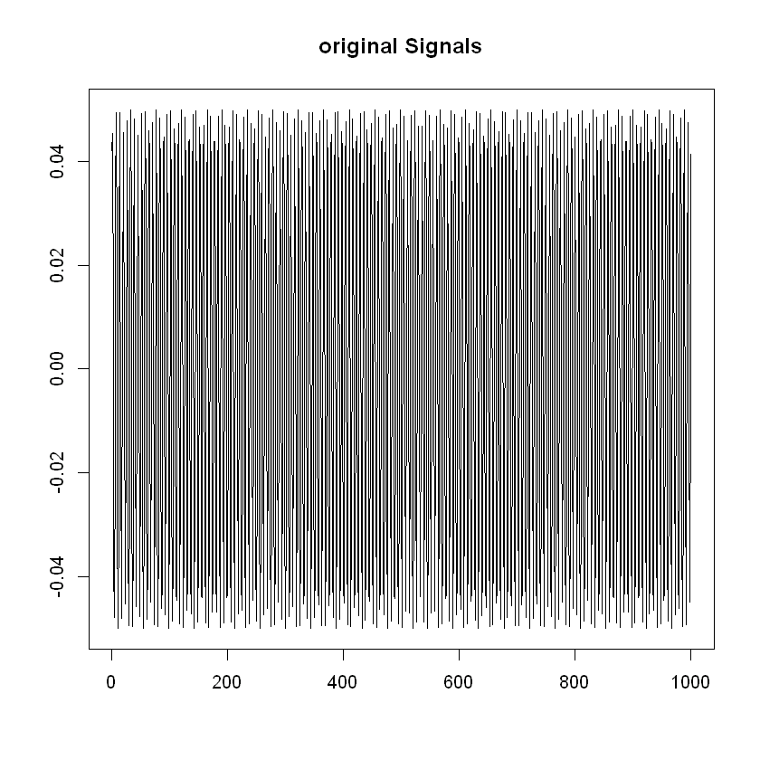

    plot(1:1000, S[,2], type="l", xlab="", ylab="")

    Error in cairo_pdf(tf, width, height, pointsize, FALSE, family, bg, antialias): unable to load winCairo.dll: was it built?
    

    Error in svg(tf, width, height, pointsize, FALSE, family, bg, antialias): unable to load winCairo.dll: was it built?
    

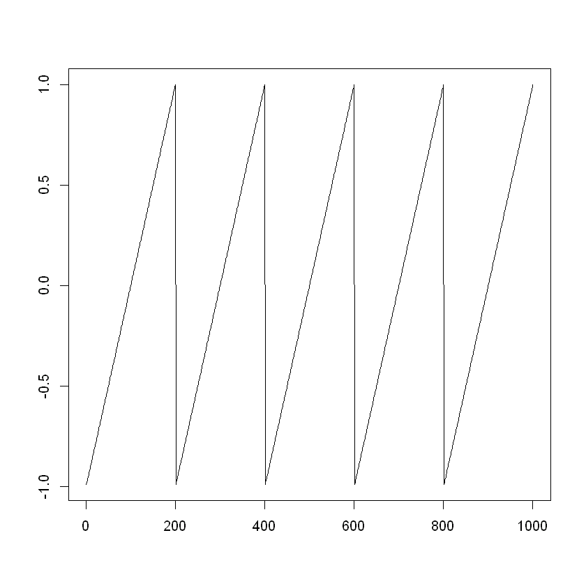

    plot(1:1000, X[,1], type="l", main="Mixed Signals", xlab="", ylab="")

    Error in cairo_pdf(tf, width, height, pointsize, FALSE, family, bg, antialias): unable to load winCairo.dll: was it built?
    

    Error in svg(tf, width, height, pointsize, FALSE, family, bg, antialias): unable to load winCairo.dll: was it built?
    

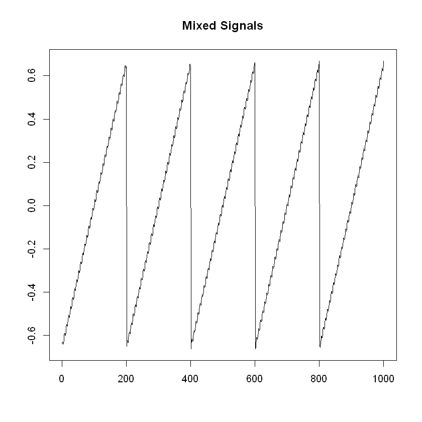

    plot(1:1000, X[,2], type="l", xlab="", ylab="")

    Error in cairo_pdf(tf, width, height, pointsize, FALSE, family, bg, antialias): unable to load winCairo.dll: was it built?
    

    Error in svg(tf, width, height, pointsize, FALSE, family, bg, antialias): unable to load winCairo.dll: was it built?
    

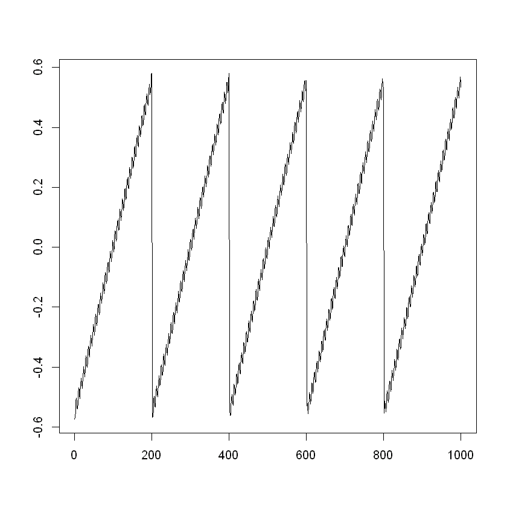

    plot(1:1000, a$S[,1], type="l", main="ICA source estimates", xlab="", ylab="")

    Error in cairo_pdf(tf, width, height, pointsize, FALSE, family, bg, antialias): unable to load winCairo.dll: was it built?
    

    Error in svg(tf, width, height, pointsize, FALSE, family, bg, antialias): unable to load winCairo.dll: was it built?
    

    plot(1:1000, a$S[,2], type="l", xlab="", ylab="")

    Error in cairo_pdf(tf, width, height, pointsize, FALSE, family, bg, antialias): unable to load winCairo.dll: was it built?
    

    Error in svg(tf, width, height, pointsize, FALSE, family, bg, antialias): unable to load winCairo.dll: was it built?
    

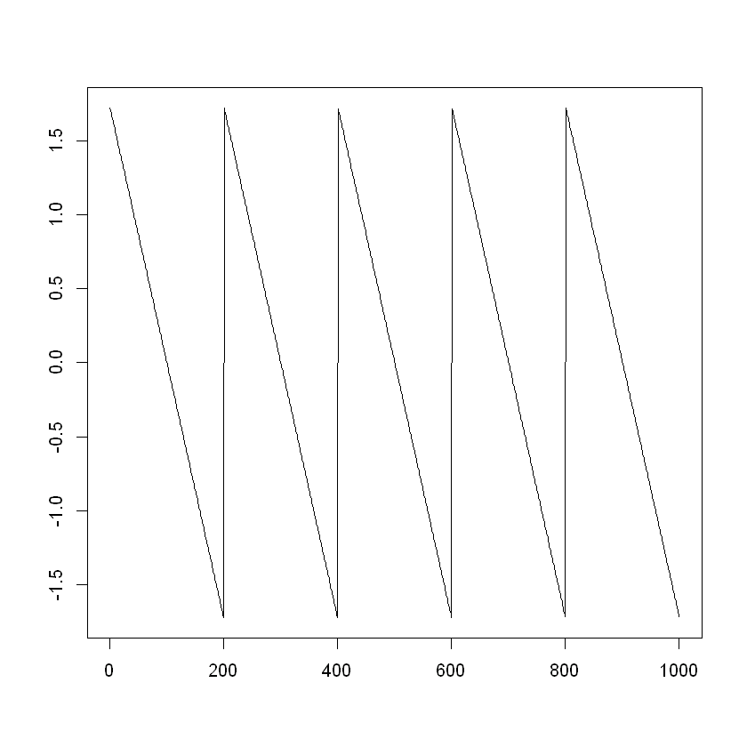

    S <- matrix(runif(1000), 500, 2)

    A <- matrix(c(1,1,-1,3),2,2,byrow=T)

    X <- S%*%A

    a <- fastICA(X, 2, alg.typ="parallel", fun="logcosh", alpha=1, method="C", row.norm=F, maxit=200, tol=1e-4, verbose=T)

    Centering
    Whitening
    Symmetric FastICA using logcosh approx. to neg-entropy function
    Iteration 1 tol=0.000339
    Iteration 2 tol=0.000000
    

    library(psych)

    data(Harman)

    head(Harman.Holzinger)

<table>
<thead><tr><th></th><th scope=col>Word_meaning</th><th scope=col>Sentence_completion</th><th scope=col>Odd_words</th><th scope=col>Mixed_Arithmetic</th><th scope=col>Remainders</th><th scope=col>Missing_Numbers</th><th scope=col>Gloves</th><th scope=col>Boots</th><th scope=col>Hatchets</th></tr></thead>
<tbody>
	<tr><th scope=row>Word_meaning</th><td>1.00</td><td>0.75</td><td>0.78</td><td>0.44</td><td>0.45</td><td>0.51</td><td>0.21</td><td>0.30</td><td>0.31</td></tr>
	<tr><th scope=row>Sentence_completion</th><td>0.75</td><td>1.00</td><td>0.72</td><td>0.52</td><td>0.53</td><td>0.58</td><td>0.23</td><td>0.32</td><td>0.30</td></tr>
	<tr><th scope=row>Odd_words</th><td>0.78</td><td>0.72</td><td>1.00</td><td>0.47</td><td>0.48</td><td>0.54</td><td>0.28</td><td>0.37</td><td>0.37</td></tr>
	<tr><th scope=row>Mixed_Arithmetic</th><td>0.44</td><td>0.52</td><td>0.47</td><td>1.00</td><td>0.82</td><td>0.82</td><td>0.33</td><td>0.33</td><td>0.31</td></tr>
	<tr><th scope=row>Remainders</th><td>0.45</td><td>0.53</td><td>0.48</td><td>0.82</td><td>1.00</td><td>0.74</td><td>0.37</td><td>0.36</td><td>0.36</td></tr>
	<tr><th scope=row>Missing_Numbers</th><td>0.51</td><td>0.58</td><td>0.54</td><td>0.82</td><td>0.74</td><td>1.00</td><td>0.35</td><td>0.38</td><td>0.38</td></tr>
</tbody>
</table>

    cor.plot(Harman.Holzinger)

    Error in cairo_pdf(tf, width, height, pointsize, FALSE, family, bg, antialias): unable to load winCairo.dll: was it built?
    

    Error in svg(tf, width, height, pointsize, FALSE, family, bg, antialias): unable to load winCairo.dll: was it built?
    

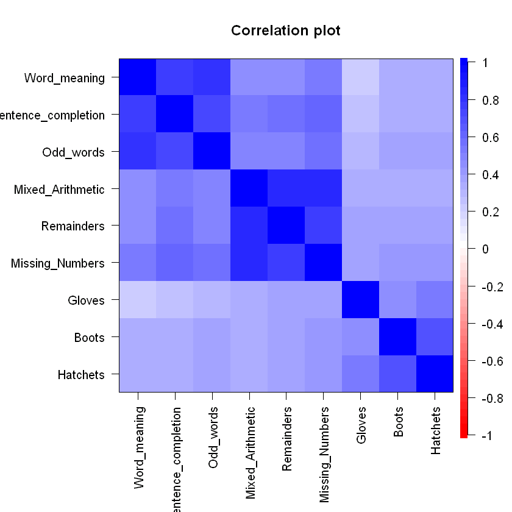

    cor.plot(Harman.Burt)

    Error in cairo_pdf(tf, width, height, pointsize, FALSE, family, bg, antialias): unable to load winCairo.dll: was it built?
    

    Error in svg(tf, width, height, pointsize, FALSE, family, bg, antialias): unable to load winCairo.dll: was it built?
    

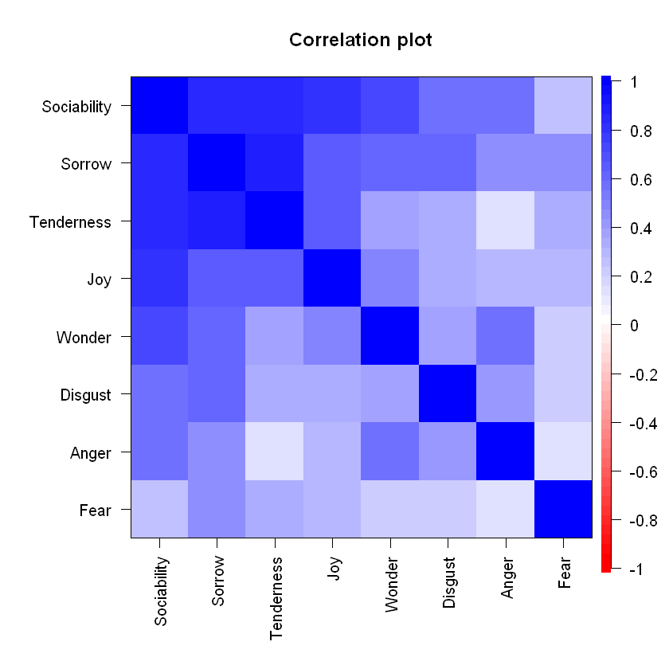

    smc(Harman.Burt)

    Warning message:
    In cor.smooth(R): Matrix was not positive definite, smoothing was done

<dl class=dl-horizontal>
	<dt>Sociability</dt>
		<dd>0.999999999693549</dd>
	<dt>Sorrow</dt>
		<dd>0.999999999481658</dd>
	<dt>Tenderness</dt>
		<dd>0.999999999711894</dd>
	<dt>Joy</dt>
		<dd>0.999999995227378</dd>
	<dt>Wonder</dt>
		<dd>0.999999997397598</dd>
	<dt>Disgust</dt>
		<dd>0.999999997438876</dd>
	<dt>Anger</dt>
		<dd>0.999999997454296</dd>
	<dt>Fear</dt>
		<dd>0.998748140747591</dd>
</dl>

    data(Harman74.cor)

    (Harman74.FA <- factanal(factors=1, covmat=Harman74.cor))

    
    Call:
    factanal(factors = 1, covmat = Harman74.cor)
    
    Uniquenesses:
          VisualPerception                  Cubes         PaperFormBoard 
                     0.677                  0.866                  0.830 
                     Flags     GeneralInformation  PargraphComprehension 
                     0.768                  0.487                  0.491 
        SentenceCompletion     WordClassification            WordMeaning 
                     0.500                  0.514                  0.474 
                  Addition                   Code           CountingDots 
                     0.818                  0.731                  0.824 
    StraightCurvedCapitals        WordRecognition      NumberRecognition 
                     0.681                  0.833                  0.863 
         FigureRecognition           ObjectNumber           NumberFigure 
                     0.775                  0.812                  0.778 
                FigureWord              Deduction       NumericalPuzzles 
                     0.816                  0.612                  0.676 
          ProblemReasoning       SeriesCompletion     ArithmeticProblems 
                     0.619                  0.524                  0.593 
    
    Loadings:
                           Factor1
    VisualPerception       0.569  
    Cubes                  0.366  
    PaperFormBoard         0.412  
    Flags                  0.482  
    GeneralInformation     0.716  
    PargraphComprehension  0.713  
    SentenceCompletion     0.707  
    WordClassification     0.697  
    WordMeaning            0.725  
    Addition               0.426  
    Code                   0.519  
    CountingDots           0.419  
    StraightCurvedCapitals 0.565  
    WordRecognition        0.408  
    NumberRecognition      0.370  
    FigureRecognition      0.474  
    ObjectNumber           0.434  
    NumberFigure           0.471  
    FigureWord             0.429  
    Deduction              0.623  
    NumericalPuzzles       0.569  
    ProblemReasoning       0.617  
    SeriesCompletion       0.690  
    ArithmeticProblems     0.638  
    
                   Factor1
    SS loadings      7.438
    Proportion Var   0.310
    
    Test of the hypothesis that 1 factor is sufficient.
    The chi square statistic is 622.91 on 252 degrees of freedom.
    The p-value is 2.28e-33 

    for(factors in 2:5){
        print(update(Harman74.FA, factors=factors))
    }

    
    Call:
    factanal(factors = factors, covmat = Harman74.cor)
    
    Uniquenesses:
          VisualPerception                  Cubes         PaperFormBoard 
                     0.650                  0.864                  0.844 
                     Flags     GeneralInformation  PargraphComprehension 
                     0.778                  0.375                  0.316 
        SentenceCompletion     WordClassification            WordMeaning 
                     0.319                  0.503                  0.258 
                  Addition                   Code           CountingDots 
                     0.670                  0.608                  0.581 
    StraightCurvedCapitals        WordRecognition      NumberRecognition 
                     0.567                  0.832                  0.850 
         FigureRecognition           ObjectNumber           NumberFigure 
                     0.743                  0.770                  0.625 
                FigureWord              Deduction       NumericalPuzzles 
                     0.792                  0.629                  0.579 
          ProblemReasoning       SeriesCompletion     ArithmeticProblems 
                     0.634                  0.539                  0.553 
    
    Loadings:
                           Factor1 Factor2
    VisualPerception       0.506   0.306  
    Cubes                  0.304   0.209  
    PaperFormBoard         0.297   0.260  
    Flags                  0.327   0.339  
    GeneralInformation     0.240   0.753  
    PargraphComprehension  0.171   0.809  
    SentenceCompletion     0.163   0.809  
    WordClassification     0.344   0.615  
    WordMeaning            0.148   0.849  
    Addition               0.563   0.115  
    Code                   0.591   0.207  
    CountingDots           0.647          
    StraightCurvedCapitals 0.612   0.241  
    WordRecognition        0.315   0.263  
    NumberRecognition      0.328   0.205  
    FigureRecognition      0.457   0.218  
    ObjectNumber           0.431   0.209  
    NumberFigure           0.601   0.116  
    FigureWord             0.399   0.222  
    Deduction              0.379   0.477  
    NumericalPuzzles       0.604   0.237  
    ProblemReasoning       0.390   0.462  
    SeriesCompletion       0.486   0.474  
    ArithmeticProblems     0.544   0.389  
    
                   Factor1 Factor2
    SS loadings      4.573   4.548
    Proportion Var   0.191   0.190
    Cumulative Var   0.191   0.380
    
    Test of the hypothesis that 2 factors are sufficient.
    The chi square statistic is 420.24 on 229 degrees of freedom.
    The p-value is 2.01e-13 
    
    Call:
    factanal(factors = factors, covmat = Harman74.cor)
    
    Uniquenesses:
          VisualPerception                  Cubes         PaperFormBoard 
                     0.500                  0.793                  0.662 
                     Flags     GeneralInformation  PargraphComprehension 
                     0.694                  0.352                  0.316 
        SentenceCompletion     WordClassification            WordMeaning 
                     0.300                  0.502                  0.256 
                  Addition                   Code           CountingDots 
                     0.200                  0.586                  0.494 
    StraightCurvedCapitals        WordRecognition      NumberRecognition 
                     0.569                  0.838                  0.848 
         FigureRecognition           ObjectNumber           NumberFigure 
                     0.643                  0.780                  0.635 
                FigureWord              Deduction       NumericalPuzzles 
                     0.788                  0.590                  0.580 
          ProblemReasoning       SeriesCompletion     ArithmeticProblems 
                     0.597                  0.498                  0.500 
    
    Loadings:
                           Factor1 Factor2 Factor3
    VisualPerception        0.176   0.656   0.198 
    Cubes                   0.122   0.428         
    PaperFormBoard          0.145   0.563         
    Flags                   0.239   0.487   0.107 
    GeneralInformation      0.745   0.191   0.237 
    PargraphComprehension   0.780   0.249   0.118 
    SentenceCompletion      0.802   0.175   0.160 
    WordClassification      0.571   0.327   0.256 
    WordMeaning             0.821   0.248         
    Addition                0.162  -0.118   0.871 
    Code                    0.198   0.219   0.572 
    CountingDots                    0.179   0.688 
    StraightCurvedCapitals  0.190   0.381   0.499 
    WordRecognition         0.231   0.253   0.210 
    NumberRecognition       0.158   0.299   0.195 
    FigureRecognition       0.108   0.557   0.186 
    ObjectNumber            0.178   0.267   0.342 
    NumberFigure                    0.427   0.424 
    FigureWord              0.167   0.355   0.240 
    Deduction               0.392   0.472   0.181 
    NumericalPuzzles        0.178   0.406   0.473 
    ProblemReasoning        0.382   0.473   0.182 
    SeriesCompletion        0.379   0.528   0.283 
    ArithmeticProblems      0.377   0.226   0.554 
    
                   Factor1 Factor2 Factor3
    SS loadings      3.802   3.488   3.186
    Proportion Var   0.158   0.145   0.133
    Cumulative Var   0.158   0.304   0.436
    
    Test of the hypothesis that 3 factors are sufficient.
    The chi square statistic is 295.59 on 207 degrees of freedom.
    The p-value is 5.12e-05 
    
    Call:
    factanal(factors = factors, covmat = Harman74.cor)
    
    Uniquenesses:
          VisualPerception                  Cubes         PaperFormBoard 
                     0.438                  0.780                  0.644 
                     Flags     GeneralInformation  PargraphComprehension 
                     0.651                  0.352                  0.312 
        SentenceCompletion     WordClassification            WordMeaning 
                     0.283                  0.485                  0.257 
                  Addition                   Code           CountingDots 
                     0.240                  0.551                  0.435 
    StraightCurvedCapitals        WordRecognition      NumberRecognition 
                     0.491                  0.646                  0.696 
         FigureRecognition           ObjectNumber           NumberFigure 
                     0.549                  0.598                  0.593 
                FigureWord              Deduction       NumericalPuzzles 
                     0.762                  0.592                  0.583 
          ProblemReasoning       SeriesCompletion     ArithmeticProblems 
                     0.601                  0.497                  0.500 
    
    Loadings:
                           Factor1 Factor2 Factor3 Factor4
    VisualPerception        0.160   0.689   0.187   0.160 
    Cubes                   0.117   0.436                 
    PaperFormBoard          0.137   0.570           0.110 
    Flags                   0.233   0.527                 
    GeneralInformation      0.739   0.185   0.213   0.150 
    PargraphComprehension   0.767   0.205           0.233 
    SentenceCompletion      0.806   0.197   0.153         
    WordClassification      0.569   0.339   0.242   0.132 
    WordMeaning             0.806   0.201           0.227 
    Addition                0.167  -0.118   0.831   0.166 
    Code                    0.180   0.120   0.512   0.374 
    CountingDots                    0.210   0.716         
    StraightCurvedCapitals  0.188   0.438   0.525         
    WordRecognition         0.197                   0.553 
    NumberRecognition       0.122   0.116           0.520 
    FigureRecognition               0.408           0.525 
    ObjectNumber            0.142           0.219   0.574 
    NumberFigure                    0.293   0.336   0.456 
    FigureWord              0.148   0.239   0.161   0.365 
    Deduction               0.378   0.402   0.118   0.301 
    NumericalPuzzles        0.175   0.381   0.438   0.223 
    ProblemReasoning        0.366   0.399   0.123   0.301 
    SeriesCompletion        0.369   0.500   0.244   0.239 
    ArithmeticProblems      0.370   0.158   0.496   0.304 
    
                   Factor1 Factor2 Factor3 Factor4
    SS loadings      3.647   2.872   2.657   2.290
    Proportion Var   0.152   0.120   0.111   0.095
    Cumulative Var   0.152   0.272   0.382   0.478
    
    Test of the hypothesis that 4 factors are sufficient.
    The chi square statistic is 226.68 on 186 degrees of freedom.
    The p-value is 0.0224 
    
    Call:
    factanal(factors = factors, covmat = Harman74.cor)
    
    Uniquenesses:
          VisualPerception                  Cubes         PaperFormBoard 
                     0.450                  0.781                  0.639 
                     Flags     GeneralInformation  PargraphComprehension 
                     0.649                  0.357                  0.288 
        SentenceCompletion     WordClassification            WordMeaning 
                     0.277                  0.485                  0.262 
                  Addition                   Code           CountingDots 
                     0.215                  0.386                  0.444 
    StraightCurvedCapitals        WordRecognition      NumberRecognition 
                     0.256                  0.639                  0.706 
         FigureRecognition           ObjectNumber           NumberFigure 
                     0.550                  0.614                  0.596 
                FigureWord              Deduction       NumericalPuzzles 
                     0.764                  0.521                  0.564 
          ProblemReasoning       SeriesCompletion     ArithmeticProblems 
                     0.580                  0.442                  0.478 
    
    Loadings:
                           Factor1 Factor2 Factor3 Factor4 Factor5
    VisualPerception        0.161   0.658   0.136   0.182   0.199 
    Cubes                   0.113   0.435           0.107         
    PaperFormBoard          0.135   0.562           0.107   0.116 
    Flags                   0.231   0.533                         
    GeneralInformation      0.736   0.188   0.192   0.162         
    PargraphComprehension   0.775   0.187           0.251   0.113 
    SentenceCompletion      0.809   0.208   0.136                 
    WordClassification      0.568   0.348   0.223   0.131         
    WordMeaning             0.800   0.215           0.224         
    Addition                0.175  -0.100   0.844   0.176         
    Code                    0.185           0.438   0.451   0.426 
    CountingDots                    0.222   0.690   0.101   0.140 
    StraightCurvedCapitals  0.186   0.425   0.458           0.559 
    WordRecognition         0.197                   0.557         
    NumberRecognition       0.121   0.130           0.508         
    FigureRecognition               0.400           0.529         
    ObjectNumber            0.145           0.208   0.562         
    NumberFigure                    0.306   0.325   0.452         
    FigureWord              0.147   0.242   0.145   0.364         
    Deduction               0.370   0.452   0.139   0.287  -0.190 
    NumericalPuzzles        0.170   0.402   0.439   0.230         
    ProblemReasoning        0.358   0.423   0.126   0.302         
    SeriesCompletion        0.360   0.549   0.256   0.223  -0.107 
    ArithmeticProblems      0.371   0.185   0.502   0.307         
    
                   Factor1 Factor2 Factor3 Factor4 Factor5
    SS loadings      3.632   2.964   2.456   2.345   0.663
    Proportion Var   0.151   0.124   0.102   0.098   0.028
    Cumulative Var   0.151   0.275   0.377   0.475   0.503
    
    Test of the hypothesis that 5 factors are sufficient.
    The chi square statistic is 186.82 on 166 degrees of freedom.
    The p-value is 0.128 
    

    Harman74.FA <- factanal(factors=5, covmat=Harman74.cor, rotation="promax")

    print(Harman74.FA$loadings, sort=T)

    
    Loadings:
                           Factor1 Factor2 Factor3 Factor4 Factor5
    VisualPerception        0.831          -0.127           0.230 
    Cubes                   0.534                                 
    PaperFormBoard          0.736          -0.290           0.136 
    Flags                   0.647                  -0.104         
    SeriesCompletion        0.555   0.126   0.127                 
    GeneralInformation              0.764                         
    PargraphComprehension           0.845  -0.140   0.140         
    SentenceCompletion              0.872          -0.140         
    WordClassification      0.277   0.505   0.104                 
    WordMeaning                     0.846  -0.108                 
    Addition               -0.334           1.012                 
    CountingDots            0.206  -0.200   0.722           0.185 
    ArithmeticProblems              0.197   0.500   0.139         
    WordRecognition        -0.126   0.127  -0.103   0.657         
    NumberRecognition                               0.568         
    FigureRecognition       0.399  -0.142  -0.207   0.562         
    ObjectNumber           -0.108           0.107   0.613         
    StraightCurvedCapitals  0.542           0.247           0.618 
    Code                            0.112   0.288   0.486   0.424 
    NumberFigure            0.255  -0.230   0.211   0.413         
    FigureWord              0.187                   0.347         
    Deduction               0.404   0.169           0.117  -0.203 
    NumericalPuzzles        0.393           0.368                 
    ProblemReasoning        0.381   0.188           0.169         
    
                   Factor1 Factor2 Factor3 Factor4 Factor5
    SS loadings      3.529   3.311   2.367   2.109   0.762
    Proportion Var   0.147   0.138   0.099   0.088   0.032
    Cumulative Var   0.147   0.285   0.384   0.471   0.503
    

    library(MASS)

    loc <- cmdscale(eurodist)

    eurodist

                    Athens Barcelona Brussels Calais Cherbourg Cologne Copenhagen
    Barcelona         3313                                                       
    Brussels          2963      1318                                             
    Calais            3175      1326      204                                    
    Cherbourg         3339      1294      583    460                             
    Cologne           2762      1498      206    409       785                   
    Copenhagen        3276      2218      966   1136      1545     760           
    Geneva            2610       803      677    747       853    1662       1418
    Gibraltar         4485      1172     2256   2224      2047    2436       3196
    Hamburg           2977      2018      597    714      1115     460        460
    Hook of Holland   3030      1490      172    330       731     269        269
    Lisbon            4532      1305     2084   2052      1827    2290       2971
    Lyons             2753       645      690    739       789     714       1458
    Madrid            3949       636     1558   1550      1347    1764       2498
    Marseilles        2865       521     1011   1059      1101    1035       1778
    Milan             2282      1014      925   1077      1209     911       1537
    Munich            2179      1365      747    977      1160     583       1104
    Paris             3000      1033      285    280       340     465       1176
    Rome               817      1460     1511   1662      1794    1497       2050
    Stockholm         3927      2868     1616   1786      2196    1403        650
    Vienna            1991      1802     1175   1381      1588     937       1455
                    Geneva Gibraltar Hamburg Hook of Holland Lisbon Lyons Madrid
    Barcelona                                                                   
    Brussels                                                                    
    Calais                                                                      
    Cherbourg                                                                   
    Cologne                                                                     
    Copenhagen                                                                  
    Geneva                                                                      
    Gibraltar         1975                                                      
    Hamburg           1118      2897                                            
    Hook of Holland    895      2428     550                                    
    Lisbon            1936       676    2671            2280                    
    Lyons              158      1817    1159             863   1178             
    Madrid            1439       698    2198            1730    668  1281       
    Marseilles         425      1693    1479            1183   1762   320   1157
    Milan              328      2185    1238            1098   2250   328   1724
    Munich             591      2565     805             851   2507   724   2010
    Paris              513      1971     877             457   1799   471   1273
    Rome               995      2631    1751            1683   2700  1048   2097
    Stockholm         2068      3886     949            1500   3231  2108   3188
    Vienna            1019      2974    1155            1205   2937  1157   2409
                    Marseilles Milan Munich Paris Rome Stockholm
    Barcelona                                                   
    Brussels                                                    
    Calais                                                      
    Cherbourg                                                   
    Cologne                                                     
    Copenhagen                                                  
    Geneva                                                      
    Gibraltar                                                   
    Hamburg                                                     
    Hook of Holland                                             
    Lisbon                                                      
    Lyons                                                       
    Madrid                                                      
    Marseilles                                                  
    Milan                  618                                  
    Munich                1109   331                            
    Paris                  792   856    821                     
    Rome                  1011   586    946  1476               
    Stockholm             2428  2187   1754  1827 2707          
    Vienna                1363   898    428  1249 1209      2105

    x

<dl class=dl-horizontal>
	<dt>Athens</dt>
		<dd>2290.27467963145</dd>
	<dt>Barcelona</dt>
		<dd>-825.382790353334</dd>
	<dt>Brussels</dt>
		<dd>59.1833405458657</dd>
	<dt>Calais</dt>
		<dd>-82.8459728969909</dd>
	<dt>Cherbourg</dt>
		<dd>-352.49943488816</dd>
	<dt>Cologne</dt>
		<dd>293.68963314387</dd>
	<dt>Copenhagen</dt>
		<dd>681.931544529409</dd>
	<dt>Geneva</dt>
		<dd>-9.42336381041896</dd>
	<dt>Gibraltar</dt>
		<dd>-2048.44911286586</dd>
	<dt>Hamburg</dt>
		<dd>561.108969942274</dd>
	<dt>Hook of Holland</dt>
		<dd>164.921799492001</dd>
	<dt>Lisbon</dt>
		<dd>-1935.04081056606</dd>
	<dt>Lyons</dt>
		<dd>-226.423236427646</dd>
	<dt>Madrid</dt>
		<dd>-1423.35369659784</dd>
	<dt>Marseilles</dt>
		<dd>-299.498710000714</dd>
	<dt>Milan</dt>
		<dd>260.878045666042</dd>
	<dt>Munich</dt>
		<dd>587.675678948474</dd>
	<dt>Paris</dt>
		<dd>-156.836256801961</dd>
	<dt>Rome</dt>
		<dd>709.413281661989</dd>
	<dt>Stockholm</dt>
		<dd>839.445911169535</dd>
	<dt>Vienna</dt>
		<dd>911.230500478075</dd>
</dl>

    x <- loc[,1]

    y <- -loc[,2]

    plot(x, y, type="n", xlab="Coordinate 1", ylab="Coordinate 2", asp=1, main="Metric MDS")

    Error in cairo_pdf(tf, width, height, pointsize, FALSE, family, bg, antialias): unable to load winCairo.dll: was it built?
    

    Error in svg(tf, width, height, pointsize, FALSE, family, bg, antialias): unable to load winCairo.dll: was it built?
    

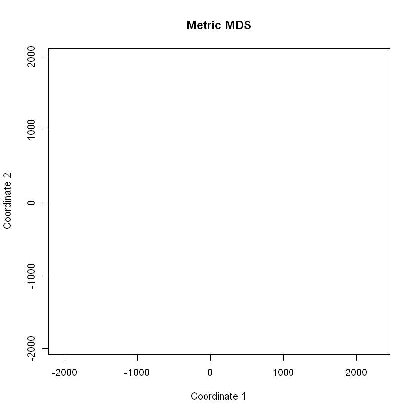

    text(x, y, rownames(loc), cex=0.7)

    Error in text.default(x, y, rownames(loc), cex = 0.7): plot.new has not been called yet
    

    library(MASS)

    data(swiss)

    swiss.x <- as.matrix(swiss[,-1])

    swiss.dist <- dist(swiss.x)

    swiss.mds <- isoMDS(swiss.dist)

    initial  value 2.979731 
    iter   5 value 2.431486
    iter  10 value 2.343353
    final  value 2.338839 
    converged
    

    plot(swiss.mds$points, type="n")

    Error in cairo_pdf(tf, width, height, pointsize, FALSE, family, bg, antialias): unable to load winCairo.dll: was it built?
    

    Error in svg(tf, width, height, pointsize, FALSE, family, bg, antialias): unable to load winCairo.dll: was it built?
    

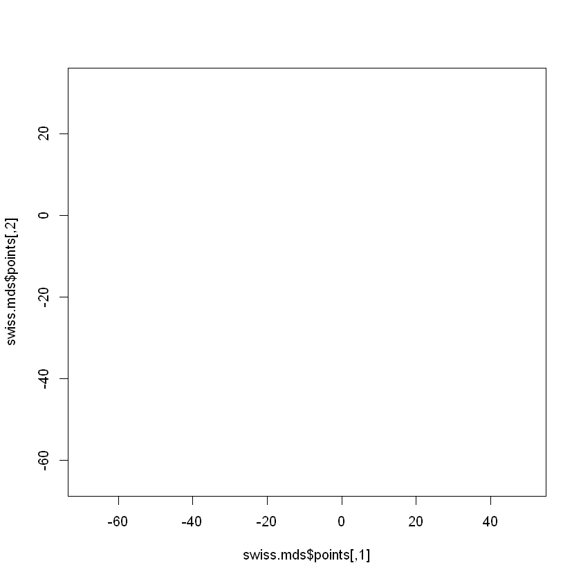

    swiss.x <- as.matrix(swiss[,-1])

    swiss.sam <- sammon(dist(swiss.x))

    Initial stress        : 0.00824
    stress after  10 iters: 0.00439, magic = 0.338
    stress after  20 iters: 0.00383, magic = 0.500
    stress after  30 iters: 0.00383, magic = 0.500
    

    swiss.sam

    Error in vapply(seq_along(mapped), function(i) {: 길이가 반드시 1이어야 하지만,
    FUN(X[[3]])의 결과는 길이 0 입니다
    

    $points
                       [,1]       [,2]
    Courtelary    41.547171 -18.918701
    Delemont     -40.720544 -17.862393
    Franches-Mnt -49.930840 -26.660688
    Moutier       10.337064  -9.002244
    Neuveville    35.008329   3.700321
    Porrentruy   -43.981743 -30.044501
    Broye        -53.961036   4.662666
    Glane        -57.735863   1.306075
    Gruyere      -56.178650 -13.581662
    Sarine       -46.812706 -19.291445
    Veveyse      -59.090223  -2.276227
    Aigle         23.981129  19.668050
    Aubonne       31.670988  29.239629
    Avenches      30.873834  21.316451
    Cossonay      26.423248  30.288934
    Echallens      8.362595  27.607783
    Grandson      43.276714  -2.086955
    Lausanne      34.066515 -28.147974
    La Vallee     53.667974 -24.690670
    Lavaux        26.373380  33.931533
    Morges        27.865651  18.346204
    Moudon        37.902636  17.917360
    Nyone         23.817964   7.238981
    Orbe          32.046500  14.357752
    Oron          32.517781  35.337672
    Payerne       34.676389  19.877845
    Paysd'enhaut  38.549097  28.926763
    Rolle         26.878101  21.096333
    Vevey         28.848541 -17.910507
    Yverdon       35.630287  10.930264
    Conthey      -69.706658  19.555797
    Entremont    -64.682143  18.029626
    Herens       -68.100123  23.589478
    Martigwy     -62.653294  10.903239
    Monthey      -63.462750  -3.453633
    St Maurice   -64.581268   7.742430
    Sierre       -68.873610  17.926141
    Sion         -55.437385  -4.838130
    Boudry        35.589581  -2.998100
    La Chauxdfnd  44.557752 -32.621583
    Le Locle      40.938674 -22.375306
    Neuchatel     31.631914 -36.709943
    Val de Ruz    41.410567   1.450610
    ValdeTravers  46.190523 -17.422161
    V. De Geneve  16.681938 -66.746039
    Rive Droite   -7.483315 -13.741128
    Rive Gauche   -7.930684 -33.567948
    
    $stress
    [1] 0.003826093
    
    $call
    sammon(d = dist(swiss.x))
    

    install.packages(c("arules"), repos='http://cran.rstudio.com/')

    package 'arules' successfully unpacked and MD5 sums checked
    
    The downloaded binary packages are in
    	C:\Users\syleeie\AppData\Local\Temp\Rtmp2xQ7Ua\downloaded_packages
    

    library(arules)

    Loading required package: Matrix
    
    Attaching package: 'arules'
    
    The following objects are masked from 'package:base':
    
        %in%, write
    
    

    a_list <- list(c("a","b","c"), c("a","b"), c("a","b","d"), c("c","e"), c("a","b","d","e"))

    names(a_list) <- paste("Tr", c(1:5), sep="")

    a_list

<dl>
	<dt>$Tr1</dt>
		<dd><ol class=list-inline>
	<li>"a"</li>
	<li>"b"</li>
	<li>"c"</li>
</ol>
</dd>
	<dt>$Tr2</dt>
		<dd><ol class=list-inline>
	<li>"a"</li>
	<li>"b"</li>
</ol>
</dd>
	<dt>$Tr3</dt>
		<dd><ol class=list-inline>
	<li>"a"</li>
	<li>"b"</li>
	<li>"d"</li>
</ol>
</dd>
	<dt>$Tr4</dt>
		<dd><ol class=list-inline>
	<li>"c"</li>
	<li>"e"</li>
</ol>
</dd>
	<dt>$Tr5</dt>
		<dd><ol class=list-inline>
	<li>"a"</li>
	<li>"b"</li>
	<li>"d"</li>
	<li>"e"</li>
</ol>
</dd>
</dl>

    trans <- as(a_list, "transactions")

    summary(trans)

    transactions as itemMatrix in sparse format with
     5 rows (elements/itemsets/transactions) and
     5 columns (items) and a density of 0.56 
    
    most frequent items:
          a       b       c       d       e (Other) 
          4       4       2       2       2       0 
    
    element (itemset/transaction) length distribution:
    sizes
    2 3 4 
    2 2 1 
    
       Min. 1st Qu.  Median    Mean 3rd Qu.    Max. 
        2.0     2.0     3.0     2.8     3.0     4.0 
    
    includes extended item information - examples:
      labels
    1      a
    2      b
    3      c
    
    includes extended transaction information - examples:
      transactionID
    1           Tr1
    2           Tr2
    3           Tr3

    image(trans)

    

    Error in cairo_pdf(tf, width, height, pointsize, FALSE, family, bg, antialias): unable to load winCairo.dll: was it built?
    

    Error in svg(tf, width, height, pointsize, FALSE, family, bg, antialias): unable to load winCairo.dll: was it built?
    

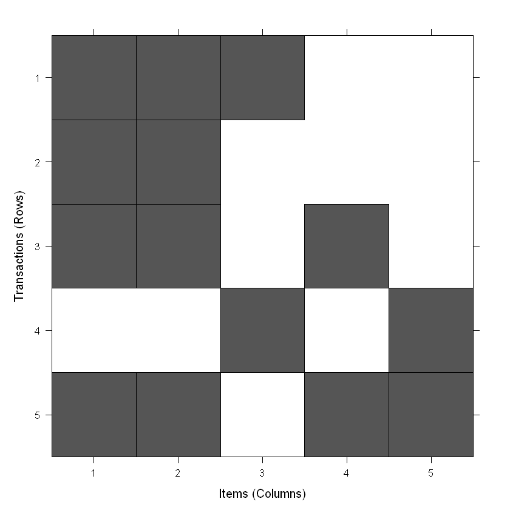

    a_matrix <- matrix(c(1,1,1,0,0,1,1,0,0,0,1,1,0,1,0,0,0,1,0,1,1,1,0,1,1), ncol=5)

    dimnames(a_matrix) <- list(c("a","b","c","d","e"), paste("Tr",c(1:5),sep=""))

    a_matrix

<table>
<thead><tr><th></th><th scope=col>Tr1</th><th scope=col>Tr2</th><th scope=col>Tr3</th><th scope=col>Tr4</th><th scope=col>Tr5</th></tr></thead>
<tbody>
	<tr><th scope=row>a</th><td>1</td><td>1</td><td>1</td><td>0</td><td>1</td></tr>
	<tr><th scope=row>b</th><td>1</td><td>1</td><td>1</td><td>0</td><td>1</td></tr>
	<tr><th scope=row>c</th><td>1</td><td>0</td><td>0</td><td>1</td><td>0</td></tr>
	<tr><th scope=row>d</th><td>0</td><td>0</td><td>1</td><td>0</td><td>1</td></tr>
	<tr><th scope=row>e</th><td>0</td><td>0</td><td>0</td><td>1</td><td>1</td></tr>
</tbody>
</table>

    trans2 <- as(a_matrix, "transactions")

    trans2

    transactions in sparse format with
     5 transactions (rows) and
     5 items (columns)

    image(trans2)

    

    Error in cairo_pdf(tf, width, height, pointsize, FALSE, family, bg, antialias): unable to load winCairo.dll: was it built?
    

    Error in svg(tf, width, height, pointsize, FALSE, family, bg, antialias): unable to load winCairo.dll: was it built?
    

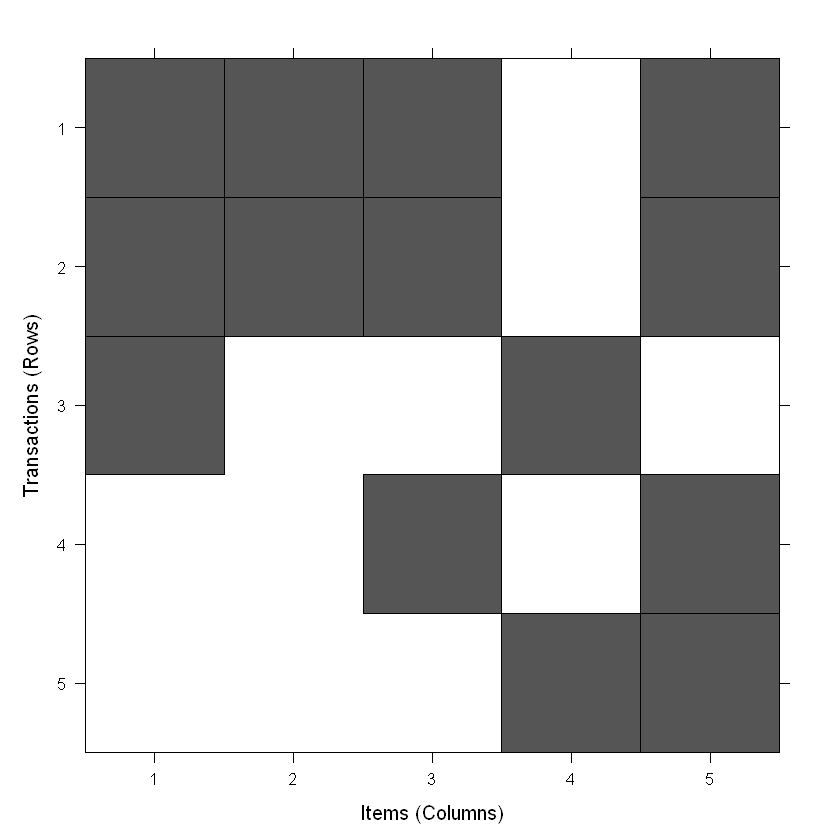

    a_data.frame <- data.frame(age=as.factor(c(6,8,7,6,9,5)), grade=as.factor(c(1,3,1,1,4,1)))

    a_data.frame

<table>
<thead><tr><th></th><th scope=col>age</th><th scope=col>grade</th></tr></thead>
<tbody>
	<tr><th scope=row>1</th><td>6</td><td>1</td></tr>
	<tr><th scope=row>2</th><td>8</td><td>3</td></tr>
	<tr><th scope=row>3</th><td>7</td><td>1</td></tr>
	<tr><th scope=row>4</th><td>6</td><td>1</td></tr>
	<tr><th scope=row>5</th><td>9</td><td>4</td></tr>
	<tr><th scope=row>6</th><td>5</td><td>1</td></tr>
</tbody>
</table>

    trans3 <- as(a_data.frame, "transactions")

    image(trans3)

    

    Error in cairo_pdf(tf, width, height, pointsize, FALSE, family, bg, antialias): unable to load winCairo.dll: was it built?
    

    Error in svg(tf, width, height, pointsize, FALSE, family, bg, antialias): unable to load winCairo.dll: was it built?
    

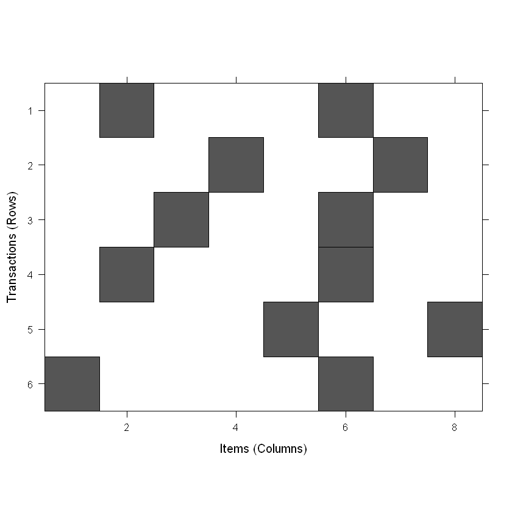

    a_df <- sample(c(LETTERS[1:5], NA), 10, T)

    a_df <- data.frame(X=a_df, Y=sample(a_df))

    a_df

<table>
<thead><tr><th></th><th scope=col>X</th><th scope=col>Y</th></tr></thead>
<tbody>
	<tr><th scope=row>1</th><td>E</td><td>E</td></tr>
	<tr><th scope=row>2</th><td>E</td><td>E</td></tr>
	<tr><th scope=row>3</th><td>C</td><td>NA</td></tr>
	<tr><th scope=row>4</th><td>NA</td><td>E</td></tr>
	<tr><th scope=row>5</th><td>A</td><td>NA</td></tr>
	<tr><th scope=row>6</th><td>E</td><td>C</td></tr>
	<tr><th scope=row>7</th><td>E</td><td>E</td></tr>
	<tr><th scope=row>8</th><td>E</td><td>C</td></tr>
	<tr><th scope=row>9</th><td>C</td><td>A</td></tr>
	<tr><th scope=row>10</th><td>NA</td><td>E</td></tr>
</tbody>
</table>

    trans3 <- as(a_df, "transactions")

    trans3

    transactions in sparse format with
     10 transactions (rows) and
     6 items (columns)

    as(trans3, "data.frame")

<table>
<thead><tr><th></th><th scope=col>transactionID</th><th scope=col>items</th></tr></thead>
<tbody>
	<tr><th scope=row>1</th><td>1</td><td>{X=E,Y=E}</td></tr>
	<tr><th scope=row>2</th><td>2</td><td>{X=E,Y=E}</td></tr>
	<tr><th scope=row>3</th><td>3</td><td>{X=C}</td></tr>
	<tr><th scope=row>4</th><td>4</td><td>{Y=E}</td></tr>
	<tr><th scope=row>5</th><td>5</td><td>{X=A}</td></tr>
	<tr><th scope=row>6</th><td>6</td><td>{X=E,Y=C}</td></tr>
	<tr><th scope=row>7</th><td>7</td><td>{X=E,Y=E}</td></tr>
	<tr><th scope=row>8</th><td>8</td><td>{X=E,Y=C}</td></tr>
	<tr><th scope=row>9</th><td>9</td><td>{X=C,Y=A}</td></tr>
	<tr><th scope=row>10</th><td>10</td><td>{Y=E}</td></tr>
</tbody>
</table>

    data(Adult)

    str(Adult)

    Formal class 'transactions' [package "arules"] with 4 slots
      ..@ transactionInfo:'data.frame':	48842 obs. of  1 variable:
      .. ..$ transactionID: Factor w/ 48842 levels "1","10","100",..: 1 11112 22223 33334 43288 44399 45510 46621 47732 2 ...
      ..@ data           :Formal class 'ngCMatrix' [package "Matrix"] with 5 slots
      .. .. ..@ i       : int [1:612200] 1 10 25 32 35 50 59 61 63 65 ...
      .. .. ..@ p       : int [1:48843] 0 13 26 39 52 65 78 91 104 117 ...
      .. .. ..@ Dim     : int [1:2] 115 48842
      .. .. ..@ Dimnames:List of 2
      .. .. .. ..$ : NULL
      .. .. .. ..$ : NULL
      .. .. ..@ factors : list()
      ..@ itemInfo       :'data.frame':	115 obs. of  3 variables:
      .. ..$ labels   :Class 'AsIs'  chr [1:115] "age=Young" "age=Middle-aged" "age=Senior" "age=Old" ...
      .. ..$ variables: Factor w/ 13 levels "age","capital-gain",..: 1 1 1 1 13 13 13 13 13 13 ...
      .. ..$ levels   : Factor w/ 112 levels "10th","11th",..: 111 63 92 69 30 54 65 82 90 91 ...
      ..@ itemsetInfo    :'data.frame':	0 obs. of  0 variables
    

    rules <- apriori(Adult, parameter=list(supp=0.5, conf=0.9, target="rules"))

    
    Parameter specification:
     confidence minval smax arem  aval originalSupport support minlen maxlen target
            0.9    0.1    1 none FALSE            TRUE     0.5      1     10  rules
       ext
     FALSE
    
    Algorithmic control:
     filter tree heap memopt load sort verbose
        0.1 TRUE TRUE  FALSE TRUE    2    TRUE
    
    apriori - find association rules with the apriori algorithm
    version 4.21 (2004.05.09)        (c) 1996-2004   Christian Borgelt
    set item appearances ...[0 item(s)] done [0.00s].
    set transactions ...[115 item(s), 48842 transaction(s)] done [0.02s].
    sorting and recoding items ... [9 item(s)] done [0.00s].
    creating transaction tree ... done [0.01s].
    checking subsets of size 1 2 3 4 done [0.00s].
    writing ... [52 rule(s)] done [0.00s].
    creating S4 object  ... done [0.00s].
    

    summary(rules)

    set of 52 rules
    
    rule length distribution (lhs + rhs):sizes
     1  2  3  4 
     2 13 24 13 
    
       Min. 1st Qu.  Median    Mean 3rd Qu.    Max. 
      1.000   2.000   3.000   2.923   3.250   4.000 
    
    summary of quality measures:
        support         confidence          lift       
     Min.   :0.5084   Min.   :0.9031   Min.   :0.9844  
     1st Qu.:0.5415   1st Qu.:0.9155   1st Qu.:0.9937  
     Median :0.5974   Median :0.9229   Median :0.9997  
     Mean   :0.6436   Mean   :0.9308   Mean   :1.0036  
     3rd Qu.:0.7426   3rd Qu.:0.9494   3rd Qu.:1.0057  
     Max.   :0.9533   Max.   :0.9583   Max.   :1.0586  
    
    mining info:
      data ntransactions support confidence
     Adult         48842     0.5        0.9

    rules.sub <- subset(rules, subset = rhs %pin% "sex" & lift > 1.3)

    rules.sub

    set of 0 rules 

    x <- matrix(rnorm(100), nrow=5)

    dist(x)

             1        2        3        4
    2 5.372303                           
    3 5.365281 3.547701                  
    4 5.941936 4.890133 4.376113         
    5 6.617011 5.468108 5.637561 6.454277

    dist(x, method="manhattan")

             1        2        3        4
    2 19.00621                           
    3 20.54485 11.86619                  
    4 22.72415 16.98648 14.34176         
    5 26.84410 19.61417 18.41263 23.23249

    dist(x, method="maximum")

             1        2        3        4
    2 2.902866                           
    3 2.290860 2.020106                  
    4 2.658064 2.498115 2.993079         
    5 2.254291 2.602018 3.256380 3.576602

    x <- c(0,0,1,1,1,1)

    y <- c(1,0,1,1,0,1)

    dist(rbind(x,y), method="binary")

        x
    y 0.4

    hamming <- function(x,y){sum(x != y)}

    hamming(x,y)

2

    x <- matrix(rnorm(100), nrow=5)

    dist(x)

             1        2        3        4
    2 5.176618                           
    3 5.937566 5.504851                  
    4 6.233673 6.744513 4.646154         
    5 5.994146 5.814612 4.689227 5.350176

    plot(h<-hclust(dist(x), method="single"))

    Error in cairo_pdf(tf, width, height, pointsize, FALSE, family, bg, antialias): unable to load winCairo.dll: was it built?
    

    Error in svg(tf, width, height, pointsize, FALSE, family, bg, antialias): unable to load winCairo.dll: was it built?
    

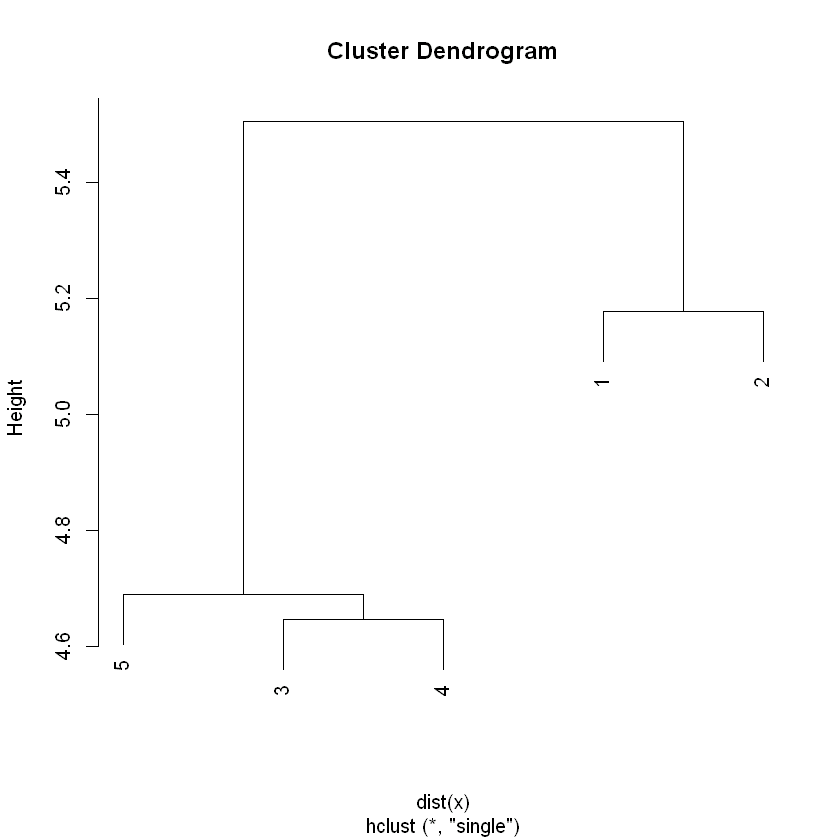

    plot(h<-hclust(dist(x), method="complete"))

    Error in cairo_pdf(tf, width, height, pointsize, FALSE, family, bg, antialias): unable to load winCairo.dll: was it built?
    

    Error in svg(tf, width, height, pointsize, FALSE, family, bg, antialias): unable to load winCairo.dll: was it built?
    

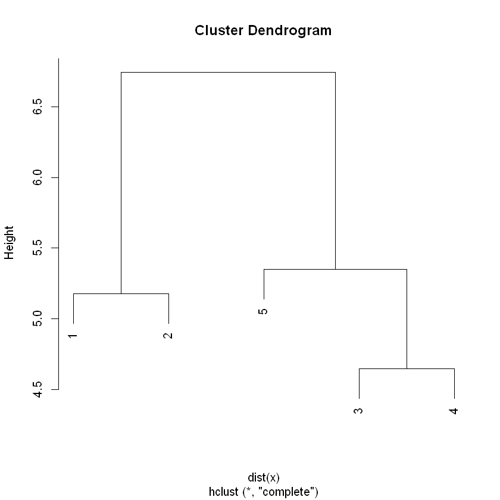

    plot(h<-hclust(dist(x), method="average"))

    Error in cairo_pdf(tf, width, height, pointsize, FALSE, family, bg, antialias): unable to load winCairo.dll: was it built?
    

    Error in svg(tf, width, height, pointsize, FALSE, family, bg, antialias): unable to load winCairo.dll: was it built?
    

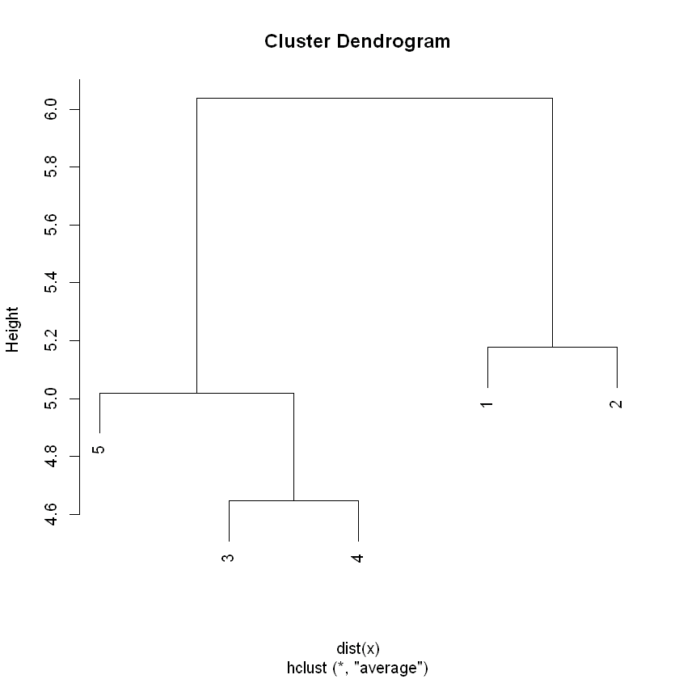

    plot(h<-hclust(dist(x), method="centroid"), hang=-1)

    Error in cairo_pdf(tf, width, height, pointsize, FALSE, family, bg, antialias): unable to load winCairo.dll: was it built?
    

    Error in svg(tf, width, height, pointsize, FALSE, family, bg, antialias): unable to load winCairo.dll: was it built?
    

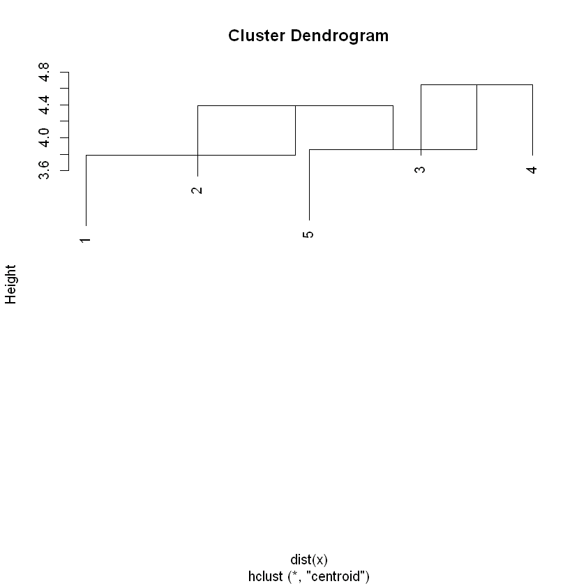

    x <- rbind(matrix(rnorm(100,sd=0.3), ncol=2), matrix(rnorm(100,mean=1,sd=0.3), ncol=2))

    colnames(x) <- c("x", "y")

    cl <- kmeans(x,2)

    cl

    K-means clustering with 2 clusters of sizes 50, 50
    
    Cluster means:
               x          y
    1 0.99478448 1.01338986
    2 0.05779591 0.02198203
    
    Clustering vector:
      [1] 2 2 2 2 2 2 2 2 2 2 2 2 2 2 2 2 2 2 2 2 2 2 2 2 2 2 2 2 2 2 2 2 2 2 2 2 2
     [38] 2 2 2 2 2 2 2 2 2 2 2 2 2 1 1 1 1 1 1 1 1 1 1 1 1 1 1 1 1 1 1 1 1 1 1 1 1
     [75] 1 1 1 1 1 1 1 1 1 1 1 1 1 1 1 1 1 1 1 1 1 1 1 1 1 1
    
    Within cluster sum of squares by cluster:
    [1] 6.552825 6.174410
     (between_SS / total_SS =  78.5 %)
    
    Available components:
    
    [1] "cluster"      "centers"      "totss"        "withinss"     "tot.withinss"
    [6] "betweenss"    "size"         "iter"         "ifault"      

    cl <- kmeans(x,5,nstart=25)

    cl

    K-means clustering with 5 clusters of sizes 35, 14, 15, 21, 15
    
    Cluster means:
               x           y
    1  0.1895784  0.08576133
    2  0.7179313  0.97496654
    3  1.0959533  0.71843451
    4  1.1070898  1.24968781
    5 -0.2496966 -0.12683634
    
    Clustering vector:
      [1] 5 1 5 1 1 1 1 5 5 5 1 1 1 5 1 1 1 5 1 5 1 1 5 1 1 5 1 1 1 1 5 1 5 1 1 5 1
     [38] 1 1 5 1 1 1 5 1 1 1 1 1 1 4 2 3 2 4 4 4 3 3 3 4 4 4 2 3 3 2 2 3 4 3 4 3 2
     [75] 3 2 4 3 2 4 4 4 2 4 4 4 3 2 3 4 4 2 2 4 2 4 2 3 4 3
    
    Within cluster sum of squares by cluster:
    [1] 2.3236487 0.5480705 0.6345940 1.3804838 1.3500778
     (between_SS / total_SS =  89.5 %)
    
    Available components:
    
    [1] "cluster"      "centers"      "totss"        "withinss"     "tot.withinss"
    [6] "betweenss"    "size"         "iter"         "ifault"      

    install.packages(c("mclust"), repos='http://cran.rstudio.com/')

    package 'mclust' successfully unpacked and MD5 sums checked
    
    The downloaded binary packages are in
    	C:\Users\syleeie\AppData\Local\Temp\Rtmp2xQ7Ua\downloaded_packages
    

    library(mclust)

    Package 'mclust' version 5.0.1
    Type 'citation("mclust")' for citing this R package in publications.
    
    Attaching package: 'mclust'
    
    The following object is masked from 'package:psych':
    
        sim
    
    

    x <- mvrnorm(100, c(0,0,0,0), diag(4)*0.7)

    y <- mvrnorm(150, c(1,1,1,1), diag(4))

    z <- mvrnorm(50, c(3,1,3,1), diag(4)*0.3)

    x <- rbind(x,y,z)

    x <- data.frame(x)

    colnames(x) <- c("x1", "x2", "x3", "x4")

    m1 <- Mclust(x)

    m1$parameters

    Error in vapply(seq_along(mapped), function(i) {: 길이가 반드시 1이어야 하지만,
    FUN(X[[4]])의 결과는 길이 0 입니다
    

    $pro
    [1] 0.2954852 0.5400408 0.1644739
    
    $mean
               [,1]      [,2]      [,3]
    x1 -0.066545265 1.0095195 3.1194452
    x2  0.172442657 0.9912534 0.9210689
    x3 -0.069965364 1.0049069 3.0225704
    x4  0.004501105 0.9541380 0.8840197
    
    $variance
    $variance$modelName
    [1] "VII"
    
    $variance$d
    [1] 4
    
    $variance$G
    [1] 3
    
    $variance$sigma
    , , 1
    
              x1        x2        x3        x4
    x1 0.5999536 0.0000000 0.0000000 0.0000000
    x2 0.0000000 0.5999536 0.0000000 0.0000000
    x3 0.0000000 0.0000000 0.5999536 0.0000000
    x4 0.0000000 0.0000000 0.0000000 0.5999536
    
    , , 2
    
             x1       x2       x3       x4
    x1 1.074353 0.000000 0.000000 0.000000
    x2 0.000000 1.074353 0.000000 0.000000
    x3 0.000000 0.000000 1.074353 0.000000
    x4 0.000000 0.000000 0.000000 1.074353
    
    , , 3
    
              x1        x2        x3        x4
    x1 0.3052345 0.0000000 0.0000000 0.0000000
    x2 0.0000000 0.3052345 0.0000000 0.0000000
    x3 0.0000000 0.0000000 0.3052345 0.0000000
    x4 0.0000000 0.0000000 0.0000000 0.3052345
    
    
    $variance$sigmasq
    [1] 0.5999536 1.0743530 0.3052345
    
    $variance$scale
    [1] 0.5999536 1.0743530 0.3052345
    
    
    $Vinv
    NULL
    

    library(e1071)

    data(iris)

    attach(iris)

    N = nrow(iris)

    tr.idx = sample(1:N, size=N/2, replace=T)

    y = iris[,5]

    x.te <- iris[-tr.idx,-5]

    x.tr <- iris[tr.idx,-5]

    m2 <- svm(Species~., data=iris[tr.idx,], kernel="linear")

    plot(m2, iris, Petal.Width~Petal.Length, slice=list(Sepal.Width=3, Sepal.Length=4))

    Error in cairo_pdf(tf, width, height, pointsize, FALSE, family, bg, antialias): unable to load winCairo.dll: was it built?
    

    Error in svg(tf, width, height, pointsize, FALSE, family, bg, antialias): unable to load winCairo.dll: was it built?
    

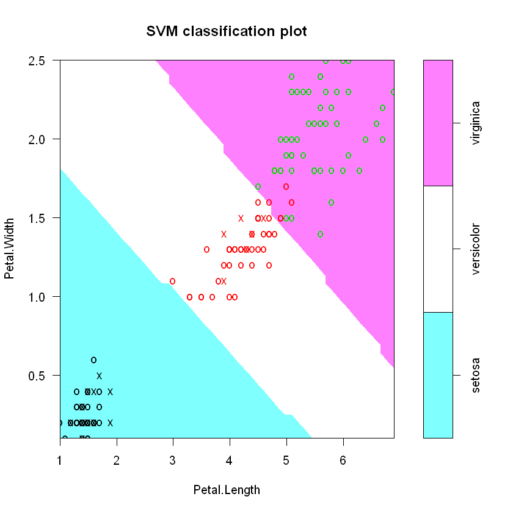

    summary(m2)

    
    Call:
    svm(formula = Species ~ ., data = iris[tr.idx, ], kernel = "linear")
    
    
    Parameters:
       SVM-Type:  C-classification 
     SVM-Kernel:  linear 
           cost:  1 
          gamma:  0.25 
    
    Number of Support Vectors:  19
    
     ( 8 2 9 )
    
    
    Number of Classes:  3 
    
    Levels: 
     setosa versicolor virginica
    
    
    

    pred <- predict(m2, x.te)

    table(pred, y[-tr.idx])

                
    pred         setosa versicolor virginica
      setosa         32          0         0
      versicolor      0         31         0
      virginica       0          3        28

    pred <- predict(m2, x.te, decision.values=T)

    attr(pred, "decision.values")[1:4,]

<table>
<thead><tr><th></th><th scope=col>virginica/setosa</th><th scope=col>virginica/versicolor</th><th scope=col>setosa/versicolor</th></tr></thead>
<tbody>
	<tr><th scope=row>2</th><td>-1.243971</td><td>-7.775535</td><td> 1.407060</td></tr>
	<tr><th scope=row>3</th><td>-1.351954</td><td>-8.166184</td><td> 1.695438</td></tr>
	<tr><th scope=row>4</th><td>-1.269762</td><td>-7.753982</td><td> 1.569708</td></tr>
	<tr><th scope=row>6</th><td>-1.249030</td><td>-8.306144</td><td> 1.429445</td></tr>
</tbody>
</table>

    plot(cmdscale(dist(x.tr)), col=as.integer(y[tr.idx]), pch=c("o","+")[1:150 %in% m2$index + 1])

    Error in cairo_pdf(tf, width, height, pointsize, FALSE, family, bg, antialias): unable to load winCairo.dll: was it built?
    

    Error in svg(tf, width, height, pointsize, FALSE, family, bg, antialias): unable to load winCairo.dll: was it built?
    

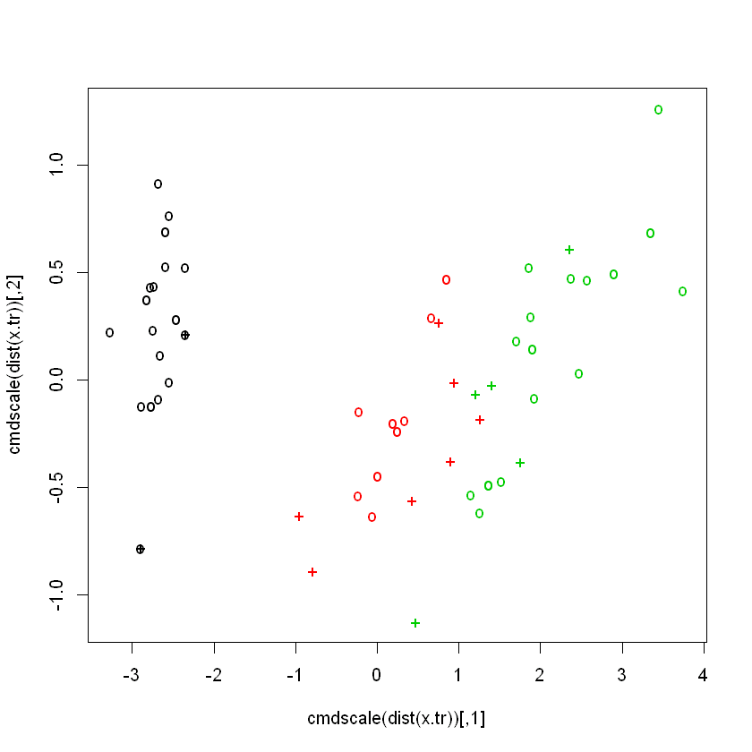

    install.packages(c("ElemStatLearn"), repos='http://cran.rstudio.com/')

    package 'ElemStatLearn' successfully unpacked and MD5 sums checked
    
    The downloaded binary packages are in
    	C:\Users\syleeie\AppData\Local\Temp\Rtmp2xQ7Ua\downloaded_packages
    

    data(spam, package="ElemStatLearn")

    str(spam)

    'data.frame':	4601 obs. of  58 variables:
     $ A.1 : num  0 0.21 0.06 0 0 0 0 0 0.15 0.06 ...
     $ A.2 : num  0.64 0.28 0 0 0 0 0 0 0 0.12 ...
     $ A.3 : num  0.64 0.5 0.71 0 0 0 0 0 0.46 0.77 ...
     $ A.4 : num  0 0 0 0 0 0 0 0 0 0 ...
     $ A.5 : num  0.32 0.14 1.23 0.63 0.63 1.85 1.92 1.88 0.61 0.19 ...
     $ A.6 : num  0 0.28 0.19 0 0 0 0 0 0 0.32 ...
     $ A.7 : num  0 0.21 0.19 0.31 0.31 0 0 0 0.3 0.38 ...
     $ A.8 : num  0 0.07 0.12 0.63 0.63 1.85 0 1.88 0 0 ...
     $ A.9 : num  0 0 0.64 0.31 0.31 0 0 0 0.92 0.06 ...
     $ A.10: num  0 0.94 0.25 0.63 0.63 0 0.64 0 0.76 0 ...
     $ A.11: num  0 0.21 0.38 0.31 0.31 0 0.96 0 0.76 0 ...
     $ A.12: num  0.64 0.79 0.45 0.31 0.31 0 1.28 0 0.92 0.64 ...
     $ A.13: num  0 0.65 0.12 0.31 0.31 0 0 0 0 0.25 ...
     $ A.14: num  0 0.21 0 0 0 0 0 0 0 0 ...
     $ A.15: num  0 0.14 1.75 0 0 0 0 0 0 0.12 ...
     $ A.16: num  0.32 0.14 0.06 0.31 0.31 0 0.96 0 0 0 ...
     $ A.17: num  0 0.07 0.06 0 0 0 0 0 0 0 ...
     $ A.18: num  1.29 0.28 1.03 0 0 0 0.32 0 0.15 0.12 ...
     $ A.19: num  1.93 3.47 1.36 3.18 3.18 0 3.85 0 1.23 1.67 ...
     $ A.20: num  0 0 0.32 0 0 0 0 0 3.53 0.06 ...
     $ A.21: num  0.96 1.59 0.51 0.31 0.31 0 0.64 0 2 0.71 ...
     $ A.22: num  0 0 0 0 0 0 0 0 0 0 ...
     $ A.23: num  0 0.43 1.16 0 0 0 0 0 0 0.19 ...
     $ A.24: num  0 0.43 0.06 0 0 0 0 0 0.15 0 ...
     $ A.25: num  0 0 0 0 0 0 0 0 0 0 ...
     $ A.26: num  0 0 0 0 0 0 0 0 0 0 ...
     $ A.27: num  0 0 0 0 0 0 0 0 0 0 ...
     $ A.28: num  0 0 0 0 0 0 0 0 0 0 ...
     $ A.29: num  0 0 0 0 0 0 0 0 0 0 ...
     $ A.30: num  0 0 0 0 0 0 0 0 0 0 ...
     $ A.31: num  0 0 0 0 0 0 0 0 0 0 ...
     $ A.32: num  0 0 0 0 0 0 0 0 0 0 ...
     $ A.33: num  0 0 0 0 0 0 0 0 0.15 0 ...
     $ A.34: num  0 0 0 0 0 0 0 0 0 0 ...
     $ A.35: num  0 0 0 0 0 0 0 0 0 0 ...
     $ A.36: num  0 0 0 0 0 0 0 0 0 0 ...
     $ A.37: num  0 0.07 0 0 0 0 0 0 0 0 ...
     $ A.38: num  0 0 0 0 0 0 0 0 0 0 ...
     $ A.39: num  0 0 0 0 0 0 0 0 0 0 ...
     $ A.40: num  0 0 0.06 0 0 0 0 0 0 0 ...
     $ A.41: num  0 0 0 0 0 0 0 0 0 0 ...
     $ A.42: num  0 0 0 0 0 0 0 0 0 0 ...
     $ A.43: num  0 0 0.12 0 0 0 0 0 0.3 0 ...
     $ A.44: num  0 0 0 0 0 0 0 0 0 0.06 ...
     $ A.45: num  0 0 0.06 0 0 0 0 0 0 0 ...
     $ A.46: num  0 0 0.06 0 0 0 0 0 0 0 ...
     $ A.47: num  0 0 0 0 0 0 0 0 0 0 ...
     $ A.48: num  0 0 0 0 0 0 0 0 0 0 ...
     $ A.49: num  0 0 0.01 0 0 0 0 0 0 0.04 ...
     $ A.50: num  0 0.132 0.143 0.137 0.135 0.223 0.054 0.206 0.271 0.03 ...
     $ A.51: num  0 0 0 0 0 0 0 0 0 0 ...
     $ A.52: num  0.778 0.372 0.276 0.137 0.135 0 0.164 0 0.181 0.244 ...
     $ A.53: num  0 0.18 0.184 0 0 0 0.054 0 0.203 0.081 ...
     $ A.54: num  0 0.048 0.01 0 0 0 0 0 0.022 0 ...
     $ A.55: num  3.76 5.11 9.82 3.54 3.54 ...
     $ A.56: int  61 101 485 40 40 15 4 11 445 43 ...
     $ A.57: int  278 1028 2259 191 191 54 112 49 1257 749 ...
     $ spam: Factor w/ 2 levels "email","spam": 2 2 2 2 2 2 2 2 2 2 ...
    

    model <- svm(spam ~., data=spam)

    summary(model)

    
    Call:
    svm(formula = spam ~ ., data = spam)
    
    
    Parameters:
       SVM-Type:  C-classification 
     SVM-Kernel:  radial 
           cost:  1 
          gamma:  0.01754386 
    
    Number of Support Vectors:  1275
    
     ( 595 680 )
    
    
    Number of Classes:  2 
    
    Levels: 
     email spam
    
    
    

    pred <- fitted(model)

    obs <- spam$spam

    table(pred,obs)

           obs
    pred    email spam
      email  2697  151
      spam     91 1662

    model <- svm(spam ~., data=spam, cross=10)

    summary(model)

    
    Call:
    svm(formula = spam ~ ., data = spam, cross = 10)
    
    
    Parameters:
       SVM-Type:  C-classification 
     SVM-Kernel:  radial 
           cost:  1 
          gamma:  0.01754386 
    
    Number of Support Vectors:  1275
    
     ( 595 680 )
    
    
    Number of Classes:  2 
    
    Levels: 
     email spam
    
    10-fold cross-validation on training data:
    
    Total Accuracy: 93.26233 
    Single Accuracies:
     93.26087 92.82609 95.21739 93.47826 91.52174 94.56522 94.56522 92.17391 93.04348 91.97397 
    
    
    

    obj <- tune(svm, spam ~ A.16 + A.53, data=spam, ranges=list(gamma=c(1.95, 2.05), cost=c(0.25, 0.35)))

    summary(obj)

    
    Parameter tuning of 'svm':
    
    - sampling method: 10-fold cross validation 
    
    - best parameters:
     gamma cost
      2.05 0.35
    
    - best performance: 0.1623545 
    
    - Detailed performance results:
      gamma cost     error dispersion
    1  1.95 0.25 0.1630062 0.01356942
    2  2.05 0.25 0.1632236 0.01358748
    3  1.95 0.35 0.1627893 0.01363160
    4  2.05 0.35 0.1623545 0.01326323
    

    plot(obj)

    Error in cairo_pdf(tf, width, height, pointsize, FALSE, family, bg, antialias): unable to load winCairo.dll: was it built?
    

    Error in svg(tf, width, height, pointsize, FALSE, family, bg, antialias): unable to load winCairo.dll: was it built?
    

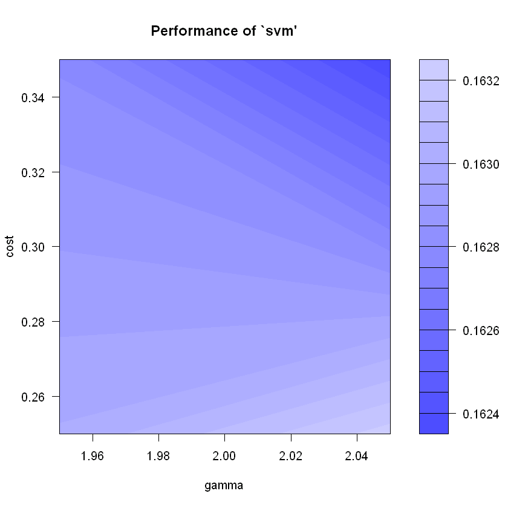

    library(rpart)

    data(Ozone, package="mlbench")

    index <- 1:nrow(Ozone)

    testindex <- sample(index, trunc(length(index)/3))

    testset <- na.omit(Ozone[testindex,-3])

    trainset <- na.omit(Ozone[-testindex,-3])

    svm.model <- svm(V4 ~., data=trainset, cost=1000, gamma=1e-04)

    svm.pred <- predict(svm.model, testset[,-3])

    crossprod(svm.pred - testset[,3]) / length(testindex)

<table>
<tbody>
	<tr><td>12.56657</td></tr>
</tbody>
</table>

    rpart.model <- rpart(V4 ~., data=trainset)

    rpart.pred <- predict(rpart.model, testset[,-3])

    crossprod(rpart.pred - testset[,3]) / length(testindex)

<table>
<tbody>
	<tr><td>15.82365</td></tr>
</tbody>
</table>

    help(crossprod)

<table width="100%" summary="page for crossprod {base}"><tr><td>crossprod {base}</td><td align="right">R Documentation</td></tr></table>

<h2>Matrix Crossproduct</h2>

<h3>Description</h3>

Given matrices <code>x</code> and <code>y</code> as arguments, return a matrix
cross-product.  This is formally equivalent to (but usually slightly
faster than) the call <code>t(x) %*% y</code> (<code>crossprod</code>) or
<code>x %*% t(y)</code> (<code>tcrossprod</code>).

<h3>Usage</h3>

<pre>
crossprod(x, y = NULL)

tcrossprod(x, y = NULL)
</pre>

<h3>Arguments</h3>

<table summary="R argblock">
<tr valign="top"><td><code>x, y</code></td>
<td>

numeric or complex matrices: <code>y = NULL</code> is taken to
be the same matrix as <code>x</code>.  Vectors are promoted to
single-column or single-row matrices, depending on the context.

</td></tr>
</table>

<h3>Value</h3>

A double or complex matrix, with appropriate <code>dimnames</code> taken
from <code>x</code> and <code>y</code>.

<h3>Note</h3>

When <code>x</code> or <code>y</code> are not matrices, they are treated as column or
row matrices, but their <code>names</code> are usually <B>not</B>
promoted to <code>dimnames</code>.  Hence, currently, the last
example has empty dimnames.

<h3>References</h3>

Becker, R. A., Chambers, J. M. and Wilks, A. R. (1988)
<EM>The New S Language</EM>.
Wadsworth &amp; Brooks/Cole.

<h3>See Also</h3>

<code>%*%</code> and outer product <code>%o%</code>.

<h3>Examples</h3>

<pre>
(z &lt;- crossprod(1:4))    # = sum(1 + 2^2 + 3^2 + 4^2)
drop(z)                  # scalar
x &lt;- 1:4; names(x) &lt;- letters[1:4]; x
tcrossprod(as.matrix(x)) # is
identical(tcrossprod(as.matrix(x)),
          crossprod(t(x)))
tcrossprod(x)            # no dimnames

m &lt;- matrix(1:6, 2,3) ; v &lt;- 1:3; v2 &lt;- 2:1
stopifnot(identical(tcrossprod(v, m), v %*% t(m)),
          identical(tcrossprod(v, m), crossprod(v, t(m))),
          identical(crossprod(m, v2), t(m) %*% v2))
</pre>

[Package <em>base</em> version 3.1.3 ]

    x <- seq(0,2*pi, length=100)

    y <- sin(x) + rnorm(100)

    m <- svm(x,y)

    m

    
    Call:
    svm.default(x = x, y = y)
    
    
    Parameters:
       SVM-Type:  eps-regression 
     SVM-Kernel:  radial 
           cost:  1 
          gamma:  1 
        epsilon:  0.1 
    
    
    Number of Support Vectors:  92
    

    new <- predict(m,x)

    plot(x,y)

    Error in cairo_pdf(tf, width, height, pointsize, FALSE, family, bg, antialias): unable to load winCairo.dll: was it built?
    

    Error in svg(tf, width, height, pointsize, FALSE, family, bg, antialias): unable to load winCairo.dll: was it built?
    

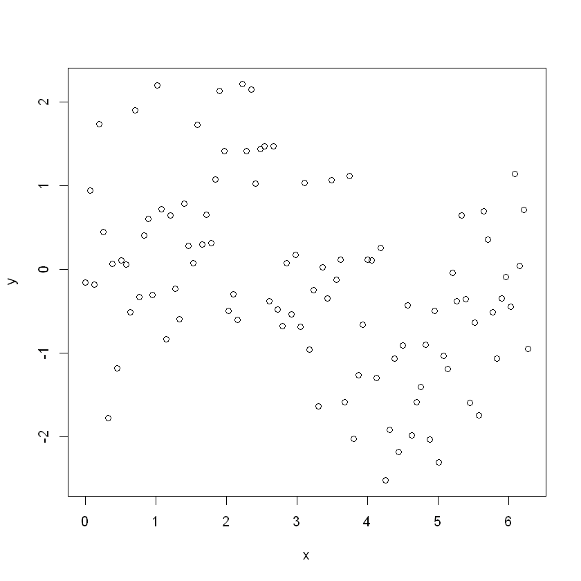

